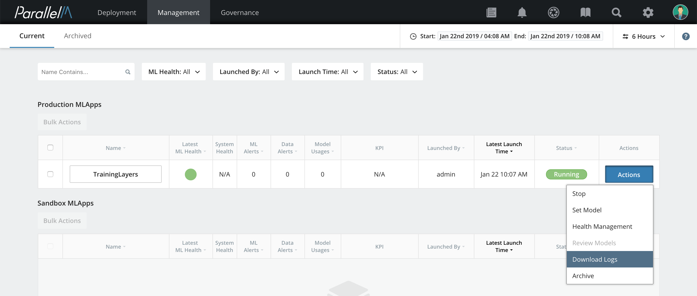

2.1 Installing MCenter from Docker Images
=========================================

This section covers the installation of ParallelM MCenter, which is
provided as a set of Docker images.

Installation Requirements
-------------------------

ParallelM MCenter requires the following environment:

-   [Docker](https://docs.docker.com/engine/installation/) version CE
    17.06 or higher

-   Linux OS with support for Docker CE 17.06 or higher

ParallelM provides MCenter as several Docker images:

-   `mcenter_server.tar` is MCenter Server + UI

-   `mcenter_agent.tar` is MCenter Agent

-   `zookeeper` is a standard ZooKeeper Docker from [ZooKeeper at
    dockerhub](https://hub.docker.com/_/zookeeper/)

Best Practices
--------------

We strongly recommend keeping the logs outside of the Docker container by mapping the log
directory to a directory on the physical host. If logs are not kept
outside of the container, they are not available to debug if the container stops
or is terminated. To place logs outside of the container, map the desired
log directory to an external store and set the log environment
variable `MCENTER_LOG_DIR` for this directory. In the example below,
these command options place logs into `/tmp`, which is mapped externally.

For example, set the log directory in the `mcenter-agent-env.list`
and `mcenter-server-env.list` configuration files.
```
MCENTER_LOG_DIR=/tmp
```

Then add the following option to the `docker run` command when starting the
server and agent:

```
-v /tmp:/tmp
```

System Configuration
--------------------

Configure your existing MySQL server as follows.

### MySQL

If you are using MCenter with MySQL as your database, create a
database for MCenter and configure your MySQL as follows.

```
mysql> set global max_connections = 10000;
mysql> set global time_zone = '+00:00';
mysql> set global max_allowed_packet = 1073741824;
mysql> create database mcenterdb;
```

**Note:** The database must be created and running before MCenter
is started.

Loading the Docker Images
-------------------------

Set the following environment variables in the Docker files.

On each host machine, load the Docker images that are relevant for the
host.

- On the server host, load the zookeeper, server, and agent Dockers.

- On each agent host, load the agent Docker.

On each host machine, perform the following:

**1.** Copy and unpack the ParallelM MCenter Docker images on your system.

**2.** Use the `docker load` command to load the Docker images.

   For the server, enter the commands below:
```
   > docker load -i zookeeper.tar
   > docker load -i pm_mcenter_server.tar
   > docker load -i pm_mcenter_agent.tar
```
   For each agent, enter the command below:

```
   > docker load -i pm_mcenter_agent.tar
```

**3.** Verify that the Docker images have been created on the server
and on the agent host using the `docker images` command.

   On the server host, you will see the output below:

```
   > docker images
   REPOSITORY TAG IMAGE ID CREATED VIRTUAL SIZE
   pm/mcenter_server latest 8ccf147d532b 15 hours ago 789.3 MB
   pm/mcenter_agent latest 518355f96e3d 15 hours ago 1.317 GB
   zookeeper latest ab641552d4e8 4 days ago 143.7 MB
```

   On the agent host, you will see the output below:
```
   > docker images
   REPOSITORY TAG IMAGE ID CREATED VIRTUAL SIZE
   pm/mcenter_agent latest 518355f96e3d 15 hours ago 1.317 GB
```

MCenter Docker Environment Variable Files
----------------------------------------

Create Docker environment variable files for the server and agents based on the
sample files shown in sections [MCenter Server Environment Variable File](./2_2.md)
and [MCenter Agent Environment Variable File](./2_3.md). Update the values
as described in the comments of those files.
Create one environment file for MCenter server and one for each MCenter agent.

Running the Dockers
-------------------

To run the zookeeper Docker:

```
> docker run -td -p 2181:2181 zookeeper
```

To run the server Docker:

**1.** Use the command `docker run` to start a Docker container:

For example:
```
   > docker run -td -p 3456:3456 \
                 -p 7092:7092 \
                 --env-file=mcenter-server-env.list \
                 -v /data-lake:/data-lake \
                 -v /tmp:/tmp \
                 --name mcenter_server \
                 --restart always \
                 pm/mcenter_server
```

Only use the `--host` option for Docker configurations. Other configurations (including Kubernetes) should not specify this option
```
   > docker run -td --network host \
                 --env-file=mcenter-server-env.list \
                 -v /data-lake:/data-lake \
                 -v /tmp:/tmp \
                 --name mcenter_server \
                 --restart always \
                 pm/mcenter_server
```


**2.** Use the command `docker ps` to verify the container is running.

To run the agent Docker:

**1.** Use the command `docker run` to run the agent container:

For example:
```
   > docker run -td -p 4567:4567 \
                 -p 8081:8081 \
                 -p 10001:10001 \
                 -p 5000-5255:5000-5255 \
                 --env-file=mcenter-agent-env.list \
                 -v /data-lake:/data-lake \
                 -v /tmp:/tmp \
                 -v /etc/hadoop/conf:/etc/hadoop/conf \
                 --name mcenter_agent \
                 --restart always \
                 pm/mcenter_agent
```

Adding Hosts to the Docker Instance
-------------------------------

If you are going to submit jobs to Spark, YARN, or other tools that access the agent Docker instance by
hostname, use the `--add-host` argument when you run the agent Docker, for example:

```
   > docker run -td -p 4567:4567 \
                 -p 8081:8081 \
                 -p 10001:10001 \
                 -p 5000-5255:5000-5255 \
                 --env-file=mcenter-agent-env.list \
                 -v /data-lake:/data-lake \
                 -v /tmp:/tmp \
                 -v /etc/hadoop/conf:/etc/hadoop/conf \
                 --name mcenter_agent \
                 --restart always \
                 --add-host="<hostname>:<ip>" \
                 pm/mcenter_agent
```

You may add multiple hosts this way for cluster configurations.

## First time logging into MCenter

   - By default, MCenter creates users *admin* and *ds* with randomly
   generated passwords. You can discover these passwords by searching
   the logs. For example:
       ```cat /tmp/<host>-eco-server.log | grep password | grep admin```
       Follow the instructions in the [User section](./3_1.md) to update these passwords.
   
   **Note:** Change each password after logging in the first time.
   **Failure to do so may be a security issue.**

   **Notes:**

   If needed, set up the following items:

   - Map the Hadoop client configuration folder in the Docker configuration.
   In this example, it is located under `/etc/hadoop/conf` on the host machine.

   - Map any IP ports outside the Docker that you need access to, for
   example, if your database exposes a listening port.

   - Map any directories/files required by the Docker from the host machine,
   such as the `log4j` properties file.

   - If your Hadoop cluster is kerberized, ensure that the value
   `KERBEROS_PRINCIPAL_KEYTAB_DIR` is set appropriately in the agent configuration
   file `mcenter-agent-env.list`. This directory is expected to contain the
   `<user>.keytab` and `<user>.principal` files, which submit jobs to
   YARN. Also note that MCenter expects a principal and keytab
   representing valid access rights to submit a job to the Hadoop cluster.

**2.** Use the command `docker ps` to verify that the container is running.

Exposing a Port from a Docker
-----------------------------

You can expose ports by configuring the `EXPOSE` option in the Docker
file and mapping the exposed port to the external host using the `-p`
option to the `docker run` command, as shown in the example below.

```
> docker run -td -p 4567:4567
```

Mounting a Host Directory Inside the Docker
-------------------------------------------

To mount a host directory inside the Docker, enter:

```
> docker run -td -v
<directory_on_host>:<directory_inside_docker> --name
<container_name> <image_id>
```

For example:

```
> docker run -td -v /data-lake:/data-lake -name agent pm/mcenter_agent
```

Executing a Command in a Running Container
------------------------------------------

To execute a command inside the current running Docker, enter:

```
> docker exec <ID>/<name> <command>
```

For example:

```
> docker exec pm_mcenter_agent tail -f /opt/parallelm/mcenter/pm-eco-1.0.0/log/<container-ID>-eco-agent.log
```

Viewing the Configuration of a Running Docker
---------------------------------------------

To view the configuration of a running Docker, enter:

```
> docker inspect <container-ID>
```


Collecting Logs
---------------

The preferred method to download MLApp logs is via the MCenter UI. From the
MLApp Overview dashboard, locate the relevant MLApp and click on **Actions** and select **Download Logs**.



The download operation collects logs from the agent instances and can take a few
minutes to complete depending on the size of the logs. The **Download** button remains
disabled until the operation of collecting logs is complete. Click on the **Download**
button to download the tar file.

*Release Note:* MLApp logs *download* operation using the MCenter UI can occasionally
fail due to size limitation.

For large log files, we recommend using the shell script `collect-mcenter-logs.sh`
provided as part of the installed Docker image. To use
`collect-mcenter-logs.sh`, first copy the script from the running MCenter docker instance to the
host machine using `docker cp` example:

```
> docker cp <mcenter-DockerID>:/opt/parallelm/mcenter/tools/dockers/collect-mcenter-logs.sh <destination-path>
```

Next, run the script. Here are some examples showing the collection of engine logs (`-e`) and
MCenter MLApp instance logs (`-i`).

```
> collect-mcenter-logs.sh -i=/tmp/mcenter-logs -e=/tmp/driver-logs
> collect-mcenter-logs.sh -e=/tmp/driver-logs
> collect-mcenter-logs.sh -i=/tmp/mcenter-logs
```

The `collect-mcenter-logs.sh` script needs to be run on each of the installed host instances
(MCenter server and MCenter agent) to collect the logs. This creates a tar file. When communicating
with ParallelM on any issues, please include these files.

**Note:** logs are expected to be stored external to the Docker as described in Best Practices.


System Settings
---------------

The configuration settings for the MCenter server and agents are imported
when each module starts, so a restart is required to apply any setting change.

In v1.0, the only system setting is the data retention period.

### Setting the Data Retention Period

The MCenter server has a garbage collection process that deletes all of
the metadata collected for an active MLApp (including statistics and
system metrics generated by ML pipelines) when the metadata age exceeds
the MCenter’s data retention period. This period is defined by the
environment variable `MCENTER_DATA_RETENTION_PERIOD` when the MCenter
server process starts up.

The information affected by this setting includes all of the ML statistics
generated by every pipeline in an MLApp, all system statistics (via the
ML platform) captured for each pipeline in an MLApp, the aggregated
statistics for each MLApp, and the events generated per MLApp.

**Note:** MCenter does not manage user data, so user data is not affected
by this setting.

**Note:** Data belonging to a timeline capture of an MLApp persists forever
unless the timeline capture itself is deleted. As a result, this data is
exempt from garbage collection.

Known Issues
------------

Avoid using `localhost` as the server address in your environment variables.
Instead, use the node IP address.

