2.6 Configuring MCenter with Ambari
===================================

To enable Spark job submission from MCenter agent, the agent
Docker needs to be registered as an Ambari client. The latest version of MCenter
Docker comes with the Ambari agent pre-installed.

Variables
---------

For this document, we define the following:

-   `AMBARI_SERVER_HOSTNAME` - Hostname of Ambari server
-   `AMBARI_SERVER_IP` - IP address of Ambari server
-   `MCENTER_AGENT_HOST` - IP address of VM hosting MCenter agent
-   `MCENTER_AGENT_DOCKER_IP` - Static IP assigned to the Docker agent 
-   `USER-KEYTAB-FILE` - Kerberos keytab filename (Optional)
-   `USER-PRINCIPAL` - Kerberos principal name (Optional)

Step 1: Create the Docker Network
---------------------------------

Run the following command from VM hosting MCenter agent Docker:

```
$> docker network create --subnet=172.18.0.0/16 mlops_network
```

Verify that the network was created with following command:

```
$> docker network ls
NETWORK ID NAME DRIVER SCOPE

13bc37ebe66d bridge bridge local

d59d9b239e6e host host local

f50c52d4f752 mlops_network bridge local
```

Step 2: Update the MCenter Agent Docker Container
---------------------------------------------

Download the Docker image and load it into VM hosting MCenter agent:

```
$> docker load -i <location of MCenter agent docker image.tar>
```

Stop any running MCenter agent Docker:

```
$> docker stop mlops_agent
$> docker rm mlops_agent
```

Create a folder for the Spark application logs:

```
$> mkdir -p /data-lake/log/parallelm/driver_logs/mcenter-agent (This
is an example, please update the path as needed.)
```

Update the MCenter Docker environment variable file before running the MCenter agent Docker.
A sample environment variable file is shown in the section [MCenter Agent Environment Variable File](./2_3.md) 
This file is included with the MCenter Docker build. This file contains environment variables
for the MCenter agent instance. Please read the variable descriptions in the file for more details.

Run the MCenter agent docker. For example:

```
   > docker run -td -p 4567:4567 \
                 -p 8081:8081 \
                 -p 10001:10001 \
                 -p 5000-5255:5000-5255 \
                 --env-file=mcenter-agent-env.list \
                 -v /data-lake:/data-lake \
                 -v /tmp:/tmp \
                 -v /etc/hadoop/conf:/etc/hadoop/conf \
                 --name mcenter_agent \
                 --restart always \
                 --add-host="<hostname>:<ip>" \
                 pm/mcenter_agent
```

Step 3: Start the Ambari Agent Service in the MCenter Agent Docker
-----------------------------------------------------------

Open a bash shell in the agent Docker:

```
docker exec -it mlops_agent bash
```

Edit the Ambari agent configuration file:

```
$> vi /etc/ambari-agent/conf/ambari-agent.ini
```

Update the server section, hostname, and IP of the Ambari server.

```
[server]
hostname=<AMBARI_SERVER_HOSTNAME>
ip_address=<AMBARI_SERVER_IP>
url_port=8440
secured_url_port=8441
connect_retry_delay=10
max_reconnect_retry_delay=30

[security]
force_https_protocol=PROTOCOL_TLSv1_2
```

Start the Ambari agent service:

```
$> service ambari-agent start
```

Verify the service has started successfully:

```
$> cat /var/log/ambari-agent/ambari-agent.log | grep "Connected to
Ambari server" 
```

Step 4: Deploy the Ambari Client Configuration on the MCenter Agent
-------------------------------------------------------------------

A) Login to the Ambari UI with admin credentials and navigate to Hosts and
select the *Add New Host* option.

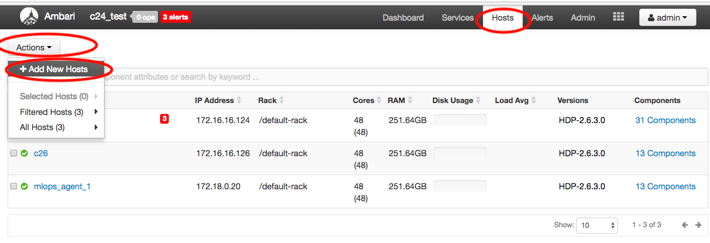

B) Under the *Target Host* section write the name provided for the
mcenter agent docker. In the example shown, it is "mlops_agent_2".

Choose *manual registration* and click ok, then click
*Register and Confirm*:

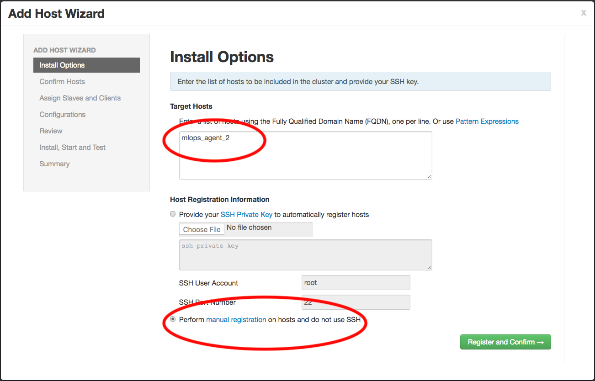

The new host should be detected. Click *Next→* then click
*Ok* twice.

C) When you see the screen *Confirm Hosts*, check whether you have
warnings that you need to resolve. Warnings related to "fqdn path exists"
can safely be ignored.

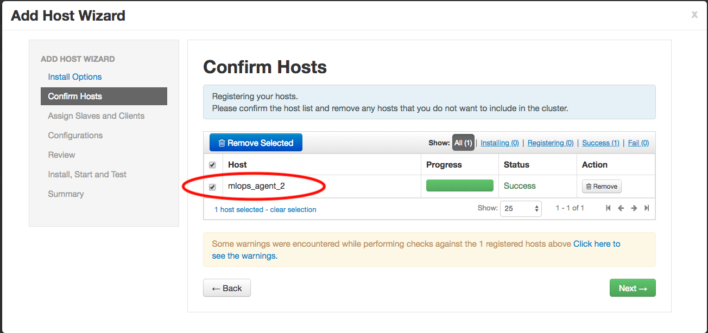

Click *Next→*.

D) On the *Assign Slaves and Clients* screen, please make sure only the
*client* option is selected.

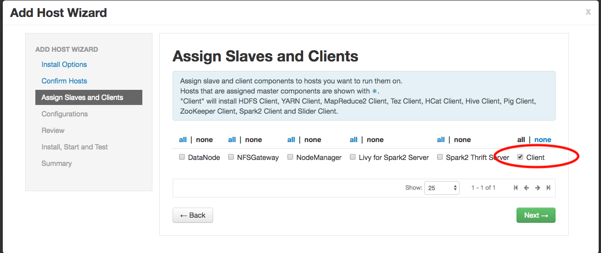

Click *Next→*.

E) Keep the default configuration on the next screen and click *Next→*.

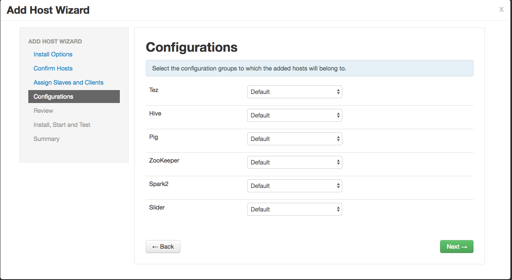

F) Review and click *Deploy*.


G) This is optional step. Provide the KDC admin principal and password
on next screen if your Hadoop cluster is Kerberized. For example:


Ambari will start deploying the client packages and configuration inside
the MCenter Docker.

Please note this step may take some time to finish.


Step 5: Create a Spark2 Configuration Group for MCenter Agent
-------------------------------------------------------------

A) Login to Ambari UI with admin credentials.

B) Go to Spark2 service, click on the *Configs* tab and click *Manage
Config Groups*.

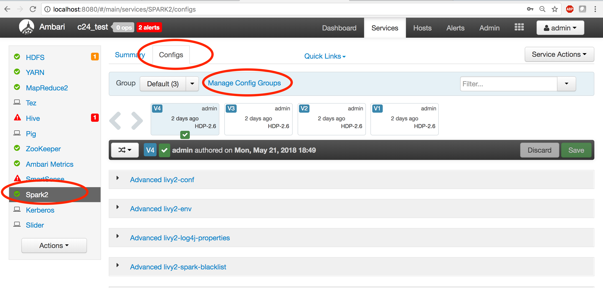

C) In *Manage Spark2 Configuration Groups* window, add a new group by
clicking the "+" button.

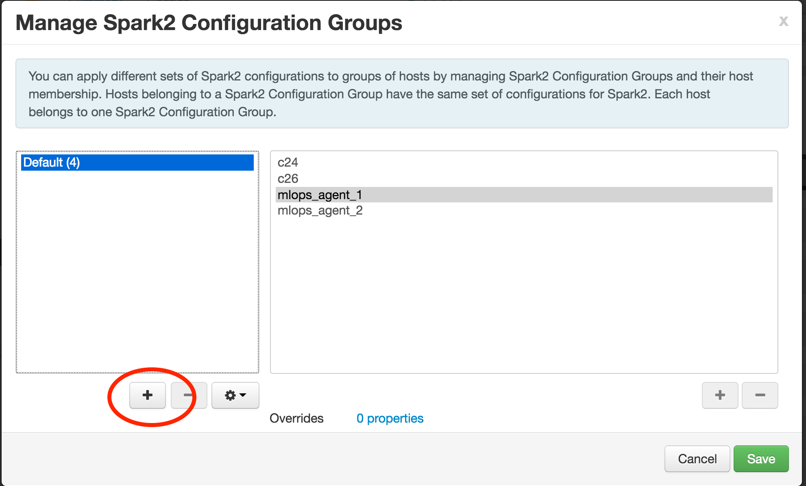

D) Provide a name for the group. In this example, the name is
"mlops_agent_config". Click *OK*.

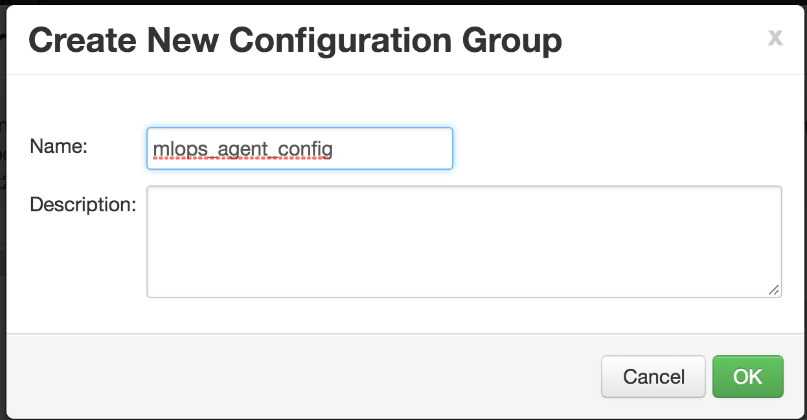

E) Once the new configuration group is created. Add the newly created
host to this group. 

Click on the group in the *Manage Spark2 Configuration Groups*, then
click on the "+" button as shown in the screenshot below:

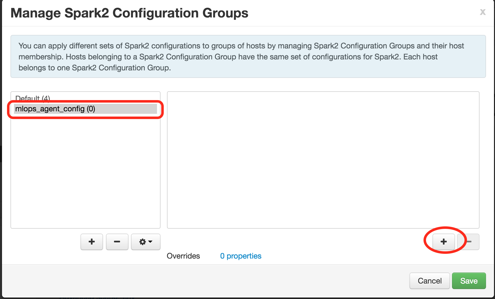

F) Select the newly added MCenter agent host and click *OK*.

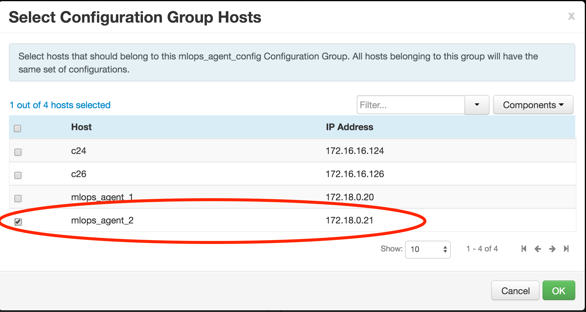

Click the *Save* button.

G) Add specific properties to the Spark2 configuration "mlops_agent".

Go to the Spark2 service, click on the *Configs* tab.

In the *Group* checkbox, check the configuration group which was created in
the previous stage.

Once this group is selected, go to the configuration section named
"**Custom spark2-defaults**" and click *Add Property*.

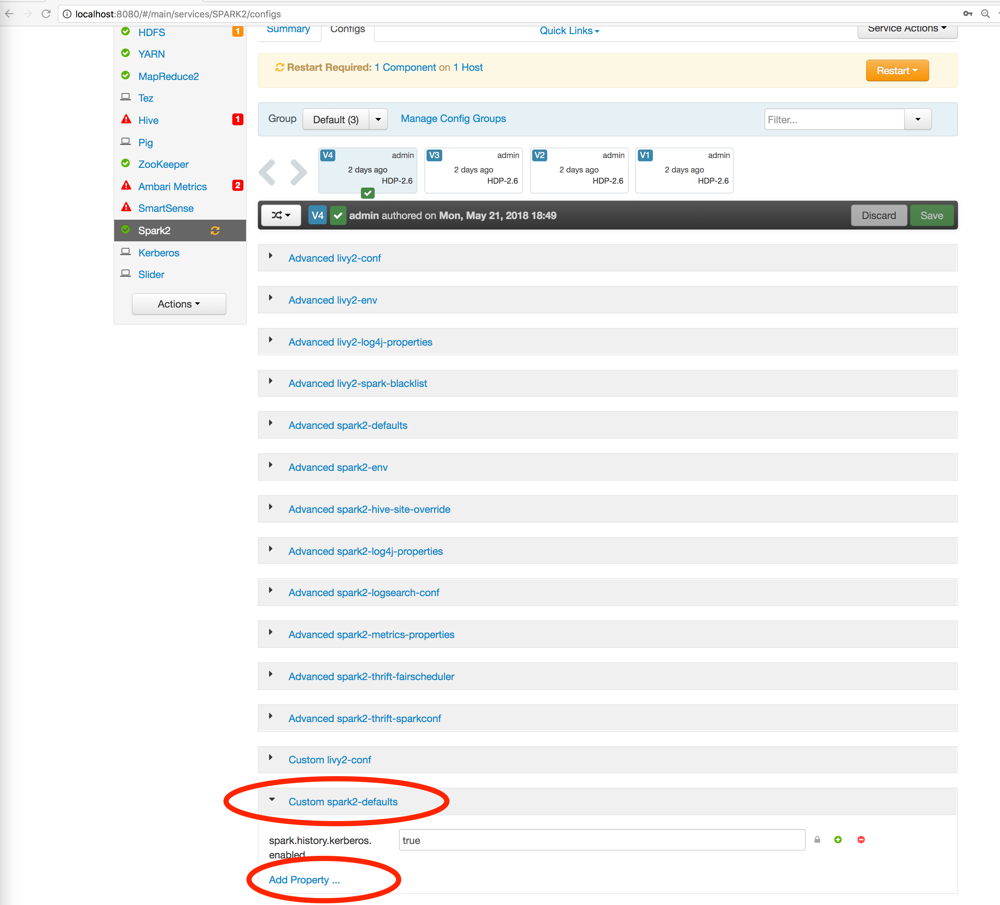

F) Inside the *Add Property* window, paste the following configuration:

```
spark.driver.host=<MCENTER_AGENT_HOST>
spark.driver.bindAddress=<MCENTER_AGENT_DOCKER_IP>
spark.driver.host=10.9.0.182
spark.driver.bindAddress=172.18.0.21
spark.driver.port=5000
spark.blockManager.port=5001
spark.broadcast.port=5002
spark.fileserver.port=5003
spark.replClassServer.port=5004
```

G) Below is a screenshot of the *Add Property* window.

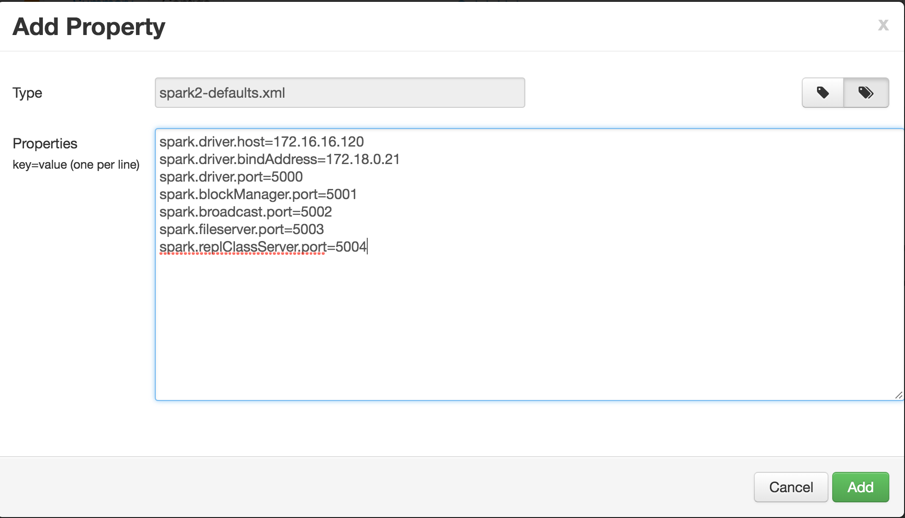

Click *Add* and then click *Save* in the main configuration window.

H) You might get a screen with MapReduce warnings. Click *Proceed Anyway*.

On the *Manage Config Groups* screen, you will see the notification *Restart
Required* since Ambari detects that a restart is needed for one
host.

Verify that this host is the host representing the MCenter agent.

Click the yellow *Restart* button and then click on *Restart All
Affected*.

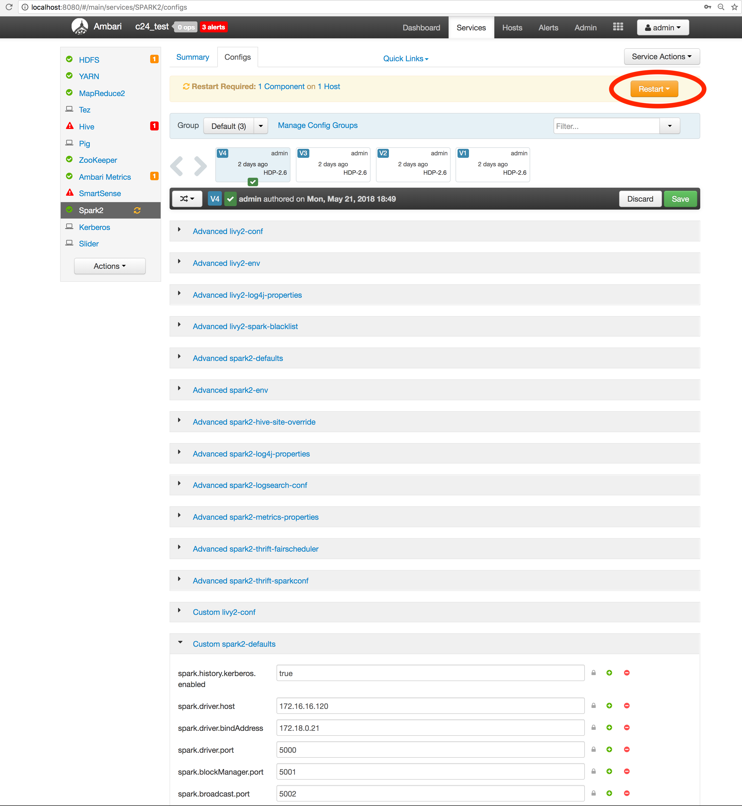

I) The confirmation screen opens. Click on *Confirm Restart All*.

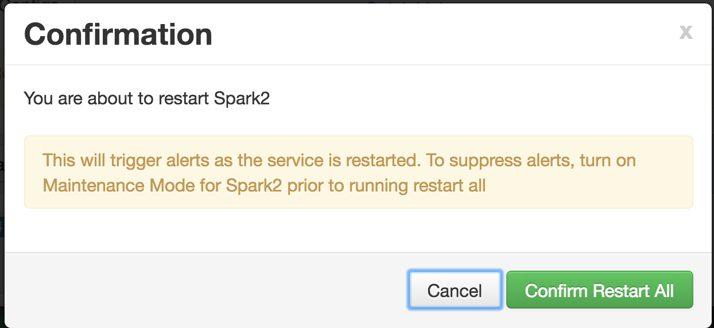

J)  To verify the configuration is correct, run the following command on
the VM hosting the MCenter agent.

```
$> cat /usr/hdp/current/spark2-client/conf/spark-defaults.conf
# Generated by Apache Ambari. Thu May 24 03:59:35 2018
spark.blockManager.port 5001
spark.broadcast.port 5002
spark.driver.bindAddress 172.18.0.21
spark.driver.extraLibraryPath /usr/hdp/current/hadoop-client/lib/native:/usr/hdp/current/hadoop-client/lib/native/Linux-amd64-64
spark.driver.host 10.9.0.182
spark.driver.port 5000
spark.eventLog.dir hdfs:///spark2-history/
spark.eventLog.enabled true
spark.executor.extraLibraryPath /usr/hdp/current/hadoop-client/lib/native:/usr/hdp/current/hadoop-client/lib/native/Linux-amd64-64
spark.fileserver.port 5003
spark.history.fs.logDirectory hdfs:///spark2-history/
spark.history.kerberos.enabled true
spark.history.kerberos.keytab
/etc/security/keytabs/spark.headless.keytab
spark.history.kerberos.principal spark-c24_test@MLOPS.COM
spark.history.provider org.apache.spark.deploy.history.FsHistoryProvider
spark.history.ui.port 18081
spark.replClassServer.port 5004
spark.yarn.historyServer.address c24:18081
spark.yarn.queue default
```

Step 6: Verify MCenter Agent is Connected to the Ambari/HDP Installation
--------------------------------------------------------------------

HDFS access 
-----------

On the MCenter agent Docker, run following command:

```
$> kinit -kt /keytab/prlm_poc.keytab prlm_poc@MLOPS.LOCAL
$> hadoop fs -ls /user/prlm_poc
```

Step 7: Spark2 Job Submission 
-----------------------------

A) On the MCenter agent Docker, run the following:

```
$> cd /tmp
$> vi test-spark.sh
```

B) Populate the file test-spark.sh with the following content:

```
#!/bin/bash
env HADOOP\_CONF\_DIR=/etc/hadoop/conf \
    SPARK\_MAJOR\_VERSION=2 \
    bin/spark-submit \
    --class org.apache.spark.examples.SparkPi \
    --master yarn \
    --num-executors 3 \
    --driver-memory 512m \
    --executor-memory 512m \
    --executor-cores 1 \
    --keytab /keytab/prlm_poc.keytab \
    --principal prlm\_poc\@BNGF.LOCAL \
    /usr/hdp/current/spark2-client/examples/jars/spark-examples\*.jar 10
```

C) Run the scripts:

```
$> sh test-spark.sh
```

Verify a job has been submitting to Yarn.

Step 8: Configure the MCenter Agent to use the Ambari provided Spark2-client Installation
-----------------------------------------------------------------------------------------

In this step, we point the MCenter agent to use the spark2-client
directory provided by Ambari.

On the host running the MCenter agent, initialize a shell in the
MCenter agent Docker: 

```
docker exec -it mlops_agent /bin/bash
```

Once inside the Docker run:

```
bash-4.2# mv /opt/parallelm/spark/ /opt/parallelm/spark_orig
bash-4.2# ln -s /usr/hdp/current/spark2-client/ /opt/parallelm/spark
```

Step 9: Saving the MCenter Agent Docker State
---------------------------------------------

Once the MCenter agent is able to submit jobs, take a snaphot of the
Docker container. 
This stage is needed to avoid repeating the Ambari registration
steps in case there is a need to remove the Docker and start it over.

Run the following command on VM hosting MCenter agent:

```
$> docker commit mlops_agent mlops_agent_with_ambari
```

Step 10: Update the MCenter Docker with the New Image
-----------------------------------------------------

After the Ambari registration phase and the new MCenter agent image is created, the
command/script used to run the MCenter agent Docker should be updated to
use the new image.

```
$> docker run -td   -p 4040:4040 \
                    -p 8080:8080 \
                    -p 4567:4567 \
                    -p 8081:8081 \
                    -p 10001:10001 \
                    -p 5000-5255:5000-5255 \
                    --env-file=mcenter-agent-env.list \
                    -v /data-lake:/data-lake \
                    -v /tmp:/tmp \
                    -v /etc/hadoop/conf:/etc/hadoop/conf \
                    --name mcenter_agent \
                    --restart always \
                     --add-host="<hostname>:<ip>" \
                    mlops_agent_with_ambari
```

Start ambari-agent service (manually now):

```
$> docker exec -it mlops\_agent /bin/bash
```
```
bash-4.2# service ambari-agent start
```

**You have finished adding MCenter as an Ambari agent.**
