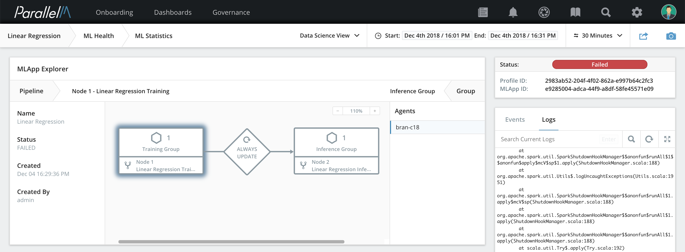
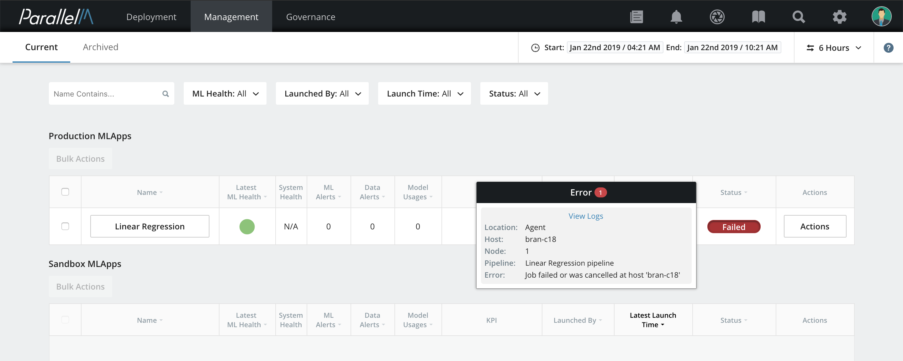

2.7 How MCenter Works with ML Engines
=====================================

The section discusses how MCenter interacts with various resource managers
to utilize different analytical engines.

Supported Engines
-----------------

MCenter agents are designed to connect with analytics engines to help
execute and control the ML pipelines within an MLApp. The overall control
of the sequence and schedule is managed by the MCenter server. The
MCenter agent manages the integration and communication with the engines
to start, stop, and cancel jobs, collect logs, and capture errors, and to
facilitate model and runtime updates. As of the this release of MCenter,
the following engines are supported.

### Spark

Spark applications may be access through Spark-cluster or Spark-YARN resource managers.

**Release note:** In this release, only batch pipelines can be executed
on Spark via MCenter.

### Containers

MCenter can connect to analytical frameworks installed in containers, including
R, Java, and Python-based frameworks, such as scikit-learn, Keras, and TensorFlow.

Supported resource managers for containers include Docker-server, Kubernetes for Azure,
AWS, and GCP.

### Operating System (OS)

During development, you may wish to test deployment locally. MCenter provides
the *Process* engine for this purpose accessed via the *OS* resource manager.
When using this engine, pipelines are
simply deployed to the same machine running the MCenter agent.

Connection to Engines
---------------------

Execute pipelines on the selected engines via MCenter agents that link to
the engines via standard interfaces advertised by the engine. These
interfaces are configured at the MCenter agent during installation.

### Connecting to Spark

Use the following information to connect to Spark:

- Spark Master Host: Hostname or IP address

- Spark Master Port: Port number

### Connecting to Containers

MCenter supports connecting to a Docker server for submitting pipelines that
run in Docker containers. Use the following information to connect to Docker server:

- Docker server URI: Hostname of IP addresss

- Docker image: the image to use for running the containers

- Docker image tag: to determine the image version

Disconnection from Engines
--------------------------

All engines supported in the MCenter platform are connectionless, so
there are no explicit disconnect operations.

Submitting Jobs to Engines
--------------------------

Use the Pipeline Builder feature in MCenter to build pipelines. These
pipelines are composed of entities that are either provided by default
in the MCenter installation or can be introduced into the system (by
uploading an ML component or linking to source control repositories like
Git). Either way, the outcome of a built pipeline is an executable with
certain input parameters. Pipelines defined in MCenter are sent from the
MCenter server to the MCenter agent and submitted to engines using standard
mechanisms for submitting executables.

### Submitting Jobs to Spark

MCenter submits jobs to Spark using *SparkLauncher*, a standard utility provided by
Spark. SparkLauncher is a Java wrapper over *spark-submit*, the standard
tool for executing Spark jobs.
For more details on the Spark submission process, see
<https://spark.apache.org/docs/latest/submitting-applications.html>.

### Submitting Jobs to Containers

MCenter deploys pipelines to Docker containers using the Docker REST interfaces
provided by the Docker server. Currently, you can run Python or R components
in containers.

Sharing Engines
---------------

Engines like Spark support running multiple jobs in parallel,
so you can execute multiple pipelines concurrently on the same engine.
The MCenter agent tasked with executing the pipeline tracks executing jobs
using their job handles. These parallel pipelines can belong to the same
MLApp or to multiple MLApps.

Engine Errors and Logs
----------------------

All per-job errors and messages posted to log files are tracked by MCenter
agents. Logs maintained by the engines themselves are also directly
accessible via the relevant file paths. MCenter provides access to logs per
MLApp and per pipeline instance. You can view these logs through the Logs
tab in the Data Science View. The logs are shown per ML pipeline.

The logs are accessible in the right panel of the Data Science View in
the MCenter. You can expand this panel for better viewing.

For Container jobs, `stdout` and `stderr` are redirected into log files
visible from the Data Science View.

Engine Failures
---------------

Any engine failure that is propagated to the ML pipeline execution is
automatically captured by the MCenter agent and made available to the user
via the MLApp Overview dashboard. Engine failures cause execution failure in the
MLApp and the status changes to **Failed**. The MCenter agent captures the
cause for each failure and the MLApp Overview view lists the causes.

