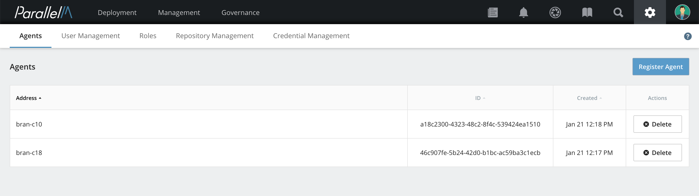

3.2 Agents
==========

An MCenter agent is attached to each running analytic engine, and the MCenter
server uses the agents to manage the engines. Each MCenter agent is
installed as a Docker container (see *Installation and Settings*).

The current version of MCenter contains an MCenter agent for Spark, Containers running Python or
R, and a simple local Process agent. Agents require
network communication with both the analytic engine and the MCenter
server.

How Agents Work with Standalone Engines
---------------------------------------

With standalone engines, an MCenter agent communicates with the *master*
node when available (e.g., for Spark), or launches and manages a
process within a Docker (for Python, R, and Java).

Agents communicate with analytic engines via interfaces supported by
those engines. As a result, analytic engines do not need to be modified
(i.e., you can use the analytic engines already in your environment or
install new ones obtained directly from their provider). You can specify analytic engine
settings (such as Spark configuration parameters) as
appropriate for your environment. Consult the documentation
available with each analytic engine for details.

How Agents Work with YARN
-------------------------

With resource managers such as YARN, an MCenter agent communicates with
the resource manager to launch analytic pipelines. MCenter supports
client-mode execution of these pipelines. When a new job (such
as a Spark job) needs to be submitted to YARN, an MCenter agent first
creates a local process and then launches the Spark driver. The launched
Spark driver then communicates with the YARN resource manager to create
Spark executors to run the ML pipeline.

As mentioned above, because analytic engines are not modified, you can use
the engines already in your environment or install new ones
obtained directly from their provider using the settings appropriate for
your environment.

How Agents Work with Containers
-------------------------------

MCenter supports running Python, Java, and R pipelines inside containers.
Currently only Docker containers are supported.
Note that not all components within a pipeline need be in the same language;
a single pipeline may include R components and Python components.
An MCenter agent can be configured to connect to a Docker server and
run a container. Once the container is running, the agent will deploy the
pipeline inside the container and will start running it. The
code running inside the container can use the MLOps
API to report statistics to the agent and perform queries. Once the
pipeline code terminates, the Docker container is removed. The Docker
server can be on any host with network connectivity to the agent.

If you need to install additional libraries or utilities in the Python Docker image
provided by ParallelM, please follow the instructions in [Updating the Python Docker](./python_docker.md).

How Agents Work with Local Processes
------------------------------------

In some cases, you may wish to run your ML pipelines as simple processes on a single machine.
By default, MCenter will run these processes within the MCenter agent Docker. If you wish to
run the process on raw agent machine itself (i.e., not within the agent Docker),
you will need to run a bare-metal version of the MCenter agent on the desired machine
(see [Installing MCenter Agent on Bare Metal](./2_4.md) for instructions). When launching these
pipelines, choose an execution environment configured to use the *OS* resource manager.

**Release Note:** In this release, only single-component pipelines are supported to run as local processes.

Installing and Configuring an Agent
-----------------------------------

The first step is to install an agent, including configuring the agent to attach analytic engines
(e.g., Spark) or resource manager (e.g., YARN). Instructions for installing an
agent are in the [Installation](./2.md) section.

Adding an Agent
---------------

After installing and configuring an agent, add it to the
MCenter server.

**1.** Log into MCenter as **admin**.

**2.** Click the gear-shaped **settings** icon on the top right. In
the menu that appears, select **Agents**.

**3.** Click **Register Agent**. On a system with no agents,
this button appears in the middle of the page. On a
system with one or more registered agents, it appears on the upper-right
portion of the page.

**4.** In the Register Agents window, type a valid hostname or IP address where an agent has already
been installed and started. Then click **Register**.

**5.** Register additional agents as needed by clicking **Add Another
Agent** and filling in the valid hostname or IP address for each.
When you are finished registering agents, click
**Register**.

The agents are now listed on the Agents page.
