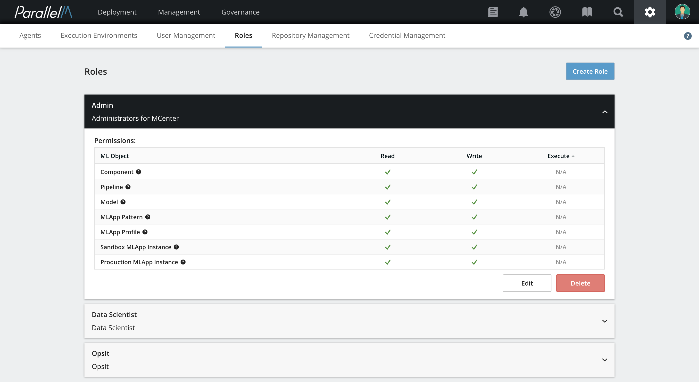
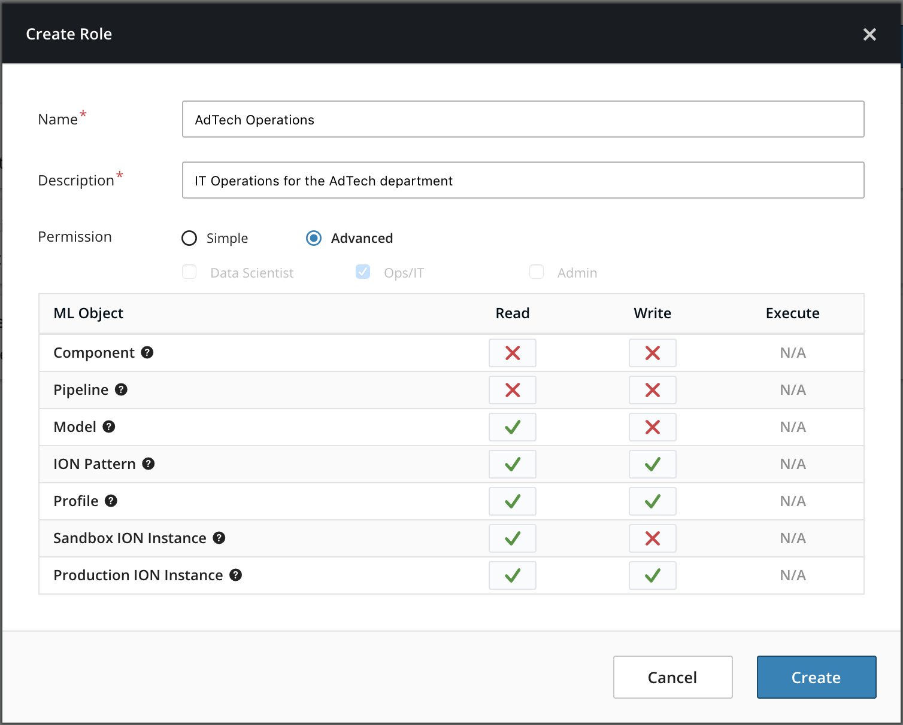
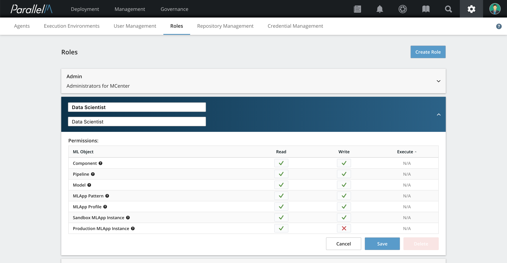

3.4 Role-Based Access Control
=============================

In this section, we discuss how to create roles in the MCenter platform
and assign permissions to each role.

**Note:** Only administrators (**admin** username) can
create, view, and modify roles.

Each permission set is defined via read, write, and execute (R-W-X) capabilities.
To aid in assigning permissions to the various operations possible in the
MCenter platform, you can assign the R-W-X permissions to *object types*,
which represent the top-level entities on which features are built.

Object Types
------------

The primary object types used to define role-based permissions are as
follows.

### Models

Any models produced by a running MLApp or uploaded into the system have
permissions attached to them for accessing, uploading, and deleting.
In addition, operations like introducing a new model to a running MLApp
or approving a model for use in an MLApp are also subject to rules on
this object type.

### Pipeline Components

Actions relating to creating, viewing, updating, or deleting pipeline
components are controlled via permissions assigned to this object type.
See [Uploading Components](./4_1.md) and [Repository Management](./4_2.md)
for more information on pipeline components.

### Pipeline Patterns

Actions relating to creating, viewing, updating, or deleting a pipeline pattern
are controlled via permissions assigned to this object type. Composing a
pipeline with components requires appropriate access to the component
being considered. See [Pipeline Builder](./4_3.md) for more information on pipeline patterns.

### MLApp Patterns

Actions relating to creating, viewing, updating, or deleting an MLApp pattern are
controlled via permissions assigned to this object type. Composing an
MLApp pattern with pipelines requires appropriate access to the pipeline
pattern being considered. See [MLApp Builder](./4_4.md) for more information on MLApp patterns.

### Profiles

Actions related to creating, viewing, updating, or deleting MLApp profiles
are controlled via permissions assigned to this object type. See the section
on [MLApp profiles](./4_5.md) for more details.

### Running MLApps in Production

An MLApp that has been deployed (launched) in production mode is
represented as an object in the MCenter system and has permissions
attached to it. Actions involving launching (creating this
running instance), terminating, or updating an MLApp are subject to
controls on this object type.

### Running MLApps in Sandbox

Similarly, MLApps deployed in sandbox mode are treated as a different
object in the MCenter system and they have assigned permissions similar to those for
production. More details on the sandbox environment are covered in the section
[Sandbox Launch](./4_6.md).

Permissions
-----------

All actions on the object types are controlled via read, write, and execute
(R-W-X) permissions. Every role in the MCenter system has R-W-X permissions on
each object type. Read permission on an object type (such as a model) enable a
user with the assigned role to observe or inspect the state of all objects of
that type. Write permission on an object type enable a user with the assigned
role to edit or launch the object.

**Release note:** For the current release, the execute (X) permission
is disabled in the UI.

Viewing Roles
-------------

To view roles, select the gear-shaped **settings** icon on the top right of MCenter
and select **Roles**.

The Roles page lists all of the roles created so far. Expanding each role shows the
permissions associated with each object type in the system.

Creating Roles
--------------

**1.** On the Roles page, click **Create Role**.

**2.** In the Create Role window, give the role a name and a
description.

**3.**  Select a permission mode:

- **Simple** mode has pre-defined permission sets designed to reflect common access
patterns for IT operations, data scientists, and administrators.

- **Advanced** mode has custom permission settings for the role.

**4.** Check the boxes for the type of permissions (Data Scientist, Ops/IT, Admin) for the role.

**5.** Click **Create**. The new role now appears in the list of roles.

Assigning Roles
-------------------

When creating or editing a user's profile, you can assign one or more roles
to the user. See the [Users](./3_1.md) section for more details on user management.

Updating Roles
------------------

You can update roles on the Roles page.

**1.** Expand the role and click **Edit**.

**2.** Change the role's name, description, and permissions, and then click **Save**.

Deleting Roles
------------------

You can delete roles on the Roles page.

**1.** Select the role and click
**Delete**. A window appears asking you to confirm the deletion.

**2.** Click **Delete**.
