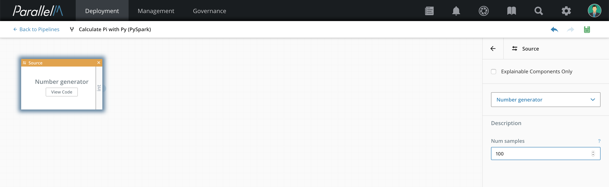
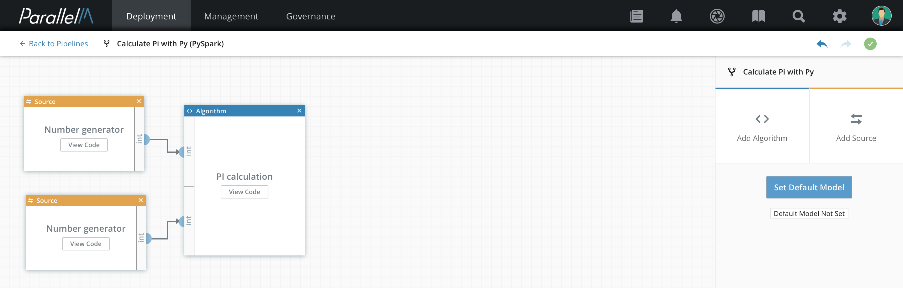

4.1 Uploading Components
========================

You can use the manual [component](./4.md#component) uploading feature to develop your own
component's source code in your own environment (Mac, laptop,
etc.). When the component is finished, you can pack it and upload it into MCenter. Then
you can use the uploaded component to build ML pipelines.

**Note:** The uploaded file must be local to your system, not just
accessible from YARN (that is, not prefixed with `file://` or
`hdfs://`).

The two modes for writing a component are *standalone* and *connectable*. The mode
determines how you can use the component when building a pipeline.

-   **Standalone** - The component is a standalone
    application. It must run as the only component within
    a pipeline because it does not implement the connection interface
    needed to connect to other components in the same pipeline.
    Use standalone mode if you have your own legacy
    code and do not want to adapt it to implement the connection
    interface.

-   **Connectable** - The component is designed to interact
    with other components by connecting its input/output to another
    component's corresponding output/input.

**Release Note:** At this time, the supported coding languages are PySpark for the Spark engine and Python and R,
which can be used in the Container engine.


Writing a Component
------------------------

### Standalone Component

With a standalone component, you can use your own legacy code with
minor code additions. First create a metadata file (`json`
format) to provide information about the component. Then
pack the component code files along with the metadata file into a tarred
or zipped file, and upload the packed file using the MCenter UI.

Each component has its [component type](./4.md#component) (algorithm, input source, etc.)
defined in its metadata file.

After the component is uploaded, you can
go to the Pipeline Builder and choose it from the **Select** box. The
component is then placed in the [Pipeline Builder](./4_3.md). Any component
parameters exposed via the metadata file are displayed in an editable form.

**Note:** In standalone mode, only one component can be used in the pipeline.

#### Manually Uploading a Component

**1.** Create a folder with the same name as the component.
This folder is supposed to contain all the associated component's files.

**Note:** Sub-folders are **not** supported,
so all files must reside within this folder.

**2.** Create a `component.json` file inside this folder
and fill in the relevant fields. For more information, refer to
the section describing [the component.json file](./4_1#component_json) later in this chapter.

**3.** Pack the folder as a tarred or zipped file using one of the
following (currently supported archives are tar, tar.gz, zip):

```> tar cf <comp-name>.tar <comp-dir>```

or

```> tar czf <comp-name>.tar.gz <comp-dir>```

or

```> zip -r <comp-name>.zip <comp-dir>```

**4.** In MCenter, click **Onboarding** in the navigation bar. In the row below that,
click **Components**, then click **Upload Component**.

**5.** In the Upload Pipeline Component window, click **Choose File** and browse to the packed file you just created.

**6.** When the component is uploaded, you can go to Pipelines tab and create a
pipeline with the uploaded component (see the [Pipeline Builder](./4_3.md) section
for details). The component is available in the Pipeline Builder palette
in the section that matches the component type specified in the
`component.json` file (source, algorithm, etc.).

**7.** When you add the component to your pipeline, fill in any
parameters exposed via the [`component.json` file](./4_1.md#component_json).



### Connectable Component <a name="connectable_component"></a>

Connectable components can
be connected to other components in a single pipeline. The source code
must implement the connection pattern, which is called by an
internal engine wrapper to execute the given code.

For more details on component source code's structure, refer to
the [Code Structure section under Repository Management](./4_2.md#code_structure).

You can upload the component source code to MCenter using one of the
following methods:

 * Manual uploading as described in [Uploading Components](./4_1.md)
 * Source control management as described in [Repository Management](./4_2.md)

When the component is uploaded, you can go to the [Pipeline Builder](./4_3.md)
and choose it from the palette.

You can connect multiple components in a single pipeline, subject to
their input/output definitions.

#### Types of Connectable Components

There are several supported types of connectable components,
each with a different coding signature that extends a different interface.
Some of these run in the PySpark engine: Spark Context, Spark Session, and Spark ML.
Others run in the Python engine: Python and R.

**_Spark Context_**

Spark context components extend the Spark context interface,
accessing the Spark context directly. These components can work with RDDs.

**Note:** This type of component is used with
Spark version 1.x and will become obsolete in the
future.

When the `SparkContextComponent` interface is extended, you
must implement the `_materialize` abstract function.
This function returns a list of RDDs or `None` if
nothing is returned.

Example:

```
from parallelm.components import SparkContextComponent


class ListToRdd(SparkContextComponent):
    def __init__(self, ml_engine):
        super(self.__class__, self).__init__(ml_engine)

    def _materialize(self, sc, parent_data_objs, user_data):
        num_samples = self._params['num_samples']
        rdd = sc.parallelize(range(num_samples))
        return [rdd]
```

Comments:

* The `__init__` function calls the parent's constructor as shown in the example.
* The `_materialize` function's arguments are:
    - `sc` - The Spark context
    - `parent_data_objs` - A list of parent data objects (e.g., RDDs)
    - `user_data` - Reserved for your private use. This argument is
      delivered to all of the components in the pipeline.
* The component's attributes values, delivered from the UI, can be
accessed from the `self._params` dictionary.


**_Spark Session_**

Spark session components extend the Spark session interface and work
with Spark version 2. The Spark session is the entry
point for the DataSet and DataFrame APIs.

When extending the `SparkSessionComponent` interface, you
must implement the `_materialize` abstract function. This
function returns a list of data objects or `None` if
nothing is returned.

Example:

```
from parallelm.components import SparkSessionComponent


class NumGen(SparkSessionComponent):
    def __init__(self, ml_engine):
        super(self.__class__, self).__init__(ml_engine)

    def _materialize(self, spark, parent_data_objs, user_data):
        num_samples = self._params['num_samples']
        df = spark.range(num_samples)
        return [df]
```

Comments:

* The `__init__` function calls the parent's constructor as show in the example.
* The `_materialize` function's arguments are as follows:
    - `spark` - The Spark session
    - `parent_data_objs` - A list of parent data objects (e.g., DataFrames)
    - `user_data` - Reserved for your private use. This argument is
      delivered to all of the components in the pipeline.
* The component's attributes values, delivered from the UI, can be
accessed from the `self._params` dictionary.

**_Spark ML pipeline_**

You can use the Spark ML pipeline component within a Spark ML
pipeline (refer to Spark documentation on
[ML Pipelines](https://spark.apache.org/docs/2.2.0/ml-pipeline.html)).

You can create two kinds of components, data and stage.

##### Data Component

The data component extends the `SparkDataComponent` interface,
so you must implement the `_dataframe`
abstract function. This function returns any derivative of the
Spark `DataFrame` class.

Example:

```
from parallelm.components import SparkDataComponent


class Csv2Df(SparkDataComponent):
    def __init__(self, ml_engine):
        super(self.__class__, self).__init__(ml_engine)

    def _dataframe(self, spark, user_data):
        filepath = self._params["filepath"]

        reader = spark.read.format("csv").option("inferSchema", "true")

        with_header = self._params.get("with_header", "true")
        reader.option("header", with_header)

        df = reader.load(filepath)
        self._logger.info("Loaded 'csv' converted to 'df': {}".format(df))
        return df
```


Comments:

* The `__init__` function calls the parent's constructor as shown in the example.
* The `__dataframe` function's arguments are as follows:
    - `spark` - The Spark session
    - `user_data` - Reserved for your private use. This argument is
      delivered to all of the components in the pipeline.
* The component's attributes values, delivered from the UI, can be
accessed from the `self._params` dictionary.


##### Stage Component

This component extends the `SparkStageComponent` interface,
so you must implement the `__stage`
abstract function. This function returns any derivative of
Spark ML `PipelineStage` class.

Example:

```
from pyspark.ml.feature import HashingTF
from parallelm.components import SparkStageComponent


class HashingTfStage(SparkStageComponent):
    def __init__(self, ml_engine):
        super(self.__class__, self).__init__(ml_engine)

    def _stage(self, spark, user_data):
        input_col = self._params['input-col']
        output_col = self._params['output-col']
        return HashingTF(inputCol=input_col, outputCol=output_col)
```

Comments:

* The `__init__` function calls the parent's constructor as shown in the example.
* The `_stage` function's arguments are as follows:
    - `spark` - The Spark session
    - `user_data` - Reserved for your private use. This argument is
      delivered to all of the components in the pipeline.
* The component attributes data values, delivered from the UI,
can be accessed from the `self._params` dictionary.

**_Python pipeline_**

Python code executes with the Python engine. To create a python component, implement a class
that inherits from the `ConnectableComponent` class. Use the following statement to import
the class:
`from parallelm.components import ConnectableComponent`

This class needs to implement the _materialize method with the following signature
`def _materialize(self, parent_data_objs, user_data):`
The `parent_data_obj` is a list of objects provided by parent components in the pipeline.
The code in `_materialize` can access the component parameters via the `self._params` dictionary
provided from the base class.

Example:

```
from parallelm.components import ConnectableComponent


class MyPythonAlgorithm(ConnectableComponent):

    def __init__(self, engine):
        super(self.__class__, self).__init__(engine)

    def _materialize(self, parent_data_objs, user_data):
        argument_1 = self._params.get("argument_1", "argument_1_default_value")
        argument_2 = self._params.get("argument_2", "argument_2_default_value")

        component_output_str = run_algorithm(argument_1, argument_2)
        return [component_output_str]

```
Comments:

* The `__init__` function should call the parent's constructor as shown in the example.
* The `_materialize` function's arguments are as follows:
    - `parent_data_objs` - A list of parent data objects (e.g., DataFrames, Strings)
    - `user_data` - Reserved for your private use. This argument is
      delivered to all of the components in the pipeline.
* The component's attribute values, delivered from the UI, can be
accessed from the `self._params` dictionary.
* The example above extract the argument_1 and argument_2 values from the self._params dictionary and passes them to
the run_algorithm function.
* The _materialize method should return a list of objects that will be used as the output of the component. In case
the component has output connections, these objects will be propagated to the next components in the pipeline.

**_R pipeline_**

Currently, R components are run within the Python engine. The R connectable component is similar to the
R standalone component except that it can access the component parameters and parent objects
via the `mlcomp` module (see example). The `mlcomp` module is also used to report the output objects of
the component. Note that R connectable components can be connected with Python components.


```
library("reticulate")

mlops <- import("parallelm.mlops", convert = TRUE)
mlops <- mlops$mlops
mlops$init()

mlcomp <- import("parallelm.components.external_component")
mlcomp <- mlcomp$mlcomp
params = mlcomp$get_params()
print(paste0("num_iter:    ", params["num_iter"]))
print(paste0("input_model: ", params["input_model"]))

parents_objs_list = mlcomp$get_parents_objs()
print(paste0("parents_objs_list lenght:", length(parents_objs_list)))
df1 = parents_objs_list[1]
str1 = parents_objs_list[2]

# Use mlops to export a statistic out of the R component
mlops$set_stat("r-code-starting", 1)

# R code running training or prediciton can be added here


# Set the output of this component to be a single string object
mlcomp$set_output_objs("s1", "s2")

# Call mlops$done just before the component is done
mlops$done()
```

Comments:

* The `reticulate` library is used to call Python code from R.
    - The `reticulate` library provides the mechanism to import Python modules.
    - The `convert = TRUE` argument to the import call indicates that an automatic conversion will be
     performed between Python and R data structures.
* The mlops module is imported and initialized.
    - `mlops$set_stats` and all other mlops methods are available, using the same API as Python.
* The mlcomp module is imported and initialized. This module provides access to the component-related data.
    - The `mlcomp$get_params` function is used to obtain the component parameters.
    - The `mlcomp$get_parents_obj` function is used to obtain the list of component inputs (parents info).
     Note that R starts array offsets at 1 while Python starts array offsets with 0.
    - The `mlcomp$set_output_objs` function is used to report the output(s) of the component.

#### Creating a Connectable Component

**1.** Within your application, create the main Python entry point file
with one of the signatures described in above in Types of Connectable
Components.

**2.** Make sure an `__init__.py` file exists in your application's
directory, as well as in any sub-folder for the application. Otherwise,
it fails to execute.

**3.** Follow the steps to upload a component to the MCenter, either
using manual component uploading or source control management.

**4.** You can use connectable components as part of a multi-component
pipeline.

   

Functionality and Behavior
--------------------------

-   Reloading the same component name triggers a pop up window,
    asking for override approval.

-   Errors are detected at two levels:

    -   When a component is uploaded, there is a preliminary validity
        check of the component's content. In case of a validity failure,
        an error is displayed on the screen.

    -   When a workflow is launched, a deeper check is performed by the
        relevant engine. In case of failure, the status column in the
        MCenter dashboard indicates the error. Clicking the
        failure indication shows the error details. In addition,
        from Data Science view in the UI, under the logs tab on the
        right pane, you can view the application log from the ML engine.

The component.json File<a name="component_json"></a>
-----------------------------------------------------

Here we show a `component.json` file template then describe each field.

### Sample

```
{
    "engineType": "<PySpark|Python>",
    "language": "Python",
    "userStandalone": <true|false>,
    "name": "<Component name>",
    "label": "<A label displayed in the UI>",
    "version": "<Component's version>",
    "group": "<Connectors|Sinks|FeatureEng|Algorithms|General|
               Flow Shaping|DataParser|DataGenerators|Statistics>",
    "program": "<The main script file name>",
    "componentClass": "<The main component class name>",
    "modelBehavior": "<ModelConsumer|ModelProducer|ModelProducerConsumer|Auxiliary>",
    "useMLOps": <true|false>,
    "inputInfo": [],
    "outputInfo": [],
    "arguments": [
        {
             "key": "<Unique argument key name>",
             "type": "int|long|float|str|bool",
             "label": "<A label that is displayed in the UI>",
             "description": "<Description>",
             "optional": <true|false>,
             "envVar": "<Environment variable to take value from>",
             "default" : <Default value to be set, if argument is not provided in a pipeline>
        }
    ]
 }
```

### Field Summary

| Field           | Description     | Standalone      | Connectable     |
|-----------------|-----------------|-----------------|-----------------|
| `engineType`     | Engine type that executes the component    | PySpark, Python | PySpark |
| `language`       | Programming language | PySpark, Python, R | PySpark, Python, R |
| `userStandalone` | Standalone or connectable | true (Optional) | false (Mandatory) |
| `name`           | Unique name     | Mandatory       | Mandatory       |
| `label`          | UI label        | Mandatory       | Mandatory       |
| `componentClass` | Main class | Not relevant    | Mandatory       |
| `modelBehavior` | ModelConsumer, ModelProducer, ModelProducerConsumer, or Auxiliary | Mandatory  | Mandatory |
| `useMLOps` | Uses MLOps module | Optional (default: false) | Optional (default: false) |
| `inputInfo`      | Description of data input path | Not relevant    | Optional (default: empty) |
| `outputInfo`     | Description of data output path | Not relevant    | Optional (default: empty)  |

### Field Descriptions

The *Field Summary* section provides summary information about each field. This section includes additional details and examples.

#### userStandalone

Specifies whether the given component is a standalone
component or connectable component. This is a mandatory field for
connectable components and optional for standalone components. If
omitted, its value is regarded as **true**.

-   **true** - The component cannot be connected to other components and
    corresponds to a single complete pipeline.

-   **false** - The component can be connected to other components,
    subject to the input and output types. Multiple components can be
    chained to form a single complete pipeline.

#### name

The component's name must be unique among all other components of the
same engine. The component's name must be the same as the directory name
that contains the component's files.

#### arguments
Descriptions of arguments expected by a component.
-   **key** - Unique argument key name.

-   **type** - The argument type, can be int|long|float|str|bool.

-   **label** - A label that is displayed in the UI.

-   **description** - Description.

-   **optional** - true|false.

-   **envVar** - Optional: Environment variable to take value from, if it is not set in pipeline.

-   **default** - Optional: This value will be used if argument is neither set in the pipeline nor read from an environment variable.

-   **tag** - Optional. Field is used only in components where [modelBehavior](./4_1.md#model_behavior) should be provided.

Example:
```
{
    "key": "argument_1",
    "type": "str",
    "label": "Argument 1>",
    "description": "<Argument is used to get vaue from environment variable>",
    "optional": false,
    "envVar": "ARGUMENT_ENV_VAR",
    "default": "Default argument value"
}
```
Value resolution order is: pipeline -> environment -> default value.
When this argument is processed, the system will try to fetch value from the pipeline. If an argument is not set in the pipeline,
the system will try read it from environment variable *ARGUMENT_ENV_VAR*. If this was not provided, the default value is used.

*envVar* and *default* fields are optional and not taken into account if not provided.


#### modelBehavior<a name="model_behavior"></a>

The component's behavior and definition, as follows:

-   **ModelConsumer** - The application is expected to read an ML model
    from a command-line argument. In the example below, the command-line
    argument to the application is `--input-model`. In addition,
    you must define a dedicated argument in the `component.json` file
    with a `tag` field with value `input_model_path`.

```
    "arguments": [ ...,
        {
            "key": "input-model",
            "label": "Model input file",
            "type": "str",
            "description": "File to use for loading model",
            "optional": false,
            "tag": "input_model_path"
        }, ...]
```

-   **ModelProducer** - The application is expected to save an ML model
    to a path provided by a command-line argument. In the example,
    the command-line argument to the application is
    `--output-model`. In addition, you must define a dedicated
    argument in the `component.json` file with a `tag` field with
    value `model_dir`.

```
    "arguments": [...,
        {
            "key": "output-model",
            "label": "Model output file",
            "type": "str",
            "description": "File to use for saving the trained model",
            "optional": false,
            "tag": "model_dir"
        }, ...]
```

-   **ModelProducerConsumer** - The combination of ModelProducer and
    ModelConsumer.

-   **Auxiliary** - Models are neither produced nor consumed by the
    application.

#### useMLOps

Indicates whether the application uses the `mlops` module to read and report statistics to MCenter.

#### inputInfo

Metadata description of the component's input for its data path.

Here is an example for two expected inputs.

```
"inputInfo": [
    {
        "description": "RDD of integers",
        "label": "int",
        "defaultComponent": "",
        "type": "org.apache.spark.rdd.RDD[int]",
        "group": "data"
    },
    {
        "description": "RDD of integers",
        "label": "int",
        "defaultComponent": "",
        "type": "org.apache.spark.rdd.RDD[int]",
        "group": "data"
   }],
```

The input can then be read with the following code snippet.

```
rdd1 = parent_data_objs[0]
rdd2 = parent_data_objs[1]
```

#### outputInfo

Metadata description of the component's output for its data path.

Here is an example for one output.

```
"outputInfo": [...,
    {
        "description": "RDD of integers",
        "label": "int",
        "defaultComponent": "",
        "type": "org.apache.spark.rdd.RDD[int]",
        "group": "data"
    }, ...],
```

The output can then be written with the following code snippet.

```
return [rdd]
```

## Handling Models in Uploaded Components

An uploaded component, be it standalone or connectable, may eventually produce or consume a model.
Typically, training components produce models, while inference pipelines consume models.
A user can specify this behavior using the `modelBehavior` field: the value of this field is "ModelProducer"
for components that create models and "ModelConsumer" for components that consume them.
To identify the component parameter that specifies the model path, this parameter
is marked with a `tag` field in the `arguments` section of the `component.json`. If the component
produces a model, the tag value for the model output parameter is "model_dir". If the component
consumes a model, the tag value is "input_model_path".
MCenter populates this field with a path, where it either writes a new model (for model producers)
or reads a new model (for model consumers).
It is important to note that this path is relative to the MCenter agent responsible for the
cluster running the uploaded component.

Depending on the nature of the execution engine (e.g., Spark on Yarn or Standalone Spark or Python in a
Container), the MCenter provided path may or may not be accessible by the uploaded code. For
example, a remote Spark executor may not have access to the MCenter path (which may be local to
the Docker running the MCenter agent). Thus, we recommend using a shared location to act as the
intermediate staging area for models. In the inference case, the uploaded code must copy the MCenter
path to the shared location before loading models. Similarly, during training, Spark executors must save
the model to the shared path and later explicitly copy the model to the MCenter path.
The MCenter MLOps library provides a helper routine to automate this process. For example, if the original code
to load the model was:

```
model_kmeans = PipelineModel.load(params.model_path)
```

With the help of the library, the code will look like the following:
```
model_kmeans = \
    SparkPipelineModelHelper()\
     .set_shared_context(spark_context=sc)\
     .set_local_path(local_path=params.model_path)\
     .set_shared_path_prefix(shared_path_prefix=params.temp_shared_path)\
     .load_sparkml_model()
```

The key elements to note here are:
1. `set_local_path` specifies the MCenter-provided path using this function.
2. `set_shared_path_prefix` specifies the shared path location using this function. The system will
create unique locations on this shared path as and when required.

Similarly, for saving models:
```
model_kmeans = \
    SparkPipelineModelHelper()\
     .set_shared_context(spark_context=sc)\
     .set_local_path(local_path=params.model_path)\
     .set_shared_path_prefix(shared_path_prefix=params.temp_shared_path)\
     .save_sparkml_model()
```

A more detailed description of the APIs can be found in the MLOps API guide.
## Examples

### PySpark Standalone Application

This example demonstrates the code and relevant `component.json` file for
a standalone component.

**`component.json`**

```
{
    "engineType": "PySpark",
    "language": "Python",
    "name": "my-standalone-app",
    "program": "main.py",
    "modelBehavior": "ModelProducer",
    "useMLOps": true,
    "inputInfo": [],
    "outputInfo": [],
    "group": "Algorithms",
    "arguments": [
        {
            "key": "argument1",
            "label": "Argument one",
            "type": "str",
            "description": "Any string argument (Mandatory)",
            "optional": false
        },
        {
            "key": "argument2",
            "label": "Argument two",
            "type": "int",
            "description": "Any integer argument (Optional)",
            "optional": true
        },
       {
            "key": "output-model",
            "label": "Model output file",
            "type": "str",
            "description": "File to use for saving the trained model",
            "optional": true,
            "tag": "model_dir"
       }
    ],
    "version": 1
}
```

**`main.py`**

```
import argparse
from pyspark import SparkContext
import sys

from parallelm.mlops import mlops
from parallelm.mlops.e2e_tests import predict_node

def parse_args():
    parser = argparse.ArgumentParser()
    parser.add_argument("--argument1", default="some string", help="Arg 1")
    parser.add_argument("--argument2", default=10, help="Arg 2")
    parser.add_argument("--output-model", help="Path to save the model")
    options = parser.parse_args()

    print("Command line arguments: " + str(sys.argv))

    return options

def main():
    sc = SparkContext(appName="My Standalone App")

    options = parse_args()

    mlops.init(sc)
    print("My MLApp Node id: {}".format(mlops.get_current_node().id))
    print("My MLApp Node name:{}".format(mlops.get_current_node().name))

    rdd = sc.parallelize([100, 200, 300, 400])
    fake_model = str(rdd.collect())
    print(fake_model)

    try:
        with open(options.output_model, "w") as f:
            f.write(fake_model)
    finally:
        sc.stop()
        mlops.done()

if __name__ == "__main__":
    main()
```

### PySpark Connectable Pi Application

This example shows the complete code for a connectable component.

The two components are a number generator and a pi
calculator. Upload each component separately. When uploaded,
you can use the Pipeline Builder to connect them to form a pipeline.
Code for this example is provided in the examples directory
of your installation.

#### Number Generator Component

**`component.json`**

```
{
    "engineType": "PySpark",
    "language": "Python",
    "userStandalone": false,
    "name": "num_gen",
    "label": "Number generator (DataFrame)",
    "version": "1.0.0",
    "group": "Connectors",
    "program": "num_gen.py",
    "componentClass": "NumGen",
    "useMLOps": false,
    "inputInfo": [],
    "outputInfo": [
        {
            "description": "DataFrame['x', 'y']",
            "label": "[int, int]",
            "defaultComponent": "",
            "type": "DataFrame[Row(int, int)]",
            "group": "data"
        }
    ],
    "arguments": [
        {
            "key": "num_samples",
            "type": "int",
            "label": "Num samples",
            "description": "Num samples",
            "optional": true
        }
    ]
}
```

**`num_gen.py`**

```
import numpy as np
from pyspark.sql import Row

from parallelm.components import SparkSessionComponent


class NumGen(SparkSessionComponent):
    num_samples = 0

    def __init__(self, ml_engine):
        super(self.__class__, self).__init__(ml_engine)

    def _materialize(self, spark, parent_data_objs, user_data):
        num_samples = self._params['num_samples']
        self._logger.info("Num samples: {}".format(num_samples))

        sc = spark.sparkContext

        np_rand = np.random.random
        df = spark.createDataFrame(sc.parallelize([0] * num_samples).map(lambda n: Row(x=np_rand(), y=np_rand())))
        return [df]
```

#### Pi Calculator Component

**`component.json`**

```
{
    "engineType": "PySpark",
    "language": "Python",
    "userStandalone": false,
    "name": "pi_calc",
    "label": "PI calculation",
    "version": "1.0.0",
    "group": "Algorithms",
    "program": "pi_calc.py",
    "componentClass": "PiCalc",
    "modelBehavior": "ModelProducer",
    "useMLOps": true,
    "inputInfo": [
        {
            "description": "DataFrame['x', 'y']s",
            "label": "[int, int]",
            "defaultComponent": "",
            "type": "DataFrame[Row(int, int)]",
            "group": "data"
        },
        {
            "description": "DataFrame['x', 'y']",
            "label": "[int, int]",
            "defaultComponent": "",
            "type": "DataFrame[Row(int, int)]",
            "group": "data"
        }
    ],
    "outputInfo": [
    ],
    "arguments": [
        {
            "key": "output-model",
            "label": "Model output file",
            "type": "str",
            "description": "File to use for saving the trained model",
            "optional": true,
            "tag": "model_dir"
        }
    ]
}
```

**`pi_calc.py`**

```
from parallelm.components import SparkContextComponent


class PiCalc(SparkContextComponent):
    def __init__(self, ml_engine):
        super(self.__class__, self).__init__(ml_engine)

    def _materialize(self, sc, parent_data_objs, user_data):
        if not parent_data_objs:
            self._logger.error("Received an empty RDD input!")
            return

        rdd1 = parent_data_objs[0]
        num_samples1 = rdd1.count()

        rdd2 = parent_data_objs[1]
        num_samples2 = rdd2.count()

        total_samples = num_samples1 + num_samples2
        self._logger.info("Total num samples in RDDs: {}".format(total_samples))

        count1 = rdd1.filter(PiCalc._inside).count()
        count2 = rdd2.filter(PiCalc._inside).count()
        total_samples_inside = count1 + count2

        result = 4.0 * total_samples_inside / total_samples
        print("Pi is roughly {}".format(result))

        self._logger.info("Output model: {}".format(self._params['output-model']))
        with open(self._params['output-model'], "w") as f:
            f.write("Pi is: {}".format(result))


    @staticmethod
    def _inside(t):
        x, y = t[0], t[1]
        return x * x + y * y < 1
```

### Python Connectable Component

The following example is a connectable Python component. Note that the example class
`Multiplier` inherits from the `ConnectableComponent` class.

```
class Multiplier(ConnectableComponent):
    def __init__(self, engine):
        super(self.__class__, self).__init__(engine)

    def _materialize(self, parent_data_objs, user_data):
        matrix = parent_data_objs[0]
        multiply_by = self._params['multiply_by']

        self._logger.info("Original matrix:\n{}".format(matrix[:3, :3]))

        multiplied_matrix = np.multiply(matrix, multiply_by)

        self._logger.info("Multiplied matrix (by: {}):\n{}".format(multiply_by, multiplied_matrix[:3, :3]))

        return [multiplied_matrix]
```

### R Standalone Application

The following code snippet demonstrates how to use the MLOps API from within an R
program.


```
        # Required for reticulate to work properly
        # Required to avoid MKL error when using reticulate
        Sys.setenv(MKL_THREADING_LAYER = "GNU")

        # The reticulate library is required prior to running R
        # It should be pre-installed inside the container
        library("reticulate")

        # Import mlops
        mlops <- import("parallelm.mlops", convert = TRUE)
        mlops <- mlops$mlops

        # Initialize mlops
        mlops$init()

        # Report a statistic
        mlops$set_stat("my-stat", 55.6)

        # Close mlops
        mlops$done()
```

### R Connectable Component

The following code snippet demonstrates how to use the ML components library (`mlcomp`) within an R
program to implement the connectable components interface needed for the component to be connected
to other components in a pipeline. To use the MLOps API within the connectable component, use the
same convention as shown in the standalone R example above.


```
        # Import the mlcomp module
        mlcomp <- import("parallelm.components.external_component")
        mlcomp <- mlcomp$mlcomp

        # Get the component parameters
        params = mlcomp$get_params()
        print(paste0("num_iter:   ", params["num_iter"]))
        print(paste0("model_file: ", params["output_model"]))

        # Get the component parent objects
        parents_objs_list = mlcomp$get_parents_objs()
        print(paste0("parents_objs_list lenght:", length(parents_objs_list)))

        # Access the parent objects - note R is using 1-based indexing
        df1 = parents_objs_list[1]
        str1 = parents_objs_list[2]

        # Report the component output objects. Provide a comma-separated
        # list of objects if the component has more then one output object
        mlcomp$set_output_objs("s3:my-output-file-with-data")
```

### RESTful Model Serving

RESTful model serving enables you to create a consumer pipeline
with RESTful endpoints for predictions.

The sample pipeline below is built from a single RESTful component that
takes parameters for the RESTful endpoint paths along with their entry point
functions, as well as a model upload callback function that can be
called while the program runs.


#### Simple RESTful Example

**`component.json`**


```
{
  "engineType": "Python",
  "userStandalone": false,
  "language": "Python",
  "name": "simple_restful_serving",
  "label": "Simple RESTful serving",
  "program": "simple_restful_serving.py",
  "modelBehavior": "ModelConsumer",
  "componentClass": "SimpleRESTfulServing",
  "group": "Connectors",
  "useMLOps": true,
  "inputInfo": [],
  "outputInfo": [],
  "arguments": [
    {
      "key": "port",
      "label": "Public IP port",
      "type": "int",
      "description": "The IP port that is used for the REST endpoint",
      "optional": false,
      "tag": "public_port"
    },
    { "key": "input-model-path",
      "label": "Model input file",
      "type": "str",
      "description": "The model file path",
      "optional": true,
      "tag": "input_model_path"
    }
    { "key": "log_level",
      "label": "Logging level [Default: 'info']",
      "type": "str",
      "description": "One of: 'noset', 'debug', 'info', 'warning', 'error', 'critical'",
      "optional": true
    },
    { "key": "log_format",
      "label": "Logging format",
      "type": "str",
      "description": "Default: %(asctime)-15s %(levelname)s [%(module)s:%(lineno)d]:  %(message)s",
      "optional": true

    },
    {
      "key": "uwsgi_disable_logging",
      "label": "Disable uWSGI request logging [Default: True]",
      "type": "bool",
      "description": "Disable uWSGI request logging",
      "optional": true
    }
  ],
  "version": 1
}
```

**Notes:**

* ```"engineType": "Python"``` - the pipeline is executed inside a
container

* ```"userStandalone": false``` - the component is connectable and not
standalone

* ```"modelBehavior": "ModelConsumer"``` - the component must be marked
as a model consumer

* The component's arguments provided in this example are consumed by
the parent component of the given component `RESTfulComponent`.

* The `port` argument is the public port that the REST server will
listen on. It is mapped from the docker's internal network to the host
machine. This key must be tagged as such:
```"tag": "public_port"```

* The input model path must be defined for any consumer and
be tagged as such:
```"tag": "input_model_path"```

* The log level and log format enables the user to control the logging
output. The logger should be accessed by:
```self._logger.<func-level>``` (e.g. ```self._logger.info(...)```)

* The `uwsgi_disable_logging` key is used for debugging and enables
you to printout information about incoming REST queries.


**`simple_restful_serving.py`**

```python
import logging
from parallelm.components.restful.flask_route import FlaskRoute
from parallelm.components.restful_component import RESTfulComponent


class SimpleRESTfulServing(RESTfulComponent):
    def __init__(self, engine):
        super(SimpleRESTfulServing, self).__init__(engine)
        self._last_model = None
        self._content = None
        self._counter = 0

    def post_fork_callback(self):
        pass

    def configure_callback(self):
        self._logger.info("Component arguments: {}".format(self._params))

    def load_model_callback(self, model_path, stream, version):
        self._logger.info("Model is reloading, path: {}".format(model_path))
        self._last_model = model_path

        with open(model_path, 'r') as f:
            self._content = f.read()

    @FlaskRoute('/v1/predict')
    def predict_v1(self, url_params, form_params):
        if self._logger.isEnabledFor(logging.DEBUG):
            self._logger.debug("predict_v1")
        status_code = 200
        return (status_code, self._build_response('jon2', 44, url_params))

    @FlaskRoute('/v2/predict')
    def predict_v2(self, url_params, form_params):
        if self._logger.isEnabledFor(logging.DEBUG):
            self._logger.debug("predict_v2")
        status_code = 200
        return (status_code, self._build_response('jon2', 64, url_params))

    @FlaskRoute('/v1/predict-raw', raw=True)
    def predict_raw(self, query_string, body_data:
        prediction = ...
        status_code = 200
        return (status_code, '{{"prediction":{}}}'.format(prediction))

    @FlaskRoute('/exception')
    def predic_exception(self, url_params, form_params):
        raise Exception("This is a dummy exception from the MLApp!")

    def cleanup_callback(self):
        pass

    def _build_response(self, user, age, params):
        self._counter += 1
        return {
            'user': user,
            'age': age,
            'last_model': self._last_model,
            'content': self._content,
            'counter': self._counter,
            'params': params
        }


if __name__ == '__main__':
    SimpleRESTfulServing.run(9999, '/tmp/dummy-model.txt')
```


**Notes:**

* The RESTful component must extend the base RESTful parent
component `RESTfulComponent`.

* There are 4 overridable functions; one is mandatory and the others
are optional:

    * `def post_fork_callback(self)` (***Optional***) enables you to take
    an action when a new process is forked. Please note that a copy-on-write
    technique is used and therefore heavy writes at this point might
    result in cache misses and reduction in performance.
    * `def configure_callback(self)` (***Optional***) enables you to read
    configuration arguments that were set by the UI. The configuration
    parameters can be accessed via `self._params`, which is a dictionary
    that contains all the configured arguments for this component.
    * `def load_model_callback(self, model_path, stream, version)` (***Mandatory***)
    is a callback function that is called in two different phases: **on startup** and
    **on the fly** whenever a new approved model is detected. The function arguments
    are as follows:

        * `model_path` - the model file path in the local file system
        * `stream` & `version` - reserved for future usage
        (Default: `None`)

        Your component code is responsible for reading the model's data
        from the provided path and keeping it in memory.

    * `def cleanup_callback(self)` (***Optional***) enables you to take
    a cleanup action when the current process is killed.

* A dedicated decorator (```@FlaskRoute```) is used to specify the REST endpoint path and
its entry point function:

    * The decorated function is called whenever a
    REST query is received with the path specified in the decorator.

    * This function must be declared with two input arguments (their
    type is dependent on an additional attribute to the decorator - `raw`):

        * `url_params` - a dictionary that holds the url path parameters.
        * `form_params` - a dictionary that holds request body parameters.

        In case the `raw` attribute is set in the decorator, that is
        `$FlaskRoute(..., raw=True)` then the corresponding arguments are:

        * `query_string` - a string that holds the url path parameters.
        * `body_data` - a byte array that holds the raw body data.

    * The returned value from the function should be a tuple of two
    elements: the status code (integer) and the response body. The
    response body can be either a dictionary or a valid json string.
    If it is a dictionary, it will be converted to a json string by
    the framework.

    * A given component can support more than one REST endpoint.

    * An exception in one of the REST endpoints results in an error
    response to the caller but does not crash the application.

    * The given decorator can have any desired attributes that Flask route
    decorator (http://flask.pocoo.org/docs/1.0/api/#flask.Flask.route) accepts.

* You can test and debug your component outside the MCenter system
by calling the class method `run`, from the main execution block:

            if __name__ == '__main__':
                SimpleRESTfulServing.run(port=9999, model_path='/tmp/dummy-model.txt')


    * The rest server will listen on the **localhost** interface, on the
    given port.
    * The model file should reside on the local file system.
    * To execute:

        ```PYTHONPATH=comp-1.0-py2.7.egg python simple_restful_serving.py```

    * Once it is executed, the user can issue REST queries to
    ```localhost:<port>```:

        ```
        curl -s -G http://localhsot:9999/v1/predict -d '{"key1":"value1","key2":"value2"}'
        ```
