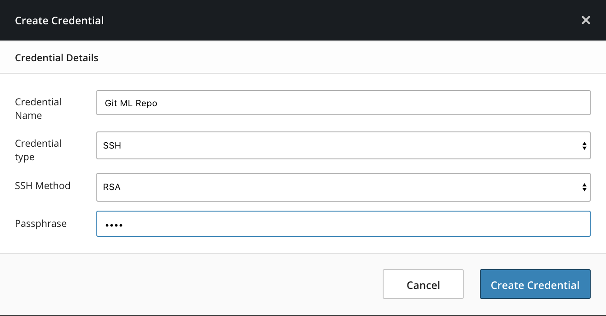
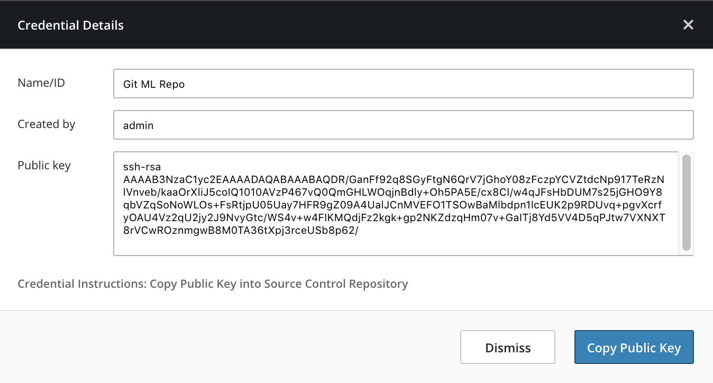
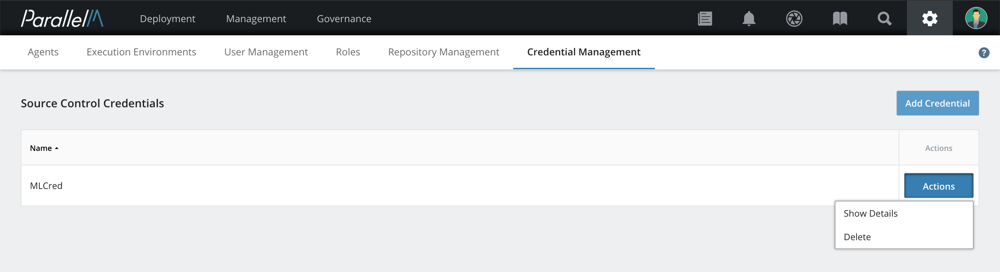
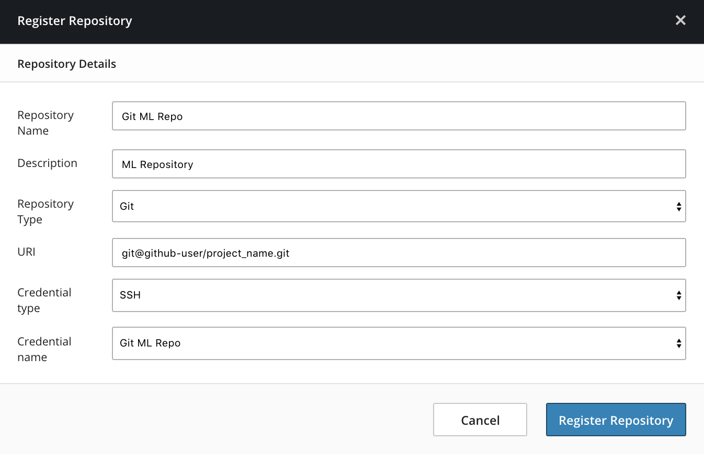
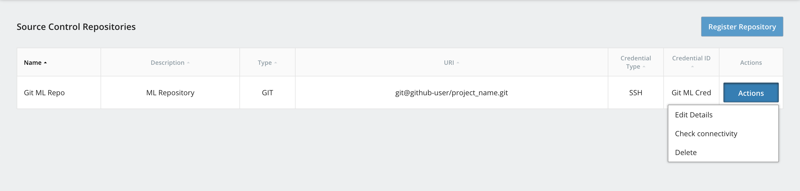

4.2 Repository Management
=========================

In MCenter, you can build [pipeline components](./4.md#component) from code in source
control repositories. You can develop your own components and check the
code into your repository. Then you can use the components in [pipelines](./4.md#pipeline),
and use those pipelines in MLApps.

Code Structure
--------------

You can structure code from repositories into components in two ways:

- **Multiple components in a single directory** - Put multiple components
in a single directory, where each has its own metadata description file (`json` format).
All component metadata description files must reside in the root directory. For
more details, see [Multiple Components in a Single Directory](./4_2.md#mcsd) later in this document.

- **Single component in a dedicated directory** - All of the code for a given
component resides in a single directory that also contains a `component.json`
file describing the component metadata. This option is also described in the
section [Uploading Components](./4_1.md).

Creating a Credential
---------------------

To register a repository for use, first ensure you can use a credential to
access the repository. If an appropriate credential is not already
present, create one using the following steps:

**1.** Click the gear-shaped **settings** icon in the navigation
bar, then select **Repository Credentials**.

**2.** On the Source Control Credentials page, click **Create
Credential**. The Create Credential window opens.

**3.** Fill in these fields:

-   **Credential Name** - Give a unique and memorable name to the
    credential.

-   **Credential Type** - Select the type of credential. Currently only
    SSH is supported.

-   **SSH Method** - Select the encryption method to be used to create
    this credential. RSA and DSA are supported.

-   **Passphrase** - (Optional) Type in a passphrase to use with
    this credential.

**4.** Click **Create Credential**.

A success message appears, and a dialog opens showing details
about this credential.

You can access these details later by clicking **Actions** to the right
of the credential and selecting **Show Details**.

**5.** Install the new credential's public key in the repository so
MCenter can access the repository. You can copy the public key from the
Details page to the clipboard by clicking **Copy Public Key**.
Follow the directions for installing a credentials public key
for your repository.

Registering a Repository
------------------------

After a credential is installed in the repository, you can register
the repository. Registration lets MCenter know that the repository is available
for use.

**1.** In the navigation bar, click the gear-shaped **settings** icon,
then select **Source Repositories**.

**2.** On the Source Control Repositories page, click **Register
Repository**.

The Register Repository window opens.

**3.** In the Register Repository window, fill in the following
information:

-   **Repository Name** - Enter a name for the repository. This can be
 any meaningful string.

-   **Description** - Enter an optional description of the repository.

-   **Repository Type** - Enter the type or the repository. Currently
 only Git repositories are supported.

-   **URI** - Enter the URI of the repository. For example, a GitHub
    repository's URI would look like:

   `git@github.com:<github-user>/<repo-name>.git`

-   **Credential type** - Enter the type of the credential to be used to
 access this repository. Currently only SSH credentials are
 supported.

-   **Credential name** - Select the name of the credential to be used to
 access this repository.

When you have finished, click **Register Repository** to make the
repository known to MCenter. The repository now appears in the Source
Control Repositories list.

After a repository is registered, you can register for use
components maintained within the repository. In the navigation bar, click **Onboarding**.
In the row below that,
click **Components**, then click **Register Remote Component**.
See the [Pipeline Builder](./4_3.md) section for details.

Managing Registered Repositories
--------------------------------

To view the list of repositories, select the
gear-shaped **settings** icon in the navigation bar, then select **Source Repositories**. The Source Control
Repositories page opens, displaying a table of information about all of the
repositories. To edit, delete, or check connectivity for a specific repository, click **Actions** to the right of that repository.

### Editing Repository Details

To change details about a repository:

**1.** To the right of the repository that you want to change, click
**Actions**. From the drop-down menu, select **Edit Details**. The Edit
Repository Details window opens.

**2.** You can change the following information:

-   **Repository Name** - The name of the repository. This can be any
 meaningful string.

-   **Description** - An optional description of the repository.

-   **Repository Type** - The type of repository. Currently only Git
 repositories are supported.

-   **URI** - The URI of the repository. For example, a GitHub
 repository's URI would look like this:

    `git@github.com:<github-user>/<repo-name>.git`

-   **Credential type** - The type of credential used to access
 this repository. Currently only SSH credentials are supported.

-   **Credential name** - The name of the credential used to access
 this repository.

When you have finished editing, click **Save Changes**.

### Checking Repository Connectivity

To make sure that MCenter can communicate with a repository, to the right of
the repository you want to check, click **Actions**, then select **Check Connectivity**.

This operation verifies that the repository is accessible by the
network, and that the credentials allows access.

**Note:** This operation takes a short time to complete.

### Removing a Repository

To remove a repository from the list of registered repositories in
MCenter:

**1.** To the right of the repository you want to change, click
**Actions**, then select **Delete**.

**2.** In the Confirm Delete window, click **Delete**.

This removes the repository's registration from MCenter, but it does not
delete the actual repository.

**Note:** Avoid using `localhost` as the server address in your environment
variables. Instead, use the node IP address.

Multiple Components in a Single Directory 
------------------------------------------------------------------------------

Multiple components can reside in a single directory. This
reduces the burden of maintaining a unique directory for each component and
enables code sharing between components.

To get information for how to write a connectable component
refer to the sub-section [Connectable Component](./4_1.md#connectable_component)
in the [Uploading Components](./4_1.md) section.

### Requirements

* The component metadata description file must reside in the top root directory.
* All of the code that is used by the given component must reside under the root
directory in any desired folder hierarchy.

### Creating the Components

**1.** Choose a directory to use as the root directory for the components.

**2.** For each component, create a metadata description file (`json` format), using a unique
name to identify that component.

**3.** Fill in the component metadata as described in the section
[The component.json File](./4_1.md#component_json),
but with the following modifications:

  * `name` - The component's name does not need to be the same as the
             root directory's name.

  * (Optional) There are two new component attributes that you can use:

    * `includeGlobPatterns` - A sequence of `glob` patterns, separated by the pipe (`|`) character.
             For detailed information refer to [Glob Patterns](https://docs.oracle.com/javase/7/docs/api/java/nio/file/FileSystem.html#getPathMatcher(java.lang.String)).
             Each file and directory under the root directory that matches the pattern is included.

             Examples:
                - `includeGlobPatterns": "num_gen* | __init__.py`
                - `includeGlobPatterns": "num_gen*.* | common/*.* | common/**/*.* | __init__.py`

    * `excludeGlobPatterns` - A sequence of `glob` patterns, separated by the pipe (`|`) character.
             For detailed information refer to [Glob Patterns](https://docs.oracle.com/javase/7/docs/api/java/nio/file/FileSystem.html#getPathMatcher(java.lang.String)).
             Each file and directory under the root directory that matches the pattern is excluded.
             **Note:** Exclusion patterns take precedence over inclusion patterns.

             Examples:
                - `excludeGlobPatterns": "*.jar | **/*.jar`
                - `excludeGlobPatterns": "pi_calc* | com*`

    **Note:** If none of these attributes are found in the component metadata
    file, then all of the files under the root directory are included by the
    given component.

Registering a Remote Component
---------------------------

To register a component from source control:

**1.** In the navigation bar, **click Onboarding**. In the row below that,
click **Components**, then click **Register Remote Component**.

**2.** Select the remote repository from the drop-down menu. If no repository exists,
follow the instructions in the section [Registering a Repository](./4_2.md#register_repository).

**3.** Fill in the relative path of the component's root directory (relative to the repository's root directory).

**4.** Fill in a specific component's metadata file name. This file must reside under the
components root directory. If the **Description File** field is left empty, MCenter looks for
a default `component.json` file.

**5.** Fill in the branch name, which must be a valid branch in the repository.
The component's source code is checked out from that branch.

**6.** Click **Register** to load the component into MCenter.
