4.3 Pipeline Builder
=====================

In this section, we show how to use the Pipeline Builder. We demonstrate
the concepts and capabilities of the Pipeline Builder by stepping
through an example pipeline construction.

General Instructions
--------------------

To illustrate composing a pipeline, we show how to create a Spark
Batch pipeline for linear regression.

To build the pipeline, create an empty pipeline, add components to it, connect
the components together, and then save the pipeline for future use in constructing MLApps.

### Creating a Pipeline

**1.** In the top menu bar, click **Onboarding**. In the row below that,
click **Pipeline**. The Pipeline Builder screen opens.

**2.** Click **Create Pipeline**.

The Create Pipeline window opens.

**3.** In the Create Pipeline window, name the pipeline and select the engine type on which your
pipeline will run. In this example, we use the Spark engine type.

**4.** Click **Create Pipeline**. The Pipeline Builder screen opens.

The annotated illustration below shows the following areas of the Pipeline Builder:

1) The Pipeline Builder workspace, where you add,
drag, and connect pipeline components.

2) The component selector palette, where you choose the
different components to add to your pipeline. Components are grouped by type.

3) The model selection area.

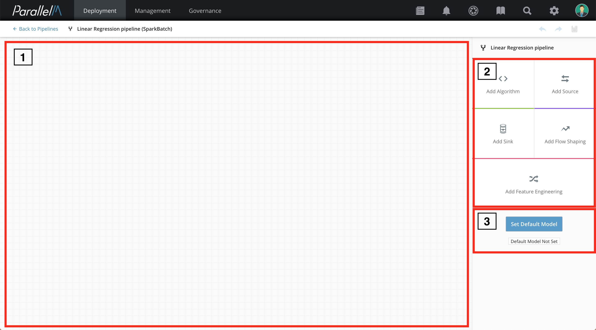

At the top right of the Pipeline Builder screen are undo, redo, and save icons.

### Adding Components to the Pipeline

**5.** Add a component to the pipeline by selecting the component group
type from the palette. For example, if you click **Add Source**, a source
component appears in the Pipeline Builder workspace.

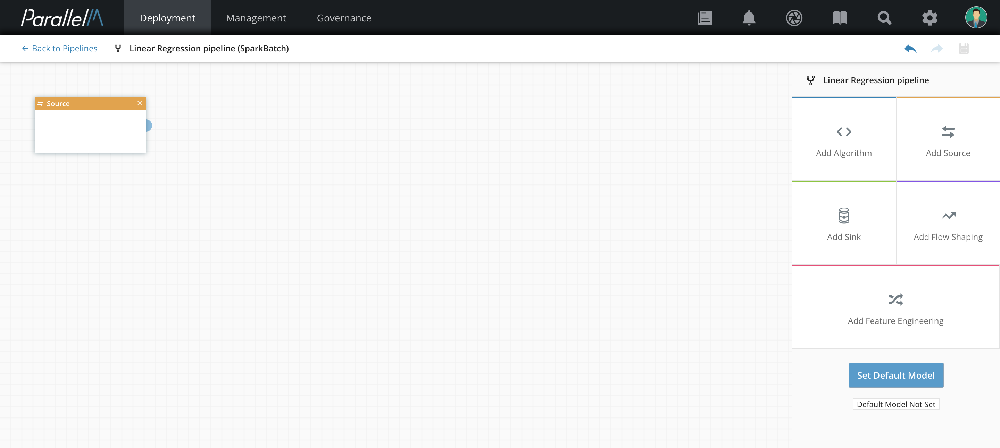

**6.** Specify the component type by selecting the newly created component
node in the Pipeline Builder workspace. The palette changes to a
selection menu for that component's group type.

**7.** Choose a component type from the selection menu. In
this example, we select **CSV to Dataframe** as the input type.

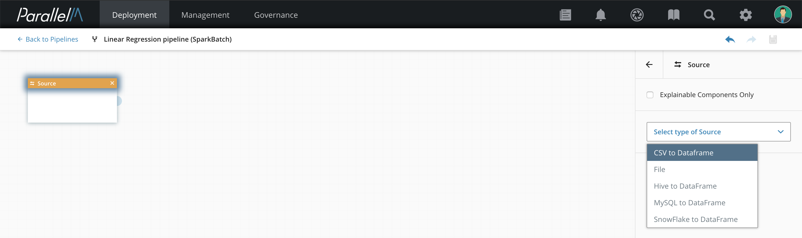

**8.** When you choose the component type, a list of parameters
appears. Fill in the component parameters. Required parameters are marked with
an asterisk. You can use the defaults for the other parameters.

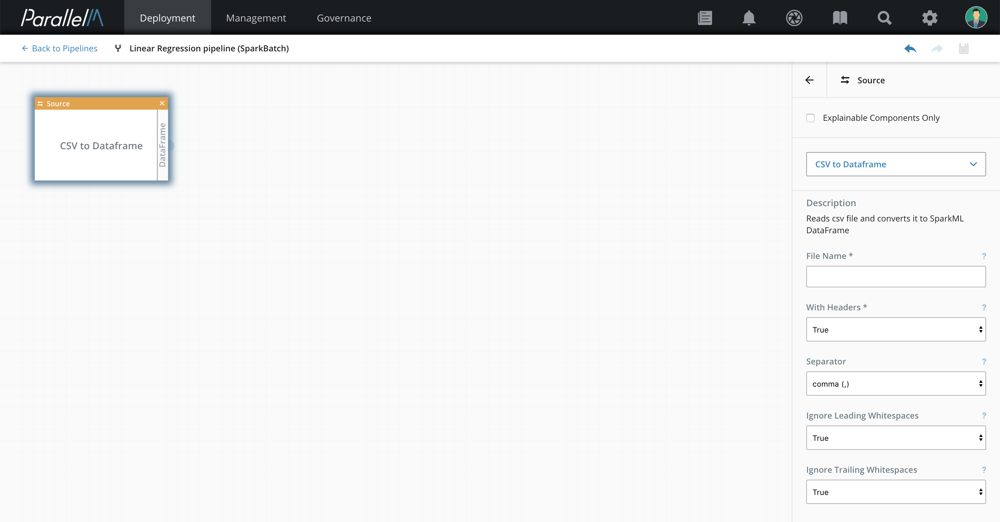

**9.** When you are done editing the parameters, click the back arrow
to continue editing the pipeline.

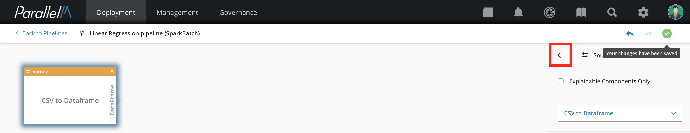

**10.** To add another component, select the Pipeline Builder workspace.
The component selector palette appears on the right side of the
screen. In this example, we add a feature engineering component,
which then appears in the Pipeline Builder workspace.

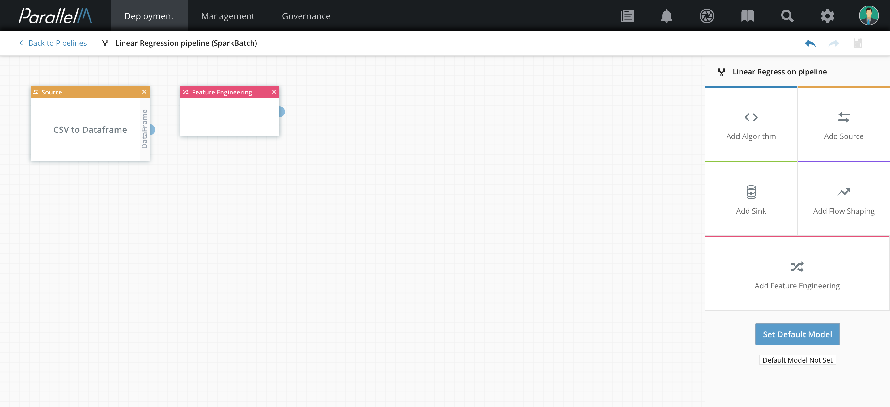

**11.** When you select the new feature engineering component in the
Pipeline Builder workspace, a menu of feature engineering
components appears. In this example, we choose the **Vector assembler** component.

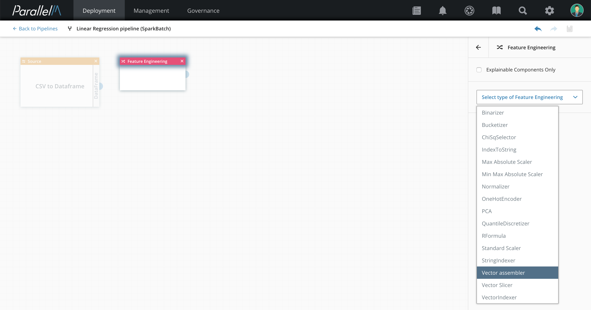

**12.** When you choose the component, the component's parameter list
appears. In this example, we type in the value "features" for the
required **Output Column** parameter.

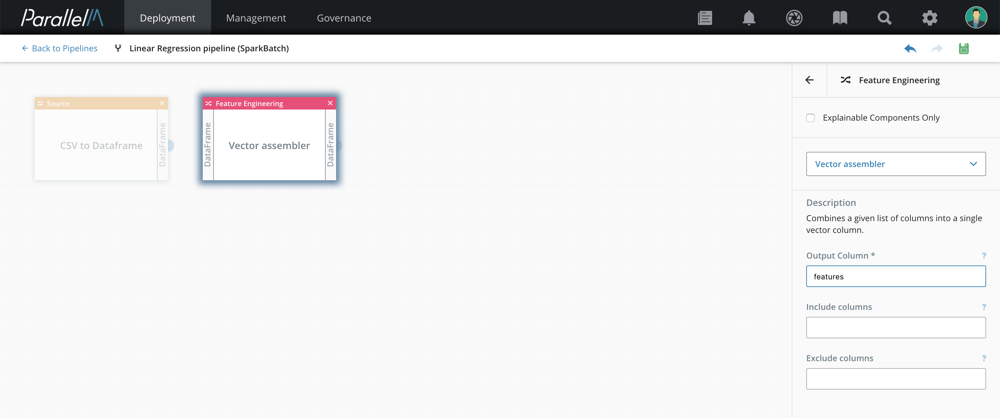

**13.** When you are done editing the parameters, click the back arrow
to continue editing the pipeline.

**14.** To add an algorithm to the pipeline, click **Add Algorithm**.
The new algorithm component appears in the Pipeline Builder workspace.

**15.** Select the new algorithm component box and a
menu of algorithms appears. In this case, we choose **Linear Regression**.

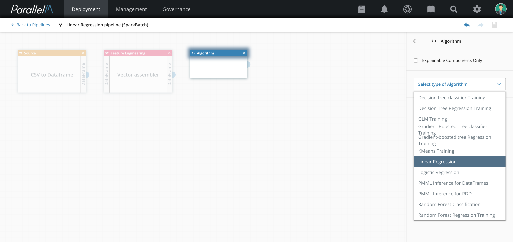

**16.** Again, after choosing a specific component, its parameter list
appears. In this case, we keep the default values. In particular, note
that the default value for **Features Column** is "features." This
matches the output column name produced by the vector assembler in
the previous pipeline stage.

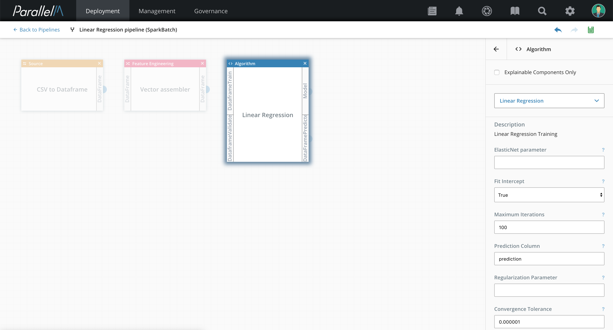

**17.** Click the back arrow to continue editing the pipeline.

### Connecting the Components

**18.** Connect the components by selecting the output
connector (small blue half circle) of the **CSV to Dataframe** component
and connecting it to the **Vector assembler**. Similarly, connect the
output connector of the **Vector assembler** to the **Linear
Regression** component. When components are connected, the output of the
first component is the input to the second component.

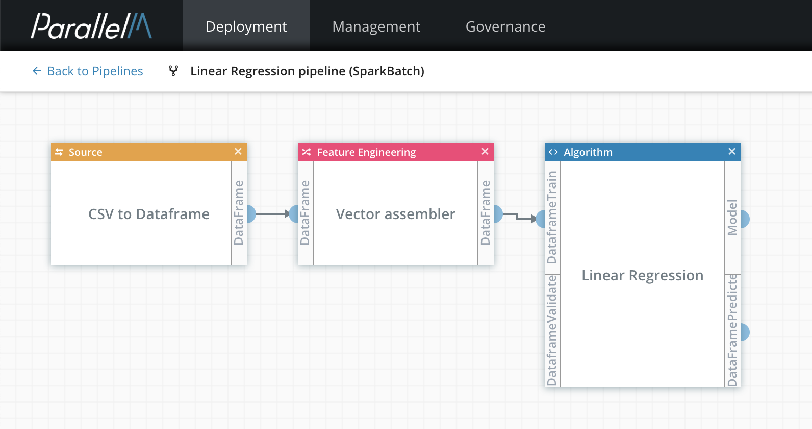

### Saving the Pipeline

**19.** When you finish editing the pipeline, click the save icon (top right of the screen).
The icon becomes a green checkmark to indicate that all changes are saved.

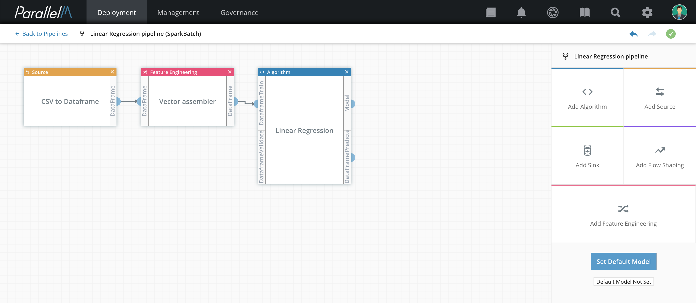

The new pipeline is now listed as one of the pipelines available to
build MLApps. To view this list, select **Onboarding** in the navigation  bar, then select **Pipelines**.

### Pipeline Actions

From the Pipelines view, click **Actions** to the right of a pipeline to **Rename**, **Copy**, **Delete**, or **Download** it.
If you select **Download**, a **JSON** version of the pipeline is downloaded to
your machine.

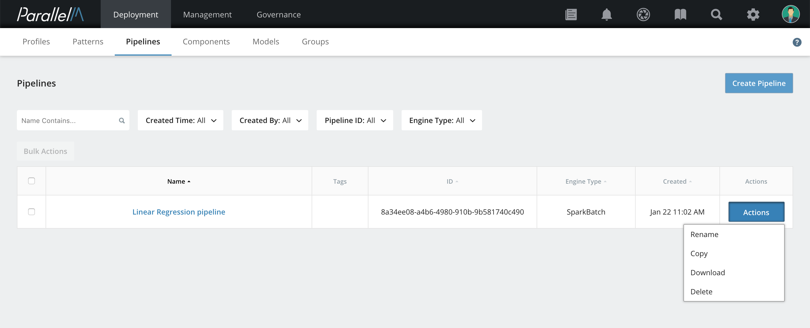

Pipelines for Legacy Components
-------------------------------

Legacy components (that is, components that do not contain connector
code) must be single-component pipelines. For details on creating a
legacy component, see [Uploading Components](./4_1.md). Here we show an
example of running a TensorFlow program that has been already uploaded as
a Python component.

**1.** In the navigation bar, click **Onboarding**. In the row below that,
click **Pipelines**, then click **Create Pipeline**.

**2.** In the Create Pipeline window, type a name for the pipeline, and select
the engine type. In this case, we are using the Python engine. Then click **Create Pipeline**.

**3.** Click **Add Algorithm** and select the algorithm from the
drop-down list of available components for the selected engine as shown in the example above.

**4.** Fill in the parameters for the selected component.

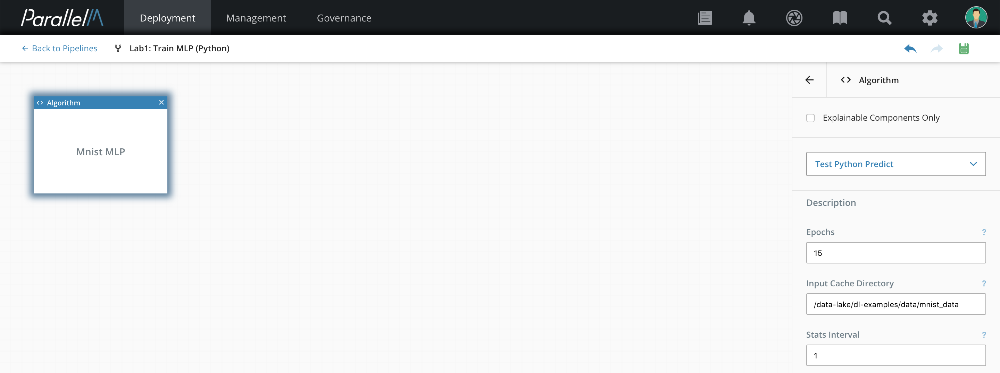

**5.** Click the save icon (top right of the screen) to save the pipeline.

The pipeline is now available to use in MLApps.

Setting Default Models for Inference Pipelines
----------------------------------------------

You can configure inference pipelines to have a default model to use.
You either upload models into MCenter manually (see
[Model Upload](./6_2.md)) or they are uploaded when they are produced by a training
pipeline.

**1.** To configure a default model, click **Set Default Model**
on the bottom right of the Pipeline Builder screen.

**2.** In the Select a Model window, select a model to use as the default, then click **Set Model**.

The default model appears on the Pipeline Builder screen.
