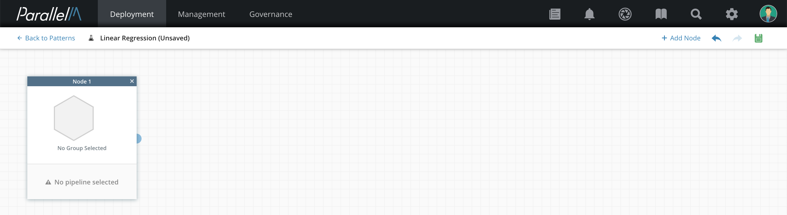
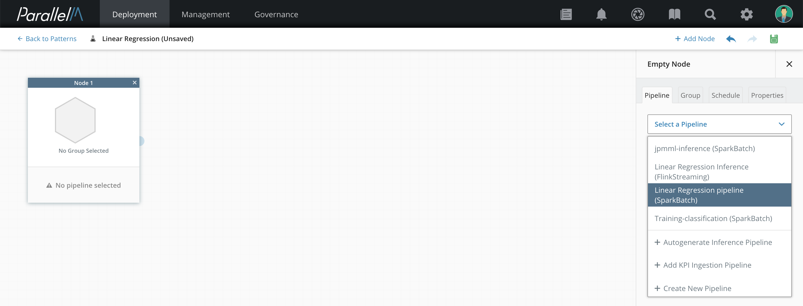
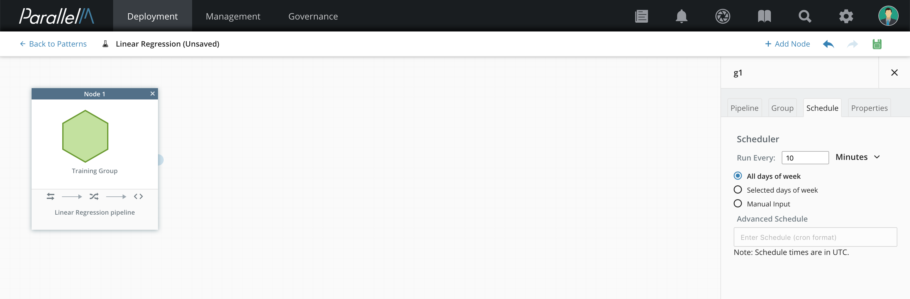
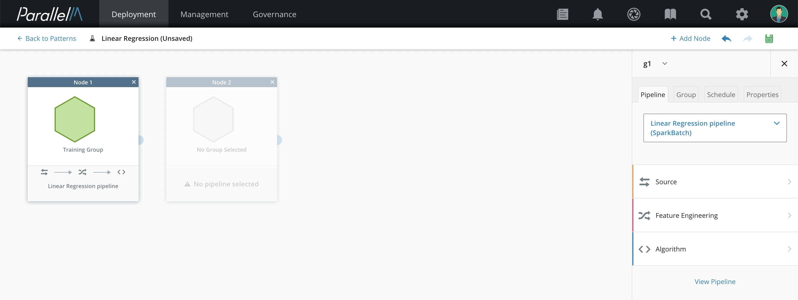
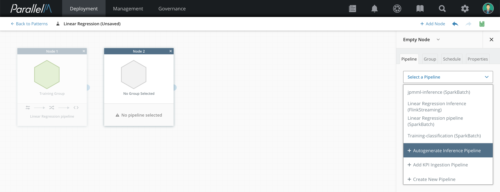
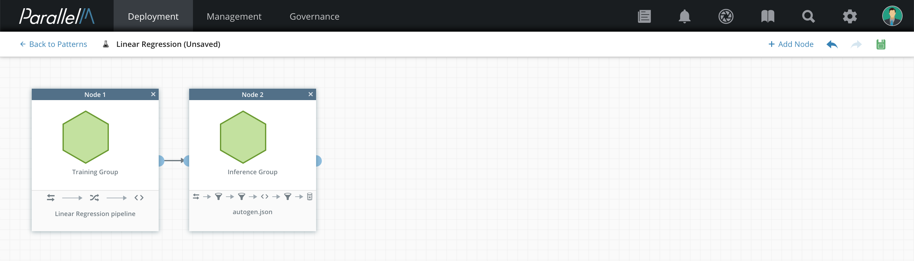

4.4 MLApp Pattern Builder
=========================

An MLApp Pattern serves as a template to create and launch multiple different ML
Applications. A Pattern captures the core aspects of an Application
such as the pipelines and their parameters, inter-relationship between the
nodes/pipelines. A single pattern could be used multiple times to create
different MLApp Profiles.

In this section, we use the Pattern Builder to create and edit
an MLApp Pattern. We step through an example MLApp with two nodes: a training
pipeline and an inference pipeline that uses the model generated from
the training pipeline. For the training pipeline, we use the Spark Batch
Linear Regression described in the [Pipeline Builder](./4_3.md) chapter.
For the inference pipeline, we will use Autogen to automatically create
the inference pipeline; this pipeline runs on the Flink streaming
engine.

General Instructions
----------------------

Before starting, create the training pipeline as described in the
*Pipeline Builder* chapter.

### Creating a Pattern

**1.** Navigate to the Pattern Builder page by clicking **Onboarding** in the
navigation bar, then **Pattern** in the row below.

**2.** Fill in a name for the Pattern, then click **Create**.

The Pattern Builder screen opens. This screen has two parts:

-   **Pattern management bar** along the top, with buttons **Add Node**,
    **Undo**, **Redo**, and **Save**.

-   **Pattern builder canvas** where the MLApp graph is constructed.
Initially, this area is populated with an empty node.

**3.** Select the new node and a configuration pane opens on the right-hand side
of the canvas. This pane includes Pipeline, Schedule,
and Properties tabs. Use these tabs to configure MLApp node attributes.

**4.** Select the Pipeline tab and choose **Linear Regression**. This is the
pipeline we created in the [Pipeline Builder](./4_3.md) chapter.

**5.** (Optional) Select the Schedule tab and edit the schedule. The
schedule determines the frequency with which this pipeline is
launched. You have these options:

-   Run the pipeline every day of the week.

-   Run on selected days of the week.

-   For more complex schedules, select **Manual Input** and
provide a cron-style schedule string into the **Advanced Schedule**
box.

> 

### Adding Nodes to the Pattern

**6.** Click **Add Node** to add the inference pipeline for this
Pattern. A new node appears in the MLApp workspace.

**7.** Select the newly created node. Then choose **Autogenerate
Inference Pipeline**.

**8.** When the pipeline is selected, its options appear in the
configuration section. Fill in the port for the REST endpoint.

**9.** (Optional) Select the Properties tab to set the level of parallelism
for the pipeline. If this is not set, the default for the engine type
is used.

**Release note:** In this version, only the Flink engine allows
configuring a non-default level for parallelism.

**10.** Connect the training node to the inference node by selecting the
training node's connector (blue half circle) and dragging it to the
inference node. This connection shows that output from the training
pipeline is propagated to the inference pipeline. In this case, the
trained model is propagated.

### Saving the Pattern

When you finish editing the Pattern, click the save icon in the
management bar. The icon becomes a green checkmark to indicate that all
changes have been saved.

In the next section, we present how to create an MLApp Profile using a Pattern.
