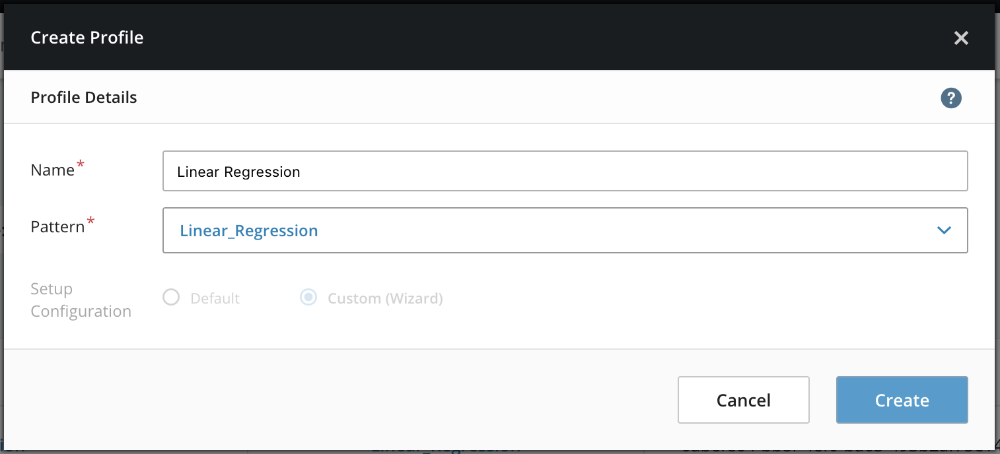
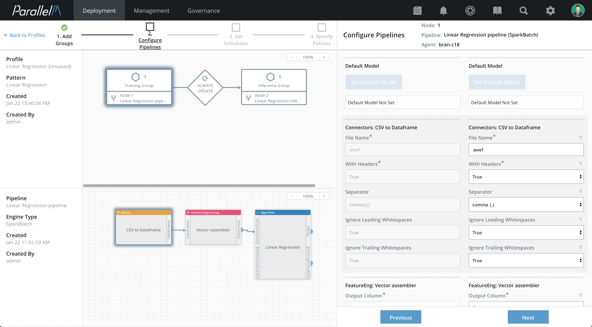
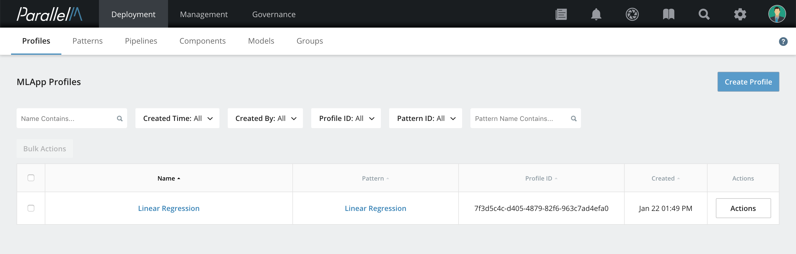

4.5 MLApp Profile Builder
=========================

Profiles help users create custom configuration(s) on top of pattern objects.
Profiles require a pattern object to be created first.  Profile objects can be
deployed in production or sandbox mode via the MCenter Server.

In this section, we use the Profile Builder to create and configure an MLApp
Profile. We step through an example Profile that is built using the pattern
(containing connected training/inference pipelines) as described in the
[Pattern Builder](./4_4.md) chapter. 

General Instructions
----------------------

The example here assumes you have already created the example pattern 
described in the [Pattern Builder](./4_4.md) chapter.

### Creating a Profile

**1.** Navigate to the Profile Builder page by clicking **Onboarding** in the
navigation bar, then **Profiles** in the row below. Click **Create Profile**.
The Create Profile window opens.

**2.** Select the Pattern from the drop-down for the profile. Choose the Pattern that was configured in the
[Pattern Builder](./4_4.md) Section.

**3.** Fill in a name for the Profile, then click **Create Profile**.

### Profile Builder Wizard

The Profile Builder Wizard screen opens. This screen has four parts:

-   The **Wizard Navigation bar** along the top left is a progress indicator showing
    the stages: **Execution Environment**, **Configure Pipelines**, **Set Schedules**,
    and **Specify Policies**.

-   The **MLApp Explorer View** on the left shows the MLApp graph with its constituent
    nodes and their connections.

-   The **Pipeline View** on the bottom left shows the pipeline selected in the MLApp graph
    and its constituent components.

-   The **Configuration View** along the right side displays the parameters of the
    pattern and profile for the selected wizard stage for the selected node.

The wizard guides you through creating or updating profiles.
After configuring each stage, click the **Next** button on the bottom right.

**Note:** You can revisit any previously configured
profile configuration stage by clicking on the desired stage in the Wizard
navigation bar.

**1.** **Select Execution Environment**. The wizard first asks you to attach each MLApp node to an execution environment.
In this pane, you may overwrite any execution environment parameters that are set to editable by the administrator.

**2.** **Configure Pipelines**. Here you may overwrite pipeline
parameters specified by the pattern for this profile. Required parameters
must be specified by either the pattern or the profile.
The wizard navigates over the individual nodes in the
MLApp graph. For each node, it iterates over the pipeline component's
parameters from its pipeline pattern.

**3.** **Set Schedules**. This is the third phase of the profile configuration
wizard. Here you can overwrite any of the pipeline schedules. The wizard
navigates over all node-agent-pipeline combinations. The default
schedule set for a pipeline pattern can be overwritten in the profile.

Click **Next** and repeat this step until all node-agent-pipeline combinations
are covered. 

**4.** **Specify Policies**. This is the final phase of the profile
configuration where users can overwrite any of the MLApp policies.
If your MLApp includes connected training and inference pipelines,
you configure the [model propagation policy](./model_prop.md#propagation_policy) at this point.

### Saving the MLApp Profile

When you finish editing the Profile, click the **Finish and Save** button in the
bottom right. At this time, progress indicators icons for all four stages
should be a green checkmark to indicate that all changes have been saved.

The newly created profile should now appear in the MLApp profiles table.

In the next section, we present how to launch MLApps into sandbox or
production.

