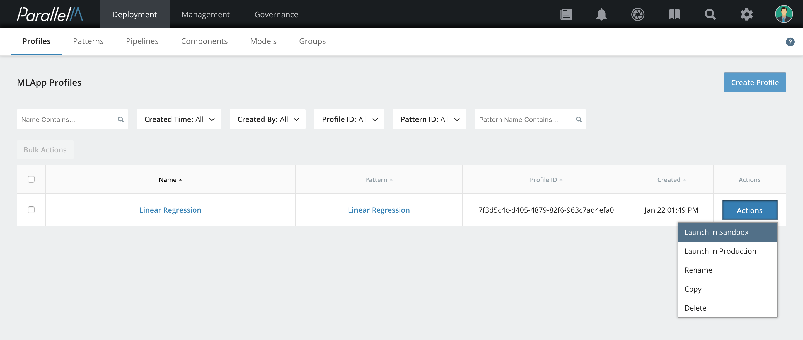

4.6 Sandbox Launch
==================

MCenter provides production-grade sandbox environments for a range of
testing scenarios from simple developer-oriented tests to large,
production-scale tests.

What Is a Sandbox?
------------------

Before you set up an MLApp for full production deployment, you can test it
by deploying it in a *production sandbox*. At this sandbox stage of
deployment, data scientists can validate the behavior of models via the
MCenter workspace dashboards. When ready, they can join with operators to
deploy the tested MLApp and accompanying model into production with
confidence.

In sandbox, the MLApp can process live production data or saved data
depending on your selection of input parameters to the pipeline.
You can configure how inferences are directed (for example, to
sandboxed business applications or to a saved location). However,
notifications and alerts from a sandboxed MLApp are directed to an
alternate display to distinguish them from production MLApps
(see [Alert Reporting](./8_2.md) and [MLApp Overview Dashboard](./5_1.md) descriptions for more information).

The MLApp definition is the same for both production and sandbox. Saved MLApp
patterns can be used for both scenarios.

Other than alerts and notifications, MLApps running in the sandbox
environment typically have the same features as those running
production. This includes all statistics and dashboard displays,
timeline captures, model rollback, and model update. See
the respective sections of this guide for these features for more information.

Launching an MLApp in Sandbox
---------------------------

**1.** From the Onboarding page, select **Profiles**. On the Profiles page,
look for the MLApp Profile to deploy in the sandbox.

**2.** Click **Actions** and then select **Launch in Sandbox**.

**3.** Choose a scheduler option: either **Use Pre-Defined Schedules** or **Run Now**. If
you select **Run Now**, you must also type in the number of **Iterations**.

In sandbox, an MLApp profile can either be launched using the pre-defined
schedule (see [Profile Builder](./4_5.md) section for details) or can be run immediately
via **Run Now**. The *Run Now* mode enables you to quickly check the
correctness or execution of the pipelines in the MLApp.

**4.** Click **Launch in Sandbox**.

**5.** (Optional) To track the launched MLApp, click **Dashboards** in the navigation bar.
The Dashboards page displays MLApps launched in sandbox mode and in production in separate lists.

Moving an MLApp from Sandbox to Production
----------------------------------------

When you have successfully deployed an MLApp in sandbox mode, you can move it
to production mode by clicking the the **Actions** button for the MLApp and selecting **Move To Production**. This move ensures that any subsequent notifications and
alerts are treated as production events.

