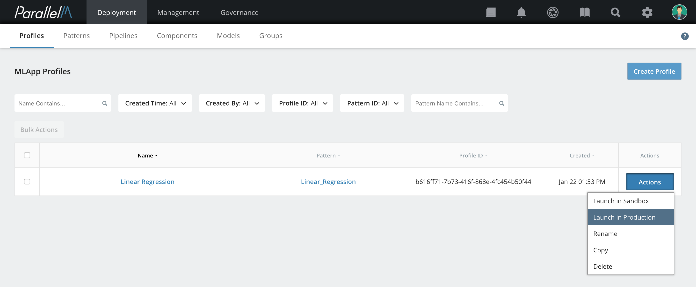

4.7 Production Launch
=====================

When an MLApp is launched in production mode, all events, alerts, and
notifications occur in the production sections of the MCenter UI. All
other MCenter functions are available for MLApps launched in either production or sandbox.

Launching an MLApp in Production
--------------------------------

**1.** From the Onboarding page, select **Profiles**. On the Profiles page,
select the MLApp Profile to be deployed in production.

**2.** Click **Actions** and then **Launch in Production** from the list of actions.

**3.** Select the service account from the drop-down.

**Note:** See the **Users** section for details on creating a service account.

**4.** Type in an annotation, then click **Launch**.

The MLApp will be launched to run in production.

**4.** (Optional) To track the launched MLApp, click **Dashboards** in the navigation bar.
The Dashboards page displays MLApps launched in sandbox mode and in production in separate lists.

