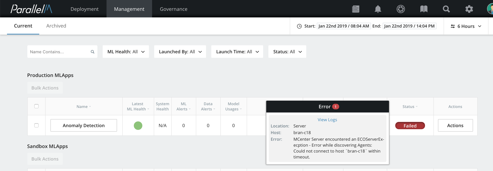
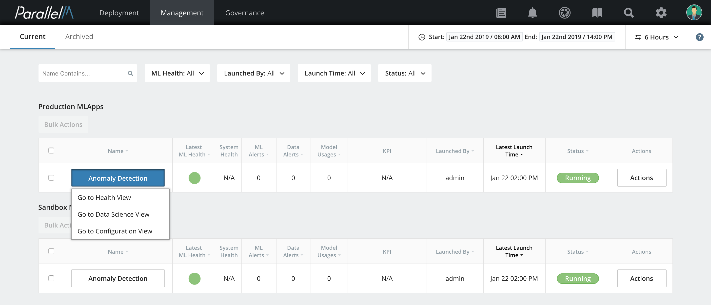

5.1 MLApp Overview
============================

The MLApp Overview provides a global view of launched MLApps in
production and sandbox. This includes overall run status, alerts,
and other high-level metrics. To open the MLApp Overview,
click **Dashboards** in the navigation bar.

Metrics
-------------------

You can see the following metrics in this view.

### Name

The name of the MLApp. The view displays all launched MLApps. MLApps
launched in production and sandbox are shown in a separate lists.

### Latest ML Health

The health of the MLApp as determined by the
relevant ML Health metrics (described in the [ML Health](./5_2.md) section). A green
status indicates that the ML application is performing as intended. A red
status is a notice that investigation is needed. Clicking the status
indicator takes the you to the Health View.

### ML Alerts

A count of the ML Health alerts over the specified duration for
this MLApp. These alerts are raised by ML Health metrics, including data
divergence between training and inference data sets, canary
divergence, and A/B testing divergence. These are discussed further in the
[ML Health](./5_2.md) section.

### Data Alerts

A count of the data alerts for this MLApp over the specified
duration. Data alerts are triggered for anomalous input. That is, an
alert is raised for each inference that has feature values outside of
the expected range.

### Model Usages

The number of times models were deployed to the MLApp's
inference pipelines.

### Launched By

Who launched this MLApp.

### Launch Time

When this MLApp was launched.

### Status

One of the following states:

-   **Accepted** - The MCenter agents have accepted the request to execute
    the ML pipelines and are preparing for execution. If the schedule
    for execution is in the future for any of the pipelines in the MLApp,
    the status remains in the *Accepted* state until all pipelines
    begin execution.

-   **Running** - At least one of the ML pipelines is executing in one of
    the MCenter agents.

-   **Completed** - All constituent execution components of the MLApp have
    been terminated.

-   **Capturing Timeline** - When you trigger a *timeline capture*
    operation, the status of the MLApp remains in this state until the
    timeline capture execution has completed.

-   **Failed** - An execution error was
    encountered in an MCenter component (agent or server) or if one of the
    ML pipelines encountered a failure. In the **Failed** state, you can
    click the status to see a brief description of the
    error as shown in the image.

    

**Release notes:**

-   In the current release, the following metrics are populated in the
    MLApp Overview: **ML ALERTS**, **DATA ALERTS**, **MODEL USAGES**,
    **LAUNCHED BY**, and **LAUNCH TIME**.

-   Failed and completed MLApps show the following metrics for the full
    MLApp run period: **ML ALERTS**, **DATA ALERTS**, and **MODEL
    USAGES**. MLApps in other states (**Accepted**, **Running**, and
    **Capturing Timeline**) show the metrics for the user-selected timeline.

-   A preview feature for KPIs is available but does not yet populate
    the **KPI** column. This column will be populated in a future
    release.

-   The **SYSTEM HEALTH** metrics will also be available in a future
    release.

### Actions

The **Actions** button and its options are described in the
[User Actions](./7_1.md) section.

Filters
-------

You can use *filters* to select a list of MLApps matching certain criteria.
You can filter MLApps by **MLApp Name**, **ML Health**,
**Launched By**, **Launch Time**, and **Status**. Filters are located
at the top of the Dashboards MLApps overview page.

The list of possible values is automatically pre-loaded for MLApp Names
and Launched By. With the exception of **Launch Time**, you can select
one or more values by expanding each individual filter and then clicking the desired
checkboxes.

To set a date and time for **Launch Time**:

**1.** Click **Launch Time**, then click
**Select a Date / Time**. The [time picker](./5_4.md) opens.

**2.** Click the desired date and time. The
time picker closes, and the chosen date and time is applied.

After a start or end launch time is applied, you can remove it by
clicking the red **X**. You can set up launch time filters with
a start time, end time, or both.

Health and Data Science Views
-----------------------------

You can go to the [Health View](./5_2.md) and [Data Science View](./5_3.md) for
a particular MLApp by clicking its name. Details for those views are
described in their respective sections.

