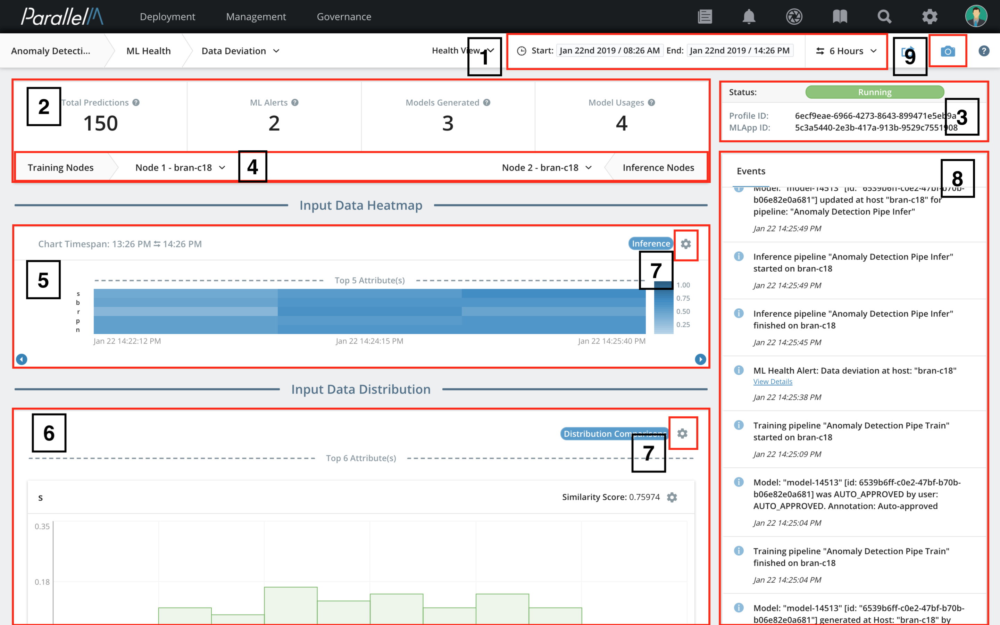

5.2 Health View
===============

The Health View is an overall picture
of the health of a particular MLApp. The view contains MCenter generated
statistics that show ML pipeline and MLApp trends over time. It also
includes a timeline of alerts and events relevant to that MLApp. An
important aspect of this view is the comparison of training and
inference pipelines with respect to the input data that they consume.
This is presented for features of the data that are
available in both training and inference pipelines. This
view displays the data distributions of all pipelines involved to
illustrate changes in data trends.

There are two ways to navigate to the Health View from the
[MLApp Overview](./5_1.md):

- Click the name of an MLApp and select **Go to Health View**.

-  Alternatively, click the circle in the **LATEST ML HEALTH**
column.

Key Sections
-----------------------------

The annotated illustration shows the following areas of the Health View.

1) **Time picker** - The statistics shown in the Health View
    correspond to the time range displayed in the time picker. You
    can alter the time range to any of the predefined options (10
    Minutes to 6 Hours) or to a custom range. See the [Time Picker](./5_4.md)
    section for more details.

2) **High-level summary** - A summary of the top statistics from the
    MLApp in the time range provided. This includes the total number of
    predictions performed by the inference pipeline, the number of models
    produced and consumed by the training and inference pipelines, and
    the number of ML alerts raised.

3) **MLApp details** - Some basic information including the MLApp ID and the
    run instance ID.

4) **Stats picker** - The stats picker includes a drop-down list
    of agents that the MLApp executed on. To compare training and
    inference pipelines, select the MCenter agent from each node
    (training and inference).

5) **Input Data Heatmap** - The heatmap shows the
    continuous features of inference data
    over time for different attributes. Each row corresponds
    to a single feature. Details of its calculation and interpretation are
    provided in the [Heatmap Calculation](./appendix_1.md) section. Attributes are sorted from
    top to bottom in increasing order of their similarity score.
    The similarity score is calculated based on the overlap between training
    and inference histograms and visualized in the
    **data distribution histograms** section of the screen.

6) **Data distribution histograms** - An overlaid pair of
    histograms from the inference and training nodes for six attributes.
    The similarity of these histograms is computed and shown as the
    **Similarity Score** in the top right of the box. The attributes are
    arranged on the basis of the similarity score, with the least
    similar on top. The same order is used when MCenter
    presents the input heatmaps for various attributes. If the dataset
    contains a mixture of continuous and categorical attributes, three
    histograms of each type are displayed.

7) **Heatmap and data distribution options** - Both the Heatmap and the Bargraphs offer
    extensive options for managing attributes. Clicking the cogwheel-shaped icon will show a
    method to track the **Top N Deviating Attributes** or an option to
    select particular attributes through the **Select Attributes** button.

8) **Events** - The timeline of all events and alerts that are relevant
    to this MLApp. The timeline typically includes events such as the
    start and end of a training cycle, production of a new model, and
    data deviation alerts.

9) **Timeline capture** - The option to
    create a timeline capture.
