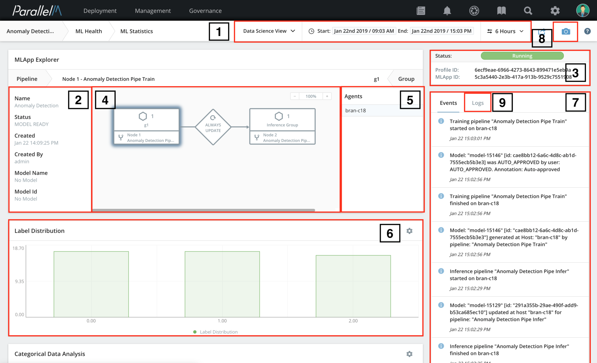

5.3 Data Science View
=====================

The Data Science View is a per-MLApp view that allows drill-down into
individual components. It shows all of the statistics reported by the
components of the MLApp. By enabling component-level
customization, this view shows you the statistics relevant to
a particular model or data set, which helps illuminate deeper insights
about the predictive performance of an algorithm. For custom uploaded
components, you can use the MLOps API to report the statistics of your
choice. The API supports many data and graph types.
Like the [Health View](./5_2.md), the Data Science View includes a timeline of
alerts and events relevant to that MLApp.

To reach the Data Science View from the [MLApp Overview](./5_1.md),
click the name of the MLApp of interest and select **Go to Data Science View**.

Key Sections
-----------------------------

The annotated illustration shows the areas of the Data Science View.

Areas 1, 3, 7 and 8 are exactly the same as in the Health View; see
the [Health View](./5_2.md) section for details. Here is a summary of the other sections.

2) **MLApp Information** - Higher level information
about the MLApp. It shows the name of the MLApp and its status, which is same as
the STATUS value shown in [MLApp Overview](./5_1.md). It also displays when the
MLApp was created and who created it.

4) **Nodes of the MLApp** - Graphics illustrating the MLApp nodes and
their relationship. When you select a node, the name of the pipeline
and the corresponding agents are displayed in areas 2 and 5, respectively.

5) **Agents per node** - The agents corresponding to a
node in the MLApp. When you click any node of the MLApp, its
corresponding agents are shown in this pane.

6) **Statistics per node per agent** - All of the statistics reported by the
pipelines either using built-in components or the MLOps API.
This example shows the confusion matrix
reported by the training node of classification. Similarly, you can view
the statistics displayed by each node by clicking the node in area 4.

9) **Logs** - Logs from each node corresponding to their respective
engines. Click the logs to expand them to a
larger window and browse or search through them.
