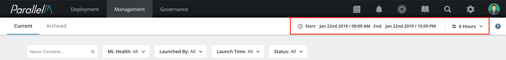
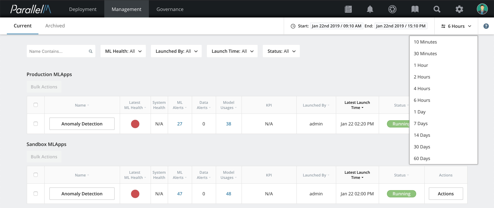

5.4 Time Picker
===============

You can use the MCenter time picker to set a time range for events and
statistics to display in the dashboards. The time picker is in the
upper right of the UI, to the right of the clock icon.

By default, the dashboards use **current time** mode. In this mode, the
time range end is set to the present time.

The time picker works as follows:

-   The MLApp Overview has separate time controls from the
    Health View and Data Science View.

-   Changes in time control in the Health View or Data Science View
    stay in effect while alternating between these views.

-   When you refresh the browser, time controls for all views
    assume the default behavior of **current time** mode.

-   When you leave the Health View or Data Science View to navigate to
    other pages, the time picker settings are reset. Similarly, when you
    move from the MLApp Overview to either the Health View or Data
    Science View, the time picker settings reset to the default.

-   When navigating to either the Health View or Data Science View from the
    Alerts or Governance page, the time picker is locked to the
    specifications defined by the Alert or Governance entry (during of
    the execution for governance or alert timestamp +/- time window);
    these time controls do not influence any other views. Adjusting
    time controls in these views is disabled. If a slider is provided,
    you can use it to browse within the locked time window.

Changing the Time Range
-----------------------

**1.** Click the time picker clock icon.

**2.** Select an interval end time. In this example, we select **Select Custom Time** and
then a date and time.

The start time of the interval is automatically calculated based
on the timespan selected.

