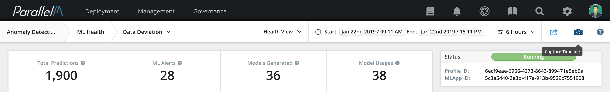
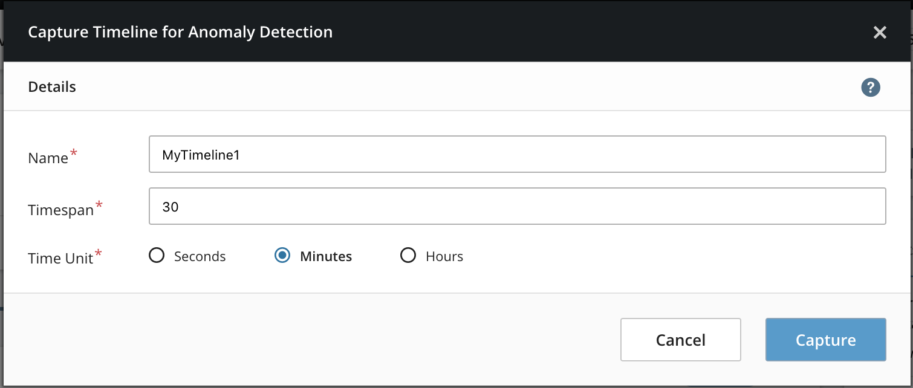
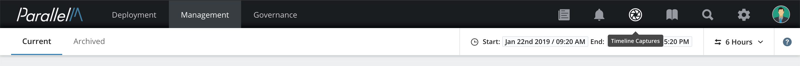
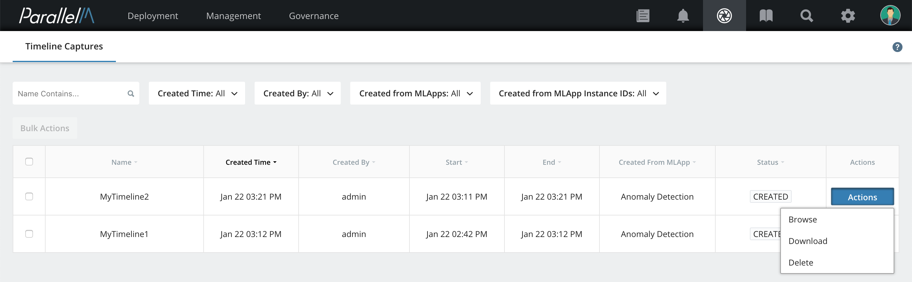
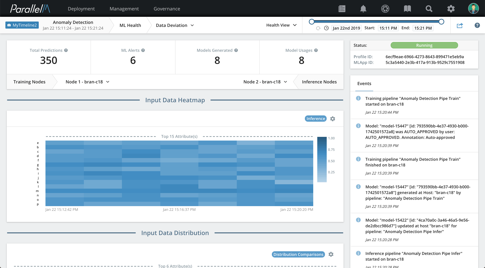
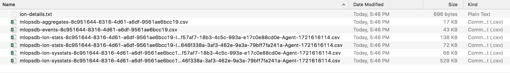

5.5 Timeline Captures
=============

MCenter timeline captures contain the state of an MLApp for a specified
range of time. A timeline capture (or snapshot) contains the MLApp
configuration (ML
pipelines, policies, topology, schedules, and parameters), statistics,
events, and user actions. You can use timeline captures for diagnostics,
reproducibility, and collaboration.

Capturing Timelines (Snapshots)
-------------------------------

You can create a timeline capture from a running MLApp at any time
either from the [Health View](./5_2.md) or [Data Science View](./5_3.md). To capture a
timeline:

**1.** Click the camera-shaped **timeline capture** icon located on the top right of
both views.



**2.** Type in a **Name** and **Timespan** (an integer), and
select a **Time Unit** for the timespan. Then
click **Capture**.



A message appears indicating the timeline capture has been created.

Discovering Timeline Captures
-----------------------------

To browse timeline captures:

**1.** On the top navigational bar, click the shutter-shaped **timeline capture** icon.



The Timeline Captures page opens and displays the name of the timeline capture, created time, creator, start time,
end time, MLApp Name, and status of the timeline capture.

**2.** To browse a specific timeline capture, to the right of that timeline capture,
click **Actions**. From the menu, select **Browse**.



Filters
--------------------------
By default, all timeline captures are displayed on the Timeline Captures page. You can use filters to select
a timeline capture or list of timeline captures that match a set of criteria.

You can filter timeline captures by **Names**, **Created Time**,
**Created By** (creator), and the **MLApps** or **MLApp Instance IDs** the timeline capture was created from.

Browsing Timeline Captures
--------------------------



You can browse a timeline the same way you browse a view. The
timeline icon on the top left indicates that you are browsing in
timeline mode and displays the name of the timeline capture being
viewed.

Use the slider bar on the top right of the
page to explore the timeline.

The ends of the slider represent the start and end time of the Timeline.
You can adjust the duration within the Timeline using the slider; when
you do this, the view dynamically changes.

Drag the slider to select a window of time.
To preserve this window of time while exploring the
timeline capture, click between the start and end points and
drag the slider to the left or right.

You can navigate between [Health View](./5_2.md) and [Data Science View](./5_3.md) or
within different health views (such as **Data Deviation**, **Canary**,
or **A/B Testing**).

Deleting Timeline Captures
--------------------------

To permanently delete captured timelines from the MLOps system:

**1.** On the Timeline Capture page, to the right of the timeline capture you
want to delete, click **Actions**. Then select
**Delete** in the drop-down menu. In this example, we delete "MyTimeline2".

**2.** Click **Delete** to confirm the
deletion.

The deleted timeline capture is removed from the Timeline Captures page.

Downloading Timeline Captures
-----------------------------

You can download timeline captures to your local machine for further
analysis.

**1.** On the Timelines page, to the right of the desired timeline,
click **Actions**, then select **Download**.


**2.** In the confirmation window, click **Download**.

In this example, we are downloading "MyTimeline2".

When the download completes, a success message appears, and the timeline
capture file is saved in `tar` format in the Downloads folder on your
local system. The name of the downloaded timeline capture file is:
`timeline_capture_<timeline_name>_<MLApp_Instance_ID>.tar`

In our example, the downloaded file is saved as:
`timeline_capture_mytimeline2_e0208e14-c3bf-4a2e-96af-04f4e0abae33.tar`.

Downloaded Timeline Contents
----------------------------

When you extract the contents of a downloaded timeline, it creates a
folder under named `timeline-export`.

A downloaded timeline capture contains an `MLApp-details.txt` file and
multiple CSV files. The file names include the MLApp instance ID, the
pipeline instance ID, the agent, and the hostname.



The `MLApp-details.txt` file contains the definition of the MLApps,
including the IDs of pipelines and instances. You can look up these instance IDs
in the MCenter database for further analysis.

**Example MLApp-details.txt File**
```
WorkflowID: 5e760180-e9ff-4df6-877e-f1cf9e5d4ecb wfNodes:
cc0ae30d-8e61-4ee8-8b3f-01264199153f Mode: offline Type:
model_producer, PipelineID: 6e613536-05f5-4508-aff4-4f4a5ed95ad5
model_consumer], modelPolicy: MANUAL
```

The CSV files contain:

-   System statistics that the analytic engines (such as Spark) export;
    these files include `-sysstat-` in their names.

-   Exported statistics from the ML pipelines; these files include
    `-stats-` in their names.

-   All events, such as scheduler, policy, health or data alerts,
    timeline capture management, user actions, and governance; this file
    includes `-event-` in its name.

-   Aggregate statistics; these files include `-aggregate-` in their
    names.

All CSV files contain the header for each column and you can import them
into Excel, Numbers, or other relevant software.
