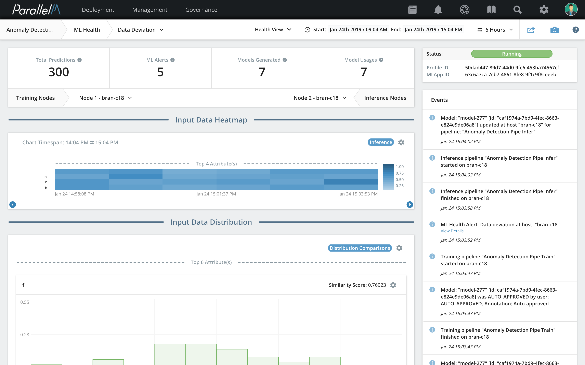
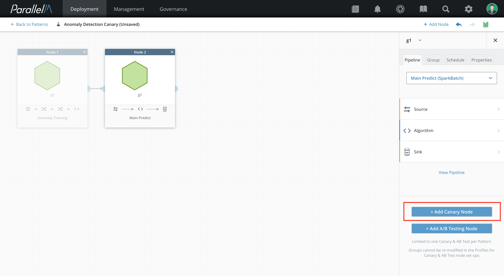
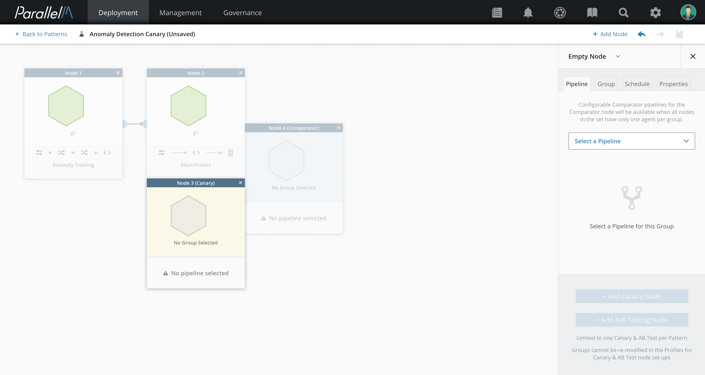
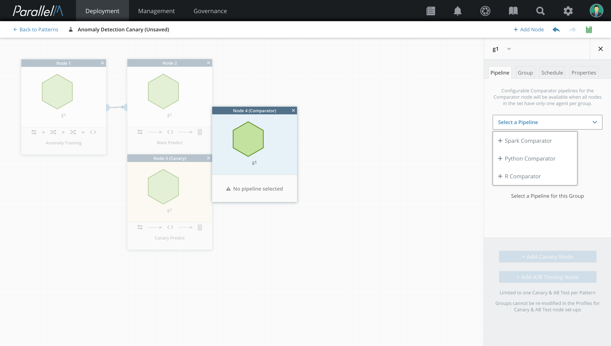
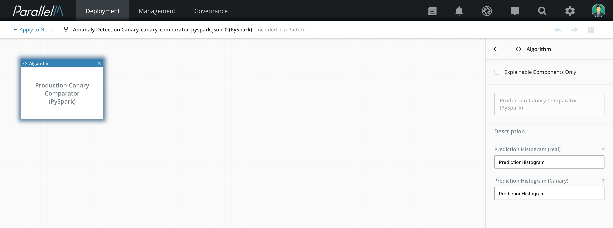
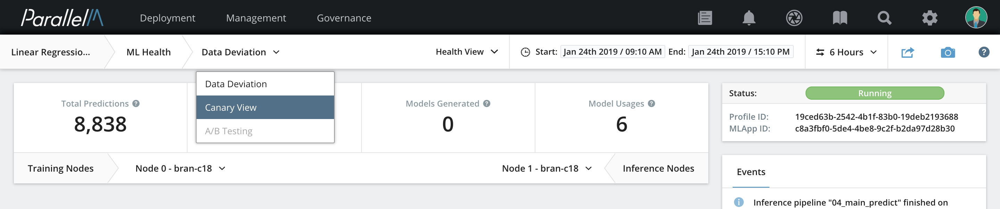
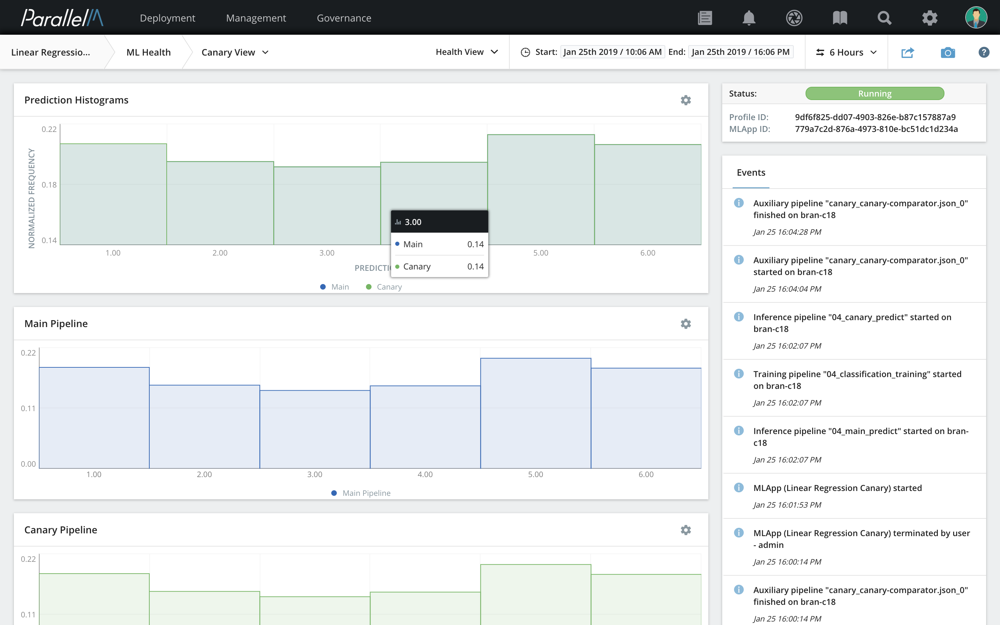
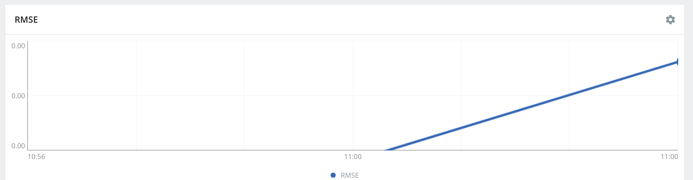
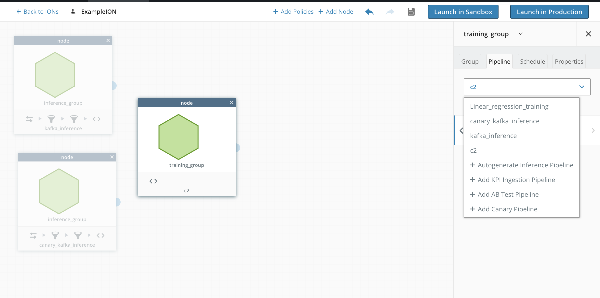

5.6 ML Health
=============

ML in production typically involves training models on a training
dataset and then serving the trained model on inference data. MCenter
coordinates and orchestrates the overall interactions between training
and inference pipelines. Even in the presence of orchestration,
training and inference are typically disconnected pipelines, connected
only by the trained model passed from one to the other. The inference
pipeline has no statistics about the training dataset or the
configurations that were used in the training pipeline. Without such
information, production model evaluation can be confounded by many
factors. For example, seemingly bad results may be due to an
inappropriate model or just a characteristic of the data the model is
being used against. To know for sure, someone with knowledge of the
model and the datasets involved (generally a data scientist) must make a
judgment call as to whether the overall system is performing optimally.

MCenter provides several mechanisms to aid production model evaluation,
presented as *ML Health* views. These views provide insights into the
quality of results produced over time. As part of ML Health, MCenter
monitors the execution of the training and inference pipelines
continuously and alerts you if anything begins to go awry. MCenter
provides two built-in ML Health mechanisms, *data deviation* and *canary*).
In addition, you can add your own customized ML Health metrics by
creating uploadable components that interact with MCenter via the MLOps
API.

Data Deviation
--------------

The dichotomy of training and inference and the datasets that they consume
provides a simple yet powerful ML Health indicator: Are the datasets
that the training and inference pipelines ingest similar in nature?
If the training and inference
data sets are dissimilar, the model might be irrelevant and might not
provide useful results.

MCenter uses a low-overhead methodology to extract histograms of training
and inference data. When the model is being trained, MCenter computes a
per-attribute histogram in parallel and transfers the histogram to the
inference nodes. On the inference side, in addition to serving the
model, MCenter computes histograms and compares the inference-side
histograms with those from the training side. If MCenter finds that the
two histograms deviate by a threshold, it raises a *data deviation*
alert.

### Configuring Data Deviation Thresholds

When you set up an MLApp, you can enable or disable
data deviation in the **Specify Policies** tab of the Profile Editor.

**1.** From the **Onboarding** tab, select **Profiles**.

The **MLApp Profiles** list appears.

**2.** From the Profiles list, click the name of the profile on which you want
to add or change data deviation policies.

The Profile Editor appears.

**3.** Click the **Specify Policies** section in the top left.

The **Specify Policies** tab appears on the right.  The following parameters can now be configured:

-   **Model Propagation Policy** - See the [Model Propagation](./model_prop.md) section for
    details.

-   **Data Deviation** - Check to enable data deviation ML Health
    checking; uncheck to disable it.

-   **Threshold** - Either type a number in the box or use the slider to set
    the similarity threshold. If the similarity score between training
    and prediction data goes below this threshold, MCenter generates an alert.

**3.** Click **Finish and Save**.

### Data Deviation in Action

An MLApp that is run with data deviation enabled produces comparative
histograms for each attribute in the data set. When the MLApp is launched,
you can view the data deviation in the Health View.

The Health View shows the various histograms and heatmaps
that were generated for the training and inference data sets. Each
histogram shows both the training and inference histograms overlaid and
includes the similarity score computed for that attribute.



If an attribute deviated beyond the configured threshold, a data
deviation alert is shown both on the MLApp Overview and the
Health View of the MLApp.

Canary
------

A commonly used technique to observe and evaluate the quality of results
produced by an inference pipeline is to compare its output with that of
a well-known pipeline. We refer to the production pipeline as the *main*
pipeline. To this, you add the known, or *canary* pipeline, which
processes the same dataset as the main inference pipeline.
Comparing the results produced by both of these pipelines can
tell you if your inference pipeline is behaving within acceptable limits.

### Configuring a Canary Pipeline

**1.** Add an inference node to the main pipeline. See the
[MLApp Builder](./4_4.md) section for details.

**2.** On the MLApp Builder page, select the **Pipeline** tab in the right
pane. At the bottom of the tab, click **Add Canary Node**.



Two extra nodes appear in the MLApp builder, **Node (Canary)** and
**Node (Comparator)**.



**4.** Configure the canary node as you would configure any other
inference pipeline. Make sure that the main (Node 1) and canary (Canary) pipelines have
identical sources.

**Note:** The **Node (Comparator)** and corresponding pipeline
perform the comparisons of the results output by
the two pipelines (main and canary) and produce an *RMSE* score.
In particular, the current canary infrastructure compares histograms of
the results (or predictions) produced by both pipelines.


MLApp Builder takes you to the Pipeline Builder, where you
configure the parameters of the comparator pipeline.



**5.** With the node selected, in the Pipeline tab, select
**Configure New Canary Pipeline** from the Select a Pipeline menu.



**6.** Enter these algorithm parameters:

-  **Prediction Histogram (main)** - The name of the statistic that stores
the prediction histogram of the main pipeline. The default value is
**PredictionHistogram**. ParallelM provides pipelines and components
that use the default name. If the inference pipeline uses a custom
uploaded component, provide the name of the statistic that stores the
histogram.

-  **Prediction Histogram (Canary)** - The name of the statistic that stores
the prediction histogram of the Canary pipeline. The default value is
**PredictionHistogram**.

**7.** Save the configuration. Once the configuration of the canary comparator
is saved, it navigates to the MLApp pattern screen which can now be saved.

### Canary in Action

When the canary and comparator nodes are configured, the MLApp is ready to
launch. After the launch, you can monitor the health of the canary.

From the [Health View](./5_2.md), click on current view (by default **Data Deviation**)
and then select **Canary View**.



This presents the results of the canary comparison. The output shows the
prediction histograms from both the main and canary pipelines as well as
the root mean squared error (RSME) score of similarity.



If the two histograms diverged beyond the configured
threshold, an alert is triggered.

**Release note:** In this release, at really small error values (e^-10
and below), the graph rendering for RMSE renders incorrectly, as shown
here.



Using Uploaded Health Programs
------------------------------

In addition to ParallelM's provided health features, MCenter also supports
customizable health components. You can write your own program and
upload it into MCenter using the [Uploadable Component](./4_1.md) feature. With
this mechanism, you can write a general-purpose application that you can
schedule along with other nodes of the MLApp. Using the MLOps APIs, you can access and generate
statistics, events, alerts, and models. You can view all
statistics, events, and logs from these components in the Data Science
View.

Example Health Program and Workflow
-----------------------------------

The following is a sample code outline for a canary comparator written
as a PySpark program using MLOps APIs.
```
from pyspark import SparkContext
from parallelm.mlops import mlops as mlops
def main():
	now = datetime.utcnow()
	last_hour = (now - timedelta(hours=1))
	sc = SparkContext(appName="canary-comparator")
	mlops.init(sc)
	....
	....
	main_data_frame = mlops.get_stats(
		name="PredictionHistogram",
		ion_node=main_prediction_component_name,
		agent=main_agent,
		start_time=last_hour,
		end_time=now)
	canary_data_frame = mlops.get_stats(
		name="PredictionHistogram",
		ion_node=canary_prediction_component_name,
		agent=canary_agent,
		start_time=last_hour,
		end_time=now)
	rmse = compare_histograms(main_data_frame, canary_data_frame)
	mlops.set_stat("RMSE", rmse, st.TIME_SERIES)
	if rmse > mlops.ion_policy.health_threshold:
		mlops.data_alert(
			"DataAlert", 
			"Main and canary data frame do not match: score {}".format(rmse))
	else:
		print("Data matches {}".format(rmse))
```
In this program, we fetch a statistic called `PredictionHistogram`
from both the main and canary pipelines and perform a comparison of the
data frames. Following that, we trigger `DataAlert` if the threshold
is exceeded. When a component is uploaded to MCenter, it can be added to
any existing MLApp by configuring a new **auxiliary** pipeline. The
following image shows the MLApp Builder with two inference nodes and an
auxiliary health program **c2** running.



When the MLApp is launched, you can view the statistics and alerts from the **c2** Health node
in the Data Science View.
