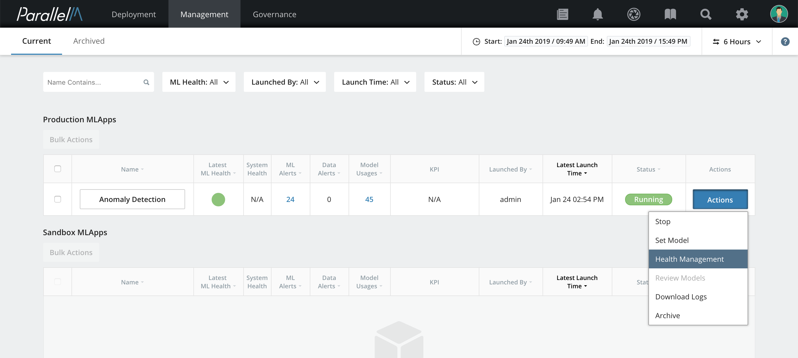
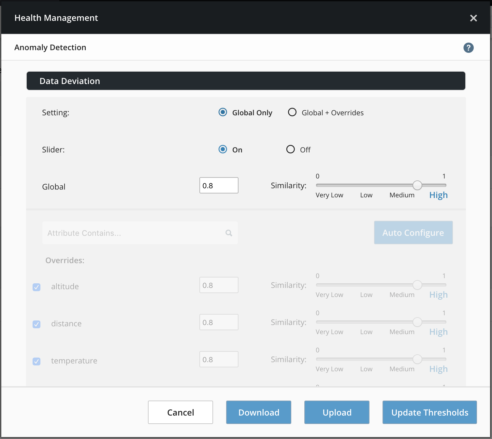
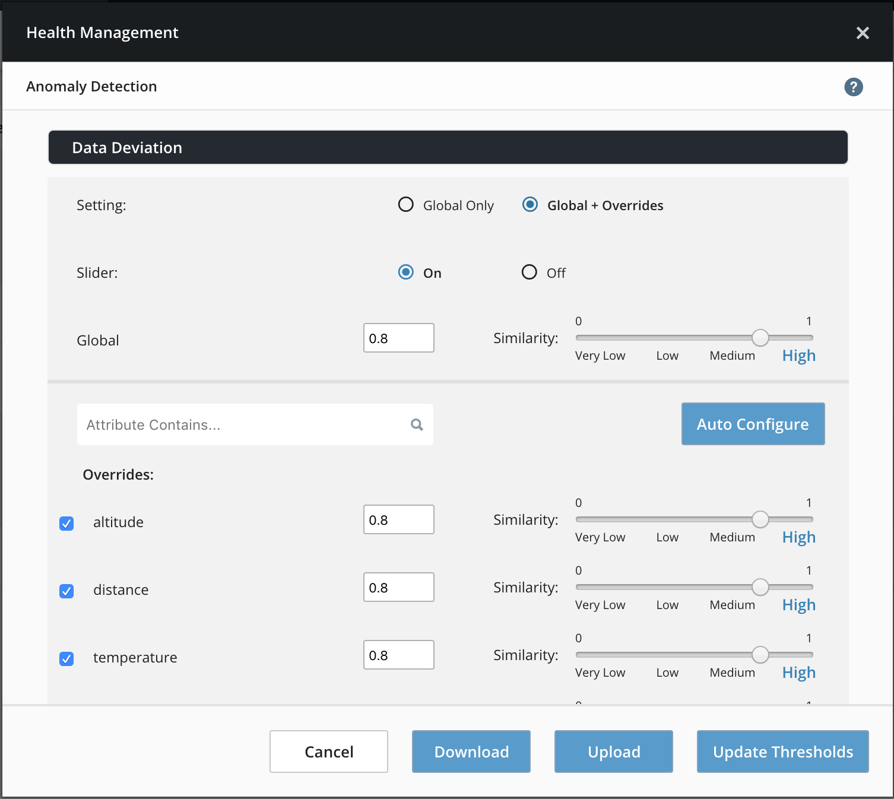
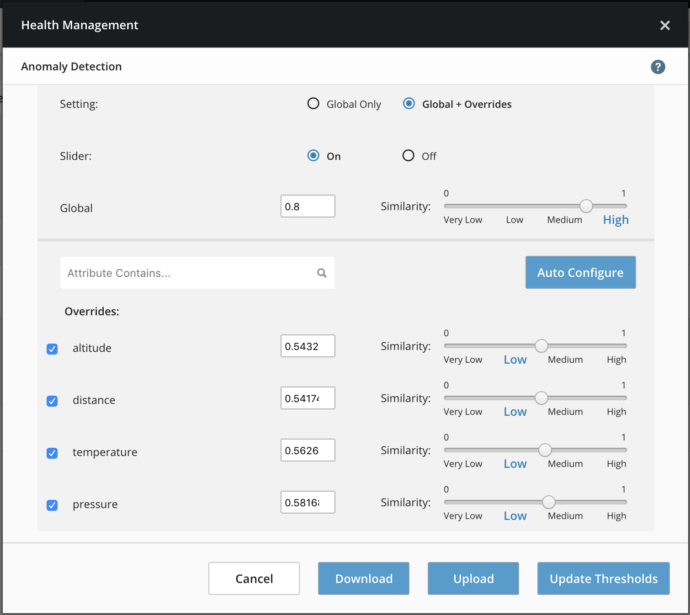

5.7 Health Threshold Management
===============================

In the [ML Health](./5_6.md) section, we covered the basics of configuring
and visualizing the overall health of the MLApp. Now, we delve deeper into
customizing health with custom data deviation and canary thresholds.
When the data deviation feature is enabled by the MLApp policy,
the MLApp builder allows you to provide a threshold for Data
Deviation and this value is applied across all attributes when data
deviation comparisons are performed. The threshold determines the extent
to which training and inference data can vary before a data deviation
alert is generated. Similarly, the canary threshold determines the extent
to which the prediction distributions from the primary and canary pipelines
can vary before a canary alert. Note that the canary threshold parameter
appears only for MLApps that contain a canary node.

In addition to the global threshold set at MLApp creation time, MCenter also
allows the modification of thresholds at runtime and customization of thresholds
for each attribute involved in the model in case of data deviation.

### Set the threshold of a running MLApp

**1.** From the [MLApp Overview](./5_1.md),
click **Actions**, and then select **Health Management**.



The Health Management window opens.



**2.** You can select **Global Only** to modify the global threshold for all attributes.
Alternatively, select **Global + Overrides** to provide a per-attribute
threshold. This option opens the following window with all of the
attributes involved in this MLApp that you can configure individually.



**3.** Click **Update Thresholds**.

### Autoconfigure MLApp Thresholds



Autoconfigure sets the thresholds of each attribute to the most recent similarity score.

### Download and Upload Attribute Thresholds

Download prepares a text file consisting of key value pairs, attribute name, and associated threshold value. 

In this example threshold file, observe that each entry contains the attribute and the current threshold.

```
{
    "age": 1,
    "capital_gain": 0.29367044651809193,
    "capital_loss": 0.5368525368803824,
    "education": 0.6519754276783775,
    "education_num": 0.6514183544764869,
    "fnlwgt": 0.43551669408356536,
    "hour_per_week": 0.74958215379426,
    "marital_status": 0.7232847981008378,
    "native_country": 0.5280742637926013,
    "occupation": 0.8349210404569114,
    "race": 0.629503686396775,
    "relationship": 0.8157947883881623,
    "sex": 0.9535700134965532,
    "workclass": 0.614963570014891
}
```

Upload uses the same text file format as listed above, with a list of attributes and their associated threshold values. The upload of the file results in updating the threshold values of the respective attributes.

We suggest downloading the thresholds for attributes, modifying these values, then uploading the modified threshold file to avoid formatting issues.

Download and Upload buttons are only available if the MLApp has attributes.
