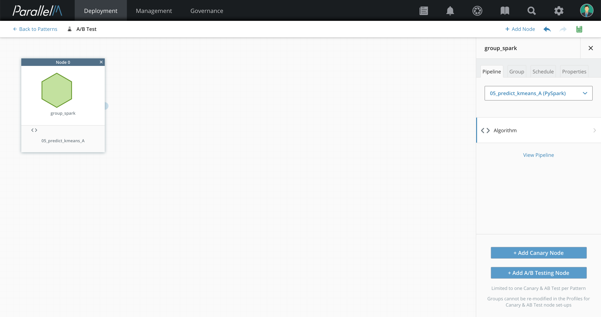
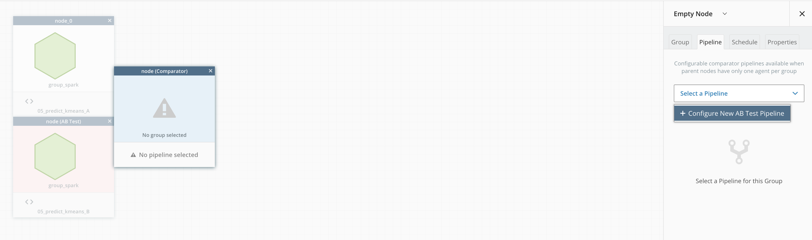
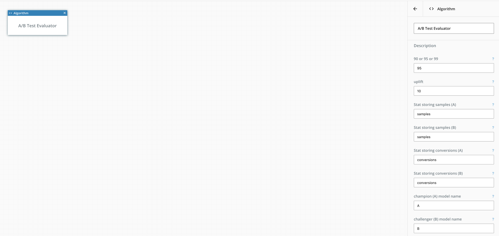

5.8 A/B Testing
===============

A/B testing compares the performance of
two pipelines and determines if one outperforms the other in a
statistically significant manner. In a standard A/B testing scenario, we
have a pair of pipelines: *champion* and *challenger*. The champion pipeline
tends to be the known, potentially deployed pipeline, while the
challenger tends to be the new, relatively unproven pipeline. Our goal
is to split the live workload between the two pipelines in a known
manner and compare their relative performance. In the typical A/B
testing scenario, each pipeline has a distinct *conversion* score---that
is, the fraction of samples that passed the criteria set by the A/B
test. The conversion score is compared across both pipelines based on
the confidence value (for more details, see <https://abtestguide.com/calc/>).

The current version of MCenter supports two-pipeline configurations. Future
releases will support AB tests with more than two pipelines.

Setting up A/B Testing
----------------------

In this example A/B test setup in MLApp Builder, there is
an existing MLApp with an inference-only node setup.

**1.** Click the inference node, and the **Add A/B Testing Node** option
appears.

**2.** Click **Add A/B Testing Node**. A second MLApp node appears and a
A/B comparator node is added (similar to the canary setup described in the
[ML Health](./5_6.md) section).

**3.** In the **Select a Pipeline** menu, select the B/challenger pipeline and configure it. 

**4.** Select the A/B comparator and configure it. Select the name of statistics that represent number of sample and
conversions. In this release, we provide a comparator pipeline pre-built
into the product. You need only configure the arguments to this pipeline
to fit the A and B pipeline statistics.

The parameters are:

-   **One-sided or two-sided** - In general, we are attempting to state whether
    B does better than A (i.e., "one-sided"). If you wish
    to be confident about B's conversion rate being lower than
    A's, then the configuration is "two-sided". The current version
    of MCenter supports one-sided tests.

-   **Confidence: 90 / 95 / 99** - Desired confidence of the results.

-   **Uplift desired** - The relative improvement in conversion rate that is
    desired / tested.

-   **Stat storing samples (A) / Stat storing samples (B)** - The two
    pipelines export a statistic (each) that stores the total
    number of samples processed by each pipeline.

-   **Stat storing conversions (A) / Stat storing conversions (B)** - The two
    pipelines export a statistic (each) that stores the total
    number of conversions among the samples processed by each pipeline.

When testing is configured, you can launch the A/B test. The Health View displays
the results under the A/B Test tab.

**Note:** The A and B pipelines run before the comparator pipeline so that
the comparator has input. Configure the pipeline schedules accordingly. 

The view provides the following graphs:

-   **A/B Test confidence graph** - The probability value of each pipeline
(champion and challenger) is computed using the ratio of the number of
conversions to the number of samples, respectively. Using this
probability value, binomial distribution is plotted with conversion
ratio as the X axis. Two vertical lines are plotted that represent the
mean value of these distributions (which is same as the respective
probability values). A third vertical line represents the user-selected
confidence value on the distribution of champion pipeline.

-   **Success history** - A timeline of all the tests that succeeded.

-   **A/B Stats** - Samples processed, conversions, rates, improvement
observed, and probability that B beats A.
