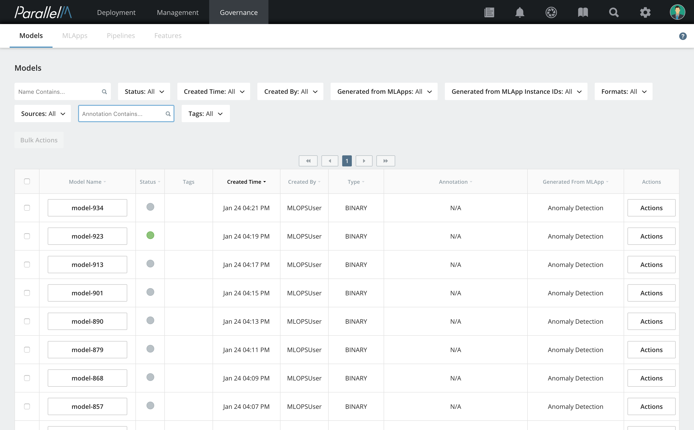
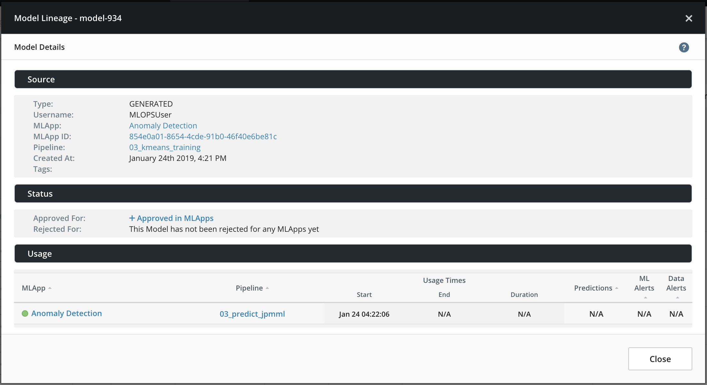
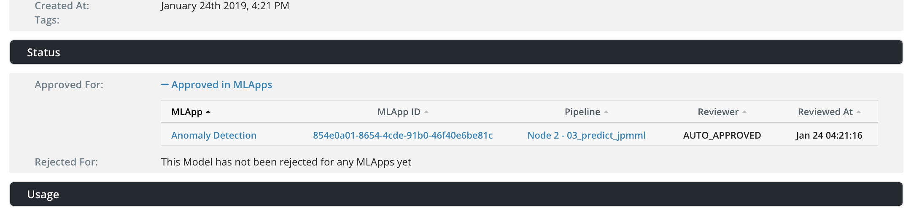
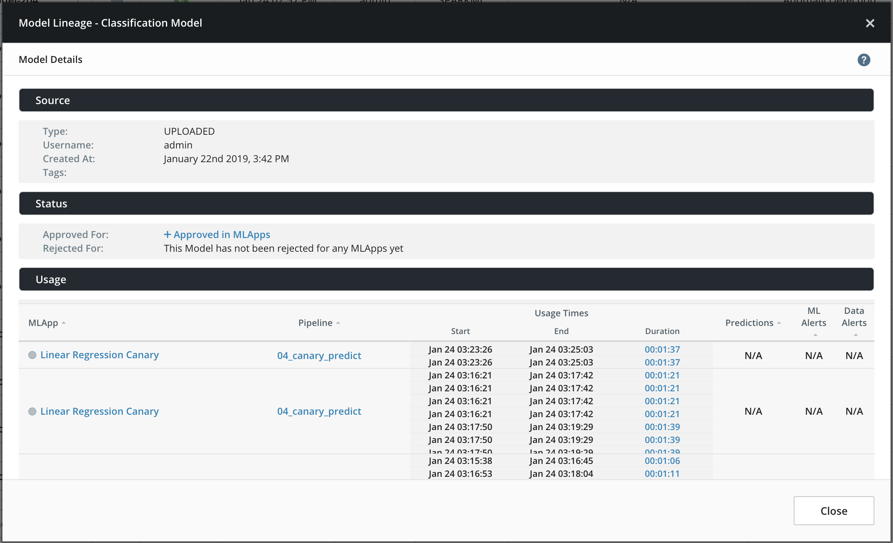
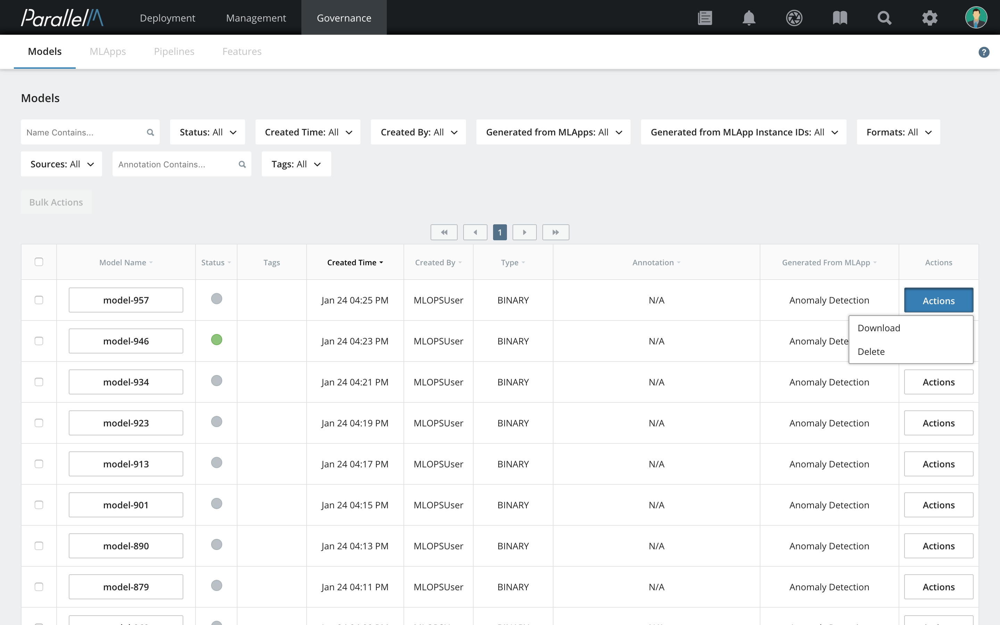

6.1 Model Governance
====================

Model governance provides information about the lineage, approvals,
rejections, and use of all models tracked by MCenter. This governance
feature tells you how and when a model was generated
(including information about MLApp, pipelines, parameters, training
results, and timestamp) or uploaded, who approved or rejected the model,
and where and for how long the model was in use (including prediction
statistics).

Model governance is provided for all models
in MCenter. Click **Governance** in
the navigation bar to view model data.

Filtering Model Data
-------

By default, all models that are generated by pipelines within MCenter or
uploaded are displayed on the Governance page. To select a model or list of
models that matches specific criteria, you can
filter models by **Name**, **Created Time**, **Created By**, **Generated from MLApps**,
**Generated from MLAPP Instance IDs** (MLApp run ID), **Formats** (model), **Sources**,
and **Annotation**. Filters are located above the list of models
on the Governance page and are applied immediately after being selected.

The list of possible values is automatically pre-populated into a dropdown list for MLApps, MLApp instances, and Formats.
With the exception of **Launch Time** and searchable filters (**Annotation** and **Model Name**), you can select
one or more values by expanding each individual filter, and then clicking the desired
checkboxes.

Viewing a Model
----------

Click the model name in the **Model Name** field
to get information about generated and uploaded models.

Generated Models
----------------

For models generated using MCenter, complete information of the model's
creation is captured. Click the
links for **MLApps**, **Instance ID**, and **Pipeline** to get information on generated models.
Clicking the MLApp takes you to the MLApp Builder page where you can
navigate the MLApp (in read-only mode) that was used to create the
selected model.

Clicking the pipeline displays the pipeline used to train/create
the model via the Pipeline Builder page.

The status section contains the list of MLApps that this model was
approved or rejected for. This example list shows approved
MLApps for a selected model.

Information about Uploaded Models
---------------

Governance information about models uploaded into MCenter includes the
user who uploaded the model, the description added during model upload,
and the time the model was uploaded to the system.

Downloading a Model
--------------

To download a model, click **Actions** and then **Download**.

The model is saved in the default download folder. If the model format is a directory, such as
TensorFlow's SavedModel or Spark's ML Model, the downloaded model will be the tarred, gzipped
model directory.

Deleting a Model
------------

Both generated and tracked models are automatically tracked and
preserved in our system until they are explicitly deleted by a user.
You can permanently delete tracked models from our system by following
these steps.

**1.** Select the model you want to delete and click **Actions**
and then **Delete**.

**2.** In the confirmation window, click **Delete**.
