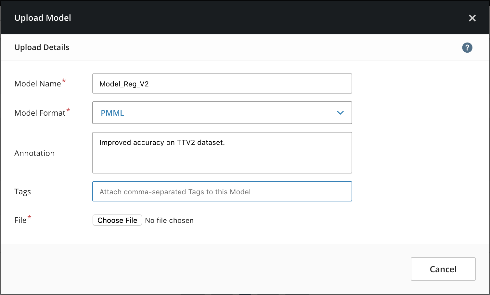

6.2 Model Upload
================

You can bring external models into MCenter via the **Upload Model**
feature. When these models are in the system, you can use them as initial models
in prediction pipelines during MLApp construction. In addition, you can
update an executing prediction pipeline via the **Set Model**
feature. You can view and download uploaded models via the
**Governance** view in the MCenter UI.

Uploading a Model
-----------------

When uploading, the model must be stored as a single file. When uploading models that are stored in a directory structure, such as TensorFlow's SavedModel format or Spark's ML Model format,
tar and gzip the model directory into a single file before uploading.

**1.** Select **Governance** in the navigation bar. The Models page opens.

**2.** In the upper right of the Models page, click **Upload
Model**. The Upload Model window opens.

**3.** Type a **Model Name**, select a
format, add an **Annotation** describing the model, and click **Choose
File** to select the model file. When you select a file, the model
automatically uploads.

When the upload is finished, the model appears in the list of models.
