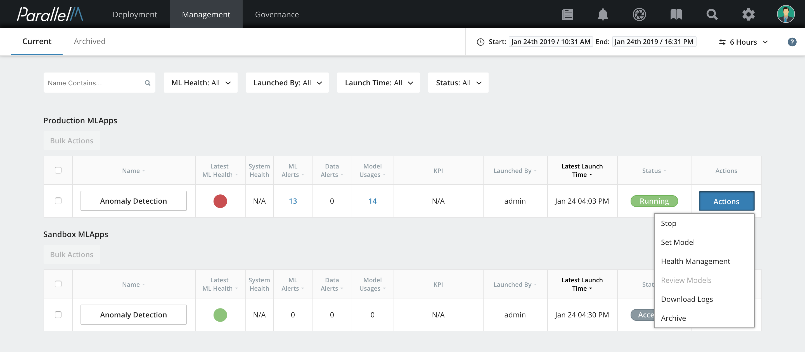
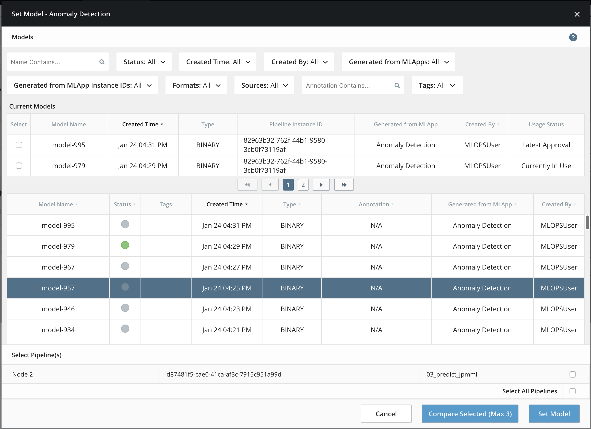
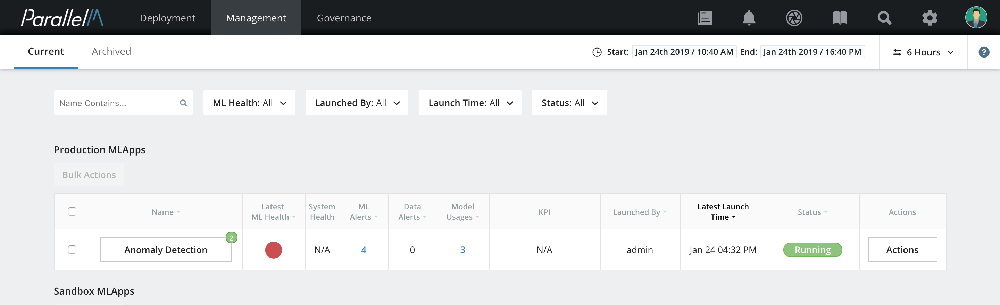
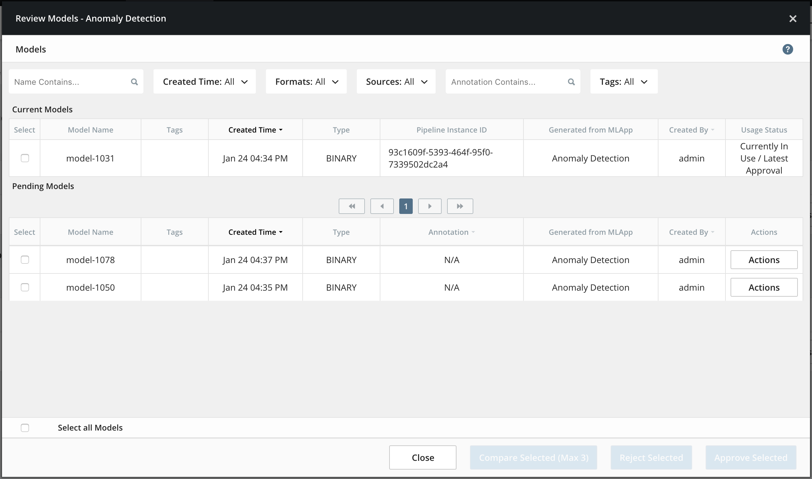

7.1 User Actions
================

User actions such as launching MLApps into production, uploading and
approving models, and configuring ML Health alert thresholds are
recorded as part of an MLApp's history. Actions that affect running MLApps
are shown in the event timeline.

Managing an Active MLApp
----------------------

The [MLApp Overview](./5_1.md) lists all active MLApps, each with an
**Actions** button on the right. These action options let you manage the
lifecycle of the MLApp and perform ML-related configuration changes.

### Stop

Select **Stop** to shut down all executing pipelines and the MCenter
server thread dedicated to this MLApp. On successful
termination, the status of this MLApp changes to **Stopped**.

### Archive an MLApp

After an MLApp is terminated, this option is available. Select
**Archive** to remove the MLApp entry from the dashboard. Note that
all relevant Governance data stays intact.

### Set Model 

**1.** Select **Set Model** to introduce a new model into the MLApp. When
you select this, the Set Model window opens listing all of the models
available in the system to be updated to the MLApp.

**Note:** Filters for models are on the top section of the
Set Model window. For instructions on how to use these
filters, see the section on [Model Governance](./6_1.md).

**2.** Select a model and check the box for the pipeline that will use this model. Then
click **Set Model**. The Annotation window opens.

**3.** (Optional) Enter an annotation describing this model update. Click **Set**.
All prediction pipelines associated with this
MLApp use this model for operation on their next scheduled iteration.

**Note:** Any model updates and annotations
are reflected in the Timeline pane of the [Health View](./5_2.md) and
[Data Science View](./5_3.md).

### Review Models 

If the MLApp was configured with a **Manually Approve** policy, you are
prompted to review and either approve or reject a newly
trained model. The MLApp associated with the model pending approval is
marked with a notification indicating the number of models that
need approval.

**1.** Here, there are two models that are pending approval
as the badge indicates. To approve or reject these models, click
**Actions**, then choose **Review Models**.

A list appears showing all of the models produced by this MLApp that are pending review.

**Note:** Filters for models are on the top section of the
window. For instructions on how to use these filters, see the
section on [Model Governance](./6_1.md).

**2.** (Optional) At this point, you can evaluate a model further.
Clicking **Download** saves a copy of the model to your local
system. Clicking **Model Stats** takes you to the Data Science View
pertaining to this MLApp.

**3.** When you have finished your evaluation, click **Approve** or **Reject**.
A new dialog opens where you can annotate your decision.

**4.** When you finish adding annotations click **Approve** or **Reject** to
save the annotation and complete the action. 

**Note:** If you approve the model, it is
updated for each prediction pipeline belonging to this MLApp. If you
reject the model, it is not propagated to the
prediction pipelines. In both cases, the model remains in the
linked database.

When you approve a model, an event shows up in the **Events** panel in
Health View and Data Scientist View along with any
annotation.

### Health Management

Select **Health Management** to configure ML Health policies and
thresholds. For more details, view the section on
[Health Threshold Management](./5_7.md).
