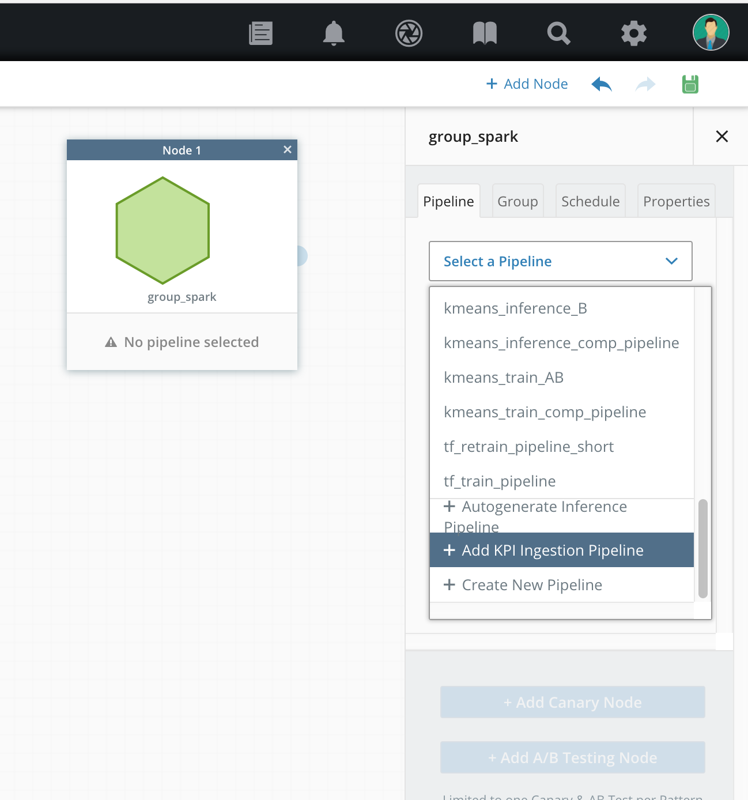
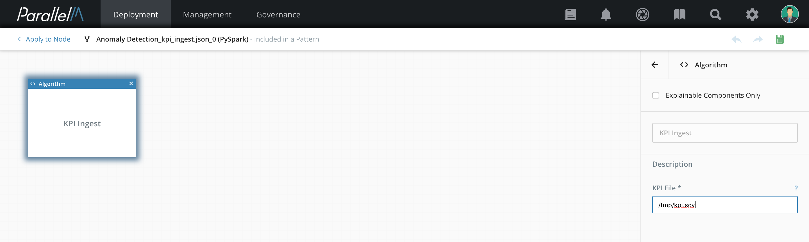
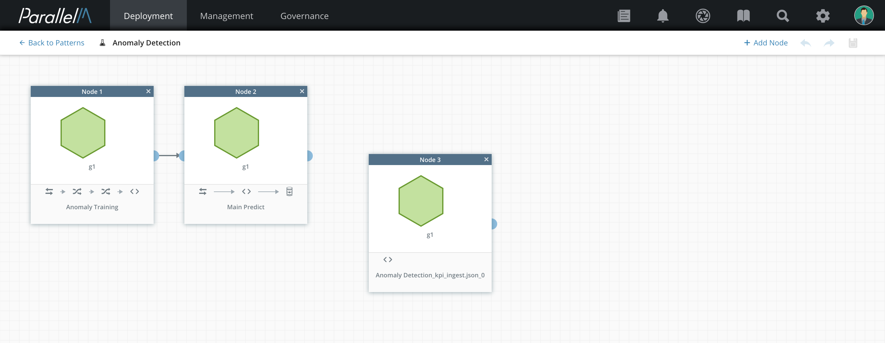
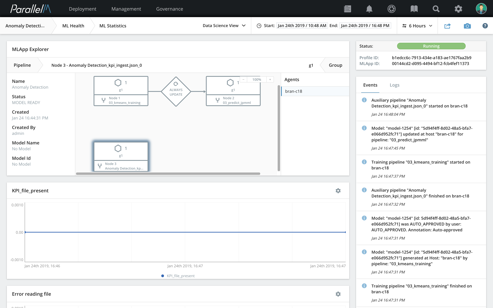
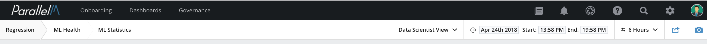
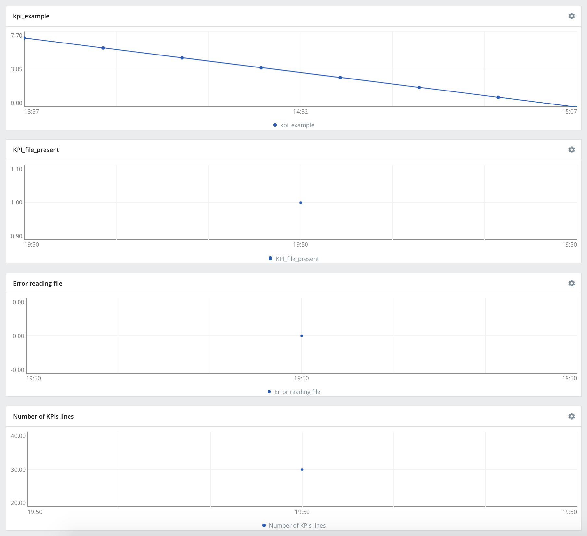

7.2 Business KPIs
=================

ParallelM MCenter allows you to add KPIs generated externally to MCenter
and correlate that data with statistics from MCenter MLApps.

Overview
--------

The current release of MCenter contains partial functionality for a
forward-looking feature, Business KPI correlation and integration,
which includes these advantages:

-   When deploying an ML application focused on serving a business
    need, it is imperative that enterprises have insights into how the
    ML investment has performed with respect to the business results.
    Business KPI integration delivers transparency and accountability
    for ML applications from the perspective of the business purpose.

-   You can configure KPIs per MLApp and add these KPIs to MCenter
    from external sources.

-   The current release supports the mechanism to add these KPIs per MLApp.
    See the section [Importing KPI](./7_2.md#importing_kpi) for details.

-   In future releases of MCenter, ingested KPIs can be analyzed
    with both standard reports available out of the box from the MCenter
    UI and via custom analytics through the MLOps API. The KPIs can also
    be cross-correlated with other MLApp metrics and events. For example,
    you will be able track the end business KPI impact from a new
    model deployment.

The current release includes a pre-configured pipeline that you can add
to any MLApp to ingest business KPIs. The KPI values over time are
automatically tracked and presented in the Data Science
View.

Importing KPI <a name="importing_kpi"></a>
-------------

Add the ingestion pipeline using these
steps.

**1.** Click **Add Node**.

**2.** Select **Add KPI Ingestion Pipeline** from the list of available
pipelines.



A new pipeline is created for this KPI ingestion pipeline.

**3.** Specify the file path parameter for the KPI ingestion
component.

**Release note:** In the current release, we only support file contents
of the format `<KPI Variable name>`, `<timestamp>`, `<value>`.

Here is an example KPI file with variable name kpi_example with
increasing values from 0 to 12.

```
kpi_example, 1524607625, 0 
kpi_example, 1524607025, 1 
kpi_example, 1524606425, 2 
kpi_example, 1524605825, 3 
kpi_example, 1524605225, 4 
kpi_example, 1524604625, 5 
kpi_example, 1524604025, 6 
kpi_example, 1524603425, 7 
kpi_example, 1524602825, 8 
kpi_example, 1524602225, 9 
kpi_example, 1524601625, 10
kpi_example, 1524601025, 11
kpi_example, 1524600425, 12
```




**4.** By default, KPI pipelines are saved under
`<ion_name>_<kpi_ingest_json>_<counter>`. In our example, the
MLApp name is `Regression` and the generated pipeline name is
`Regression_kpi_ingest_json_0`. When the KPI ingestion pipeline is
configured, navigate to the MLApp builder to save the MLApp.



**5.** To visualize the KPI values, navigate to the Data Science View
and select the node with the KPI ingestion pipeline. The KPI pipeline
might not be visible in the MLApp explorer pane by default. Scroll down in
the MLApp explorer pane to select node with KPI ingestion pipeline.



**6.** The KPI values are plotted across time. If the values are in the
past, use the timeline picker on the top right to choose the appropriate
time window.



In addition to the KPI values, the UI displays the following as
line graphs: file presence (*KPI_file_present*), number of errors
(*Error reading file*), and number of samples in the KPI file (*Number
of KPIs lines*).


