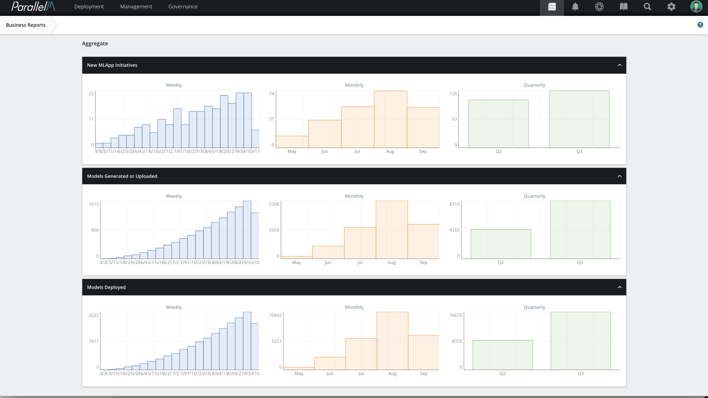

7.3 Business Reports
====================

MCenter contains a Business Reports view that outlines the broad
deployment of ML initiatives across the organization. The Business
Reports view is intended for IT operations, business analysts, and other
stakeholders to understand the number of ML initiatives in deployment
and the growth of these initiatives over time (monthly and quarterly).

In MCenter, each such initiative maps to an MLApp, so the Business Reports
view uses the deployment statistics of MLApps to reflect the overall trends of
ML deployment across the organization.

You can access these reports by clicking the ledger-shaped **Reports** icon in the
navigation bar.

Business report charts fall into three categories:

-   **New MLApp Initiatives** - New MLApps that have been run in the given
    time period.

-   **Models Generated** - The number of times the training pipeline has
    run and generated a new model.

-   **Models Deployed** - The number of the new models that have been put
    into production in the inference pipeline.

For each category, three bar graphs are shown. Each shows the number of
times the events occurred, aggregated by week, month, or
quarter.

In the following example business report, notice that the new MLApp
initiatives have been steadily increasing from 2 MLApps/week to 19
MLApps/week and as a result have roughly 100 new MLApps in the first two
quarters of the year. Similarly, notice that with the increasing
MLApps, the models generated and deployed are also steadily increasing
(\>750 Models/Quarter).

New MLApp initiatives track all MLApps launched by the MCenter users
(including those launched in sandbox mode).

