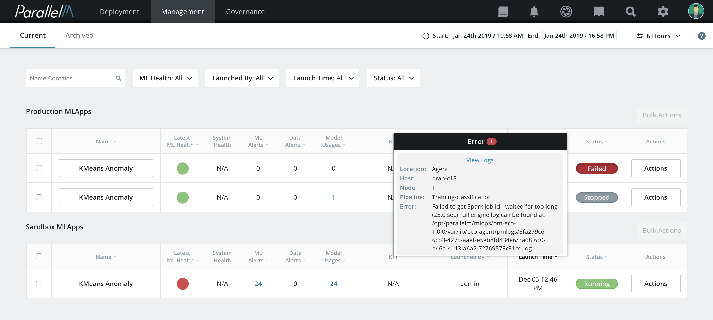
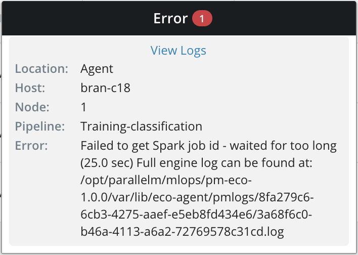

# 8.1 Error Reporting

When running an MLApp, MCenter launches each pipeline on one or more agents.
The agents monitor these pipelines and propagate any error to MCenter.

Viewing Errors
--------------

To view errors in a pipeline, click the **Failed** button under the MLApp's
**STATUS** column in the MLApp Overview dashboard.

The error message contains the following fields:

-   **Location**: Whether the error occurred on an agent or the server.

-   **Host**: The host on which the pipeline was running.

-   **Node**: The node on which the pipeline was running.

-   **Pipeline**: The name of the pipeline where the error occurred.

-   **Error**: The specific error message.

Node and Pipeline fields do not appear for errors located on the server.

Examples of Errors in Pipeline Code
-----------------------------------

The following screenshot shows a pipeline-specific error. In this
example, a PySpark program failed to find its input file. You can
determine the cause of the error by scrolling through the error message.

If the information in the error message is not sufficient for
understanding the cause of the issue, you can access the full logs of
the pipeline by clicking on the **View Logs** link inside the error window.
