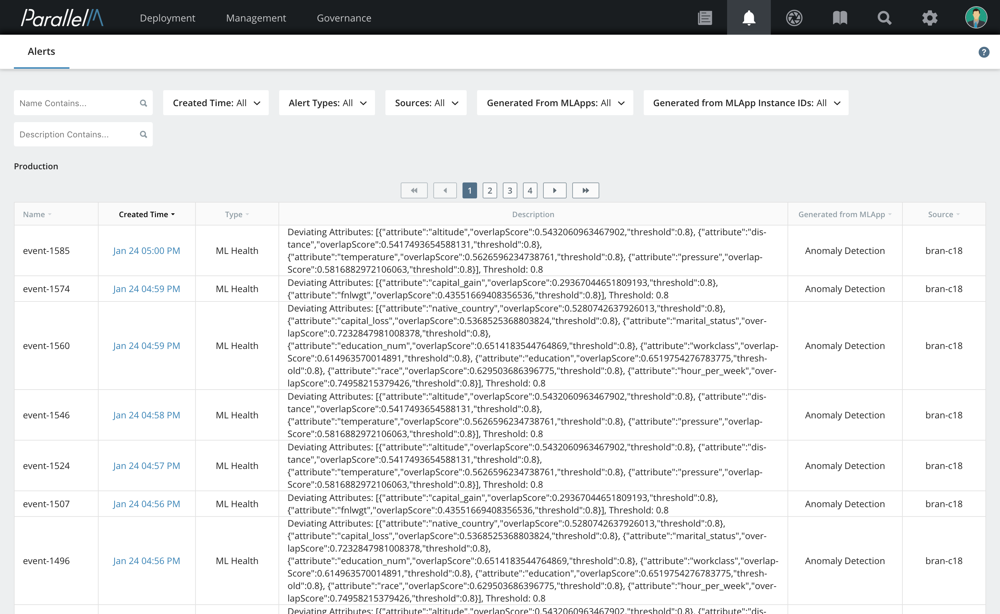
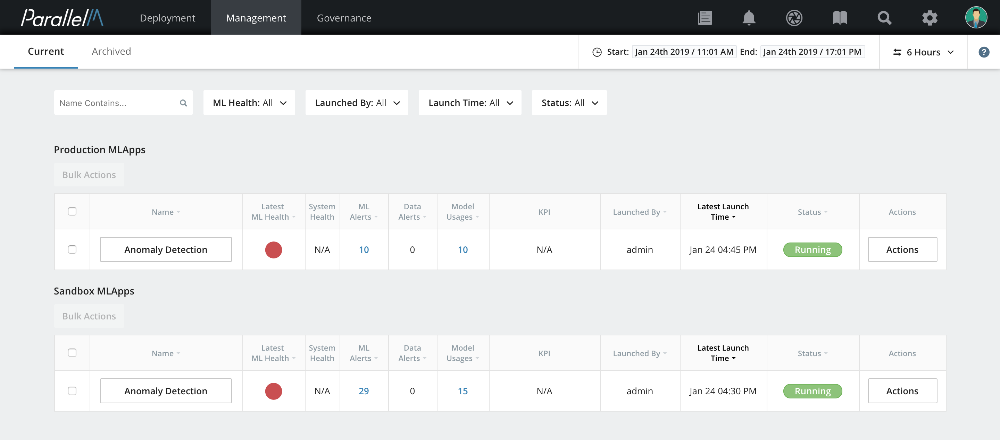
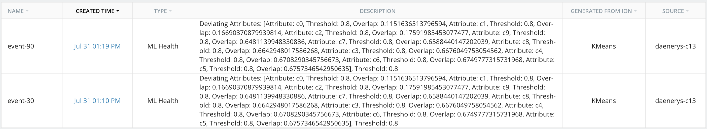
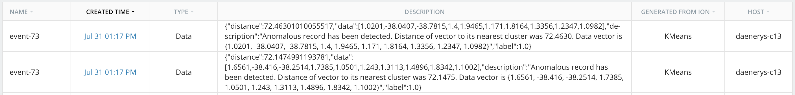
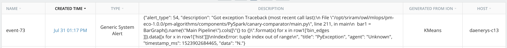

8.2 Alert Reporting
===================

Any pipeline running as part of an MLApp can generate alerts. An *alert*
is an event that needs special notification and tracking. Each such
alert is saved in the database for later reference.

Viewing Alerts
--------------

There are two ways to view alerts through the MCenter UI.

### Alerts View

To view the Alerts page in MCenter, click the bell-shaped Alerts icon in
the navigation bar.

The Alerts page is separated into separate sections for Production and
Sandbox environments to clearly distinguish alerts generated during
experimental Sandbox deployments from ones generated from a full
Production deployment.

### MLApp Overview Dashboard

You can view alert notifications in the MLApp Overview Dashboard. The
**LATEST ML HEALTH** column indicates the last known state of the MLApp's
ML Health; a red dot indicates that there is currently an active ML
Health issue. The **ML ALERTS** column displays the number of ML Health
issues as observed over the specified time window shown in the Time
Picker. The **DATA ALERTS** column displays the number of data alerts
(such as anomalies).

Filters
-------

By default, all alerts are displayed in the Alerts page. To select an alert or list of
alerts that matches a set of criteria, filters can be used. You can
filter alerts by **Names**, **Created Time**, **Alert Types**, **Sources**, the
**IONs** or **ION Instance IDs** the alert was created
from, and the **Description**. Filters are located on the top
section of the Alerts page.

With the exception of **Launch Time** and searchable filters (**Description**), you can select
one or more values by expanding each individual filter, and then clicking on the desired
checkboxes.

Types of Alerts
---------------

MCenter categorizes alerts as ML Health, Data, or Generic System.

### ML Health

An *ML Health* alert is generated when the ML Health of an MLApp shows
indications of non-optimal functioning. Based on the kind of ML Health
being determined, an alert could have different meanings. MCenter tracks
the following types of ML Health alerts:

### Data Deviation Alert

MCenter pipelines compute the feature distributions of input data for both
training and inference pipelines. When the feature distributions for
these pipelines diverges beyond a configured amount, an alert is raised.
Such an alert includes information about the dataset attributes where
the divergence occurred, the threshold used to trigger the alert and the
difference in scores assigned to the specific attribute. More
information on this calculation is available in the [ML Health](./5_6.md) section.

The screenshot below shows a sample data deviation alert.

### Canary Alert

If the MLApp was constructed with a canary pipeline, the pipeline
responsible for performing comparisons between the main and canary
pipeline prediction sets raises a Canary Alert when the prediction sets
differ by more than the defined threshold. Here, the description of the
alert contains the threshold used to detect a canary deviating.

### Data Alert

A Data alert is one that is generated when it is determined that a
specific data point (or a set of data points) is anomalous. An anomaly
detection pipeline (MCenter is packaged with K-Means Anomaly Detection
components), when set up with an anomaly threshold during pipeline
construction will trigger a Data alert when faced with an anomaly. The
alert will include information about the anomalous field and the
absolute value that triggered the alert.

As seen here, the alert describes an anomaly from a KMeans pipeline and
denotes the fields in the anomalous record and the distance to the
nearest center.

### Generic System Alert

To facilitate general alerts and error reporting, MCenter allows pipelines
that incorporate the MLOps API to report generic alerts using this type.
Each alert contains fields for describing the alert, any associated
data, a title, and the time at which it occurred.

Generating Alerts
-----------------

Alerts are triggered from pipeline components provided by MCenter or by
custom user programs using the MLOps API. Pipelines built using the
Pipeline Builder can generate any of the alert types based on the type
of MLApp they participate in. For example, an MLApp with canary nodes and a
canary comparator pipeline could generate Canary Alerts. To generate
custom alerts, view the alerts section in the MLOps API documentation.
