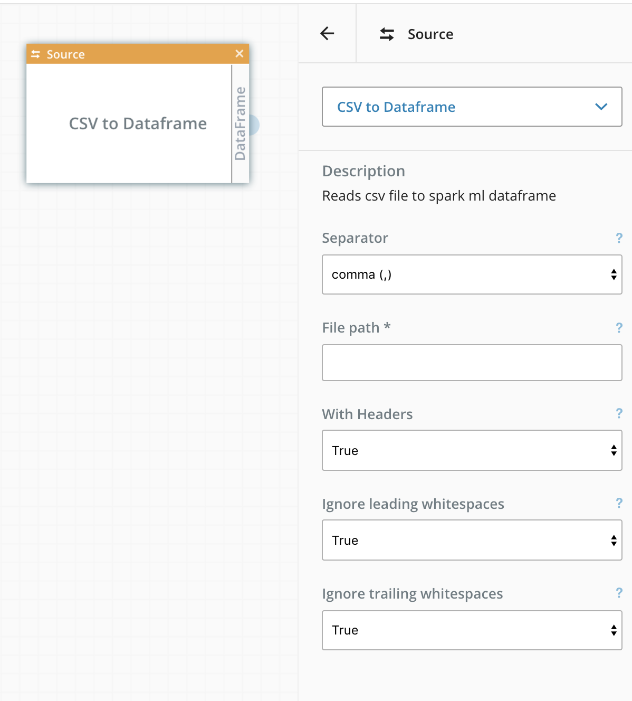
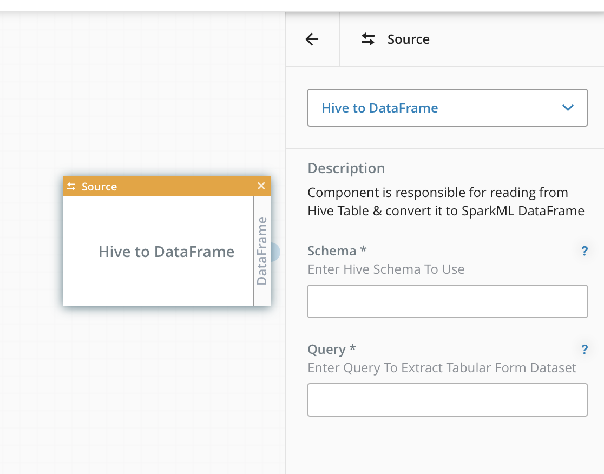
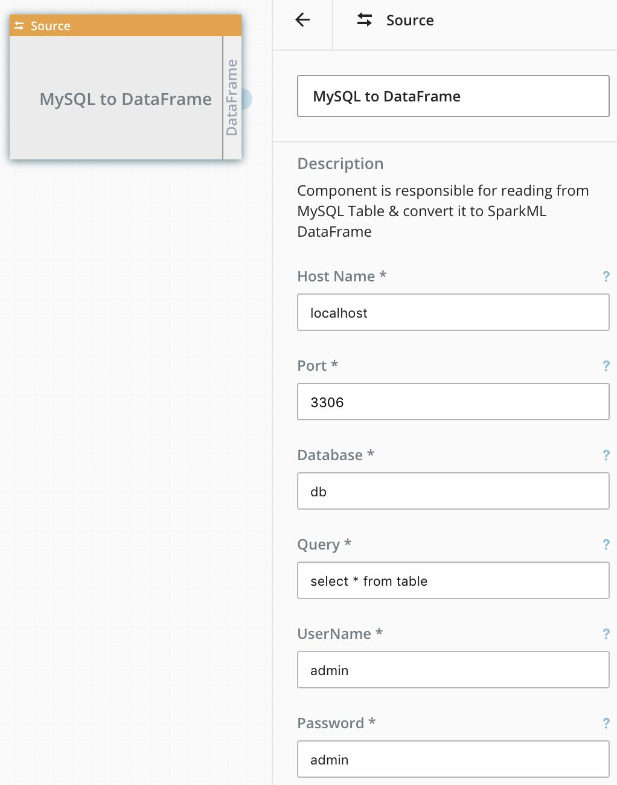
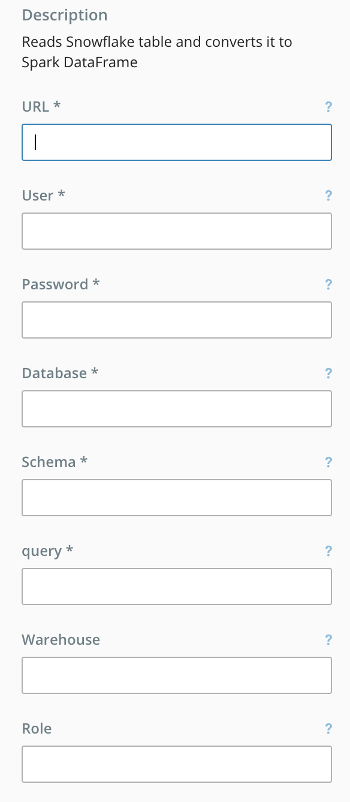

# 9.2 Supporting Modules for Spark

In addition to algorithms, MCenter provides additional built-in components
for Spark pipelines. This section lists these components. By default,
these components do not provide statistics but can be used within
pipelines that report statistics as described in the [Bundled MLApps](./9_1.md) section.

### Source Components

We provide three source components:

- **CSV to Dataframe** component has the following options:

1.  Separator

2.  File path

3.  With Headers

4.  Ignore leading white spaces (in headers)

5.  Ignore trailing white spaces (in headers)

An example screenshot of how this component can be used and configured
within the pipeline builder is shown in the figure below.

- **Hive to Dataframe** component has the following options:

1. Schema

2. Query

- **MySQL to Dataframe** component has the following options:

1. Host Name

2. Port

3. Database

4. Query

5. User Name

6. Password

- **SnowFlake Table to Dataframe** component has the following options:

1. URL

2. User Name

3. Password

4. Database

5. Schema

6. Query

7. Warehouse

8. Role

*Other components listed in later sections have similar configuration
windows within the pipeline builder, with arguments listed specific
to each component.*

### Feature Engineering

We provide the following feature engineering components that take a
dataframe as input.

-   Max Absolute Scaler

-   Normalizer

-   Min Max Absolute Scaler

-   Vector Assembler

-   PCA

-   Vector Indexer

-   String Indexer

-   Binarizer

-   Bucketizer

-   Vector Slicer

-   Quantile Discretizer

-   OneHotEncoder

-   RFormula

-   ChiSqSelector

-   IndextoString

-   Standard Scaler

### Sink

The following Sink components are supported.

-   RDD to File

-   Dataframe to CSV

-   Dataframe to Hive

-   Dataframe to MySQL

-   Dataframe to Snowflake table

### Flow Shaping

Flow shaping components provide dataframe manipulation functions like

-   Dataframe Split

-   Dataframe Duplication
