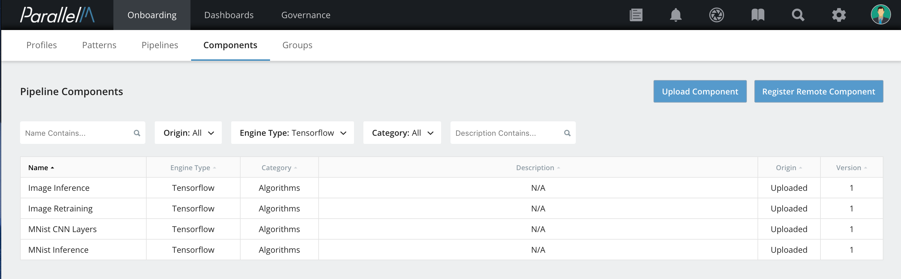
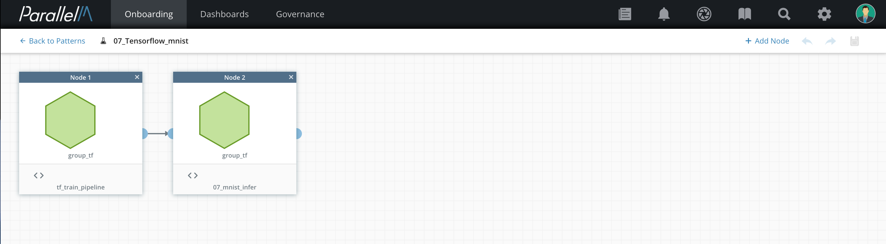
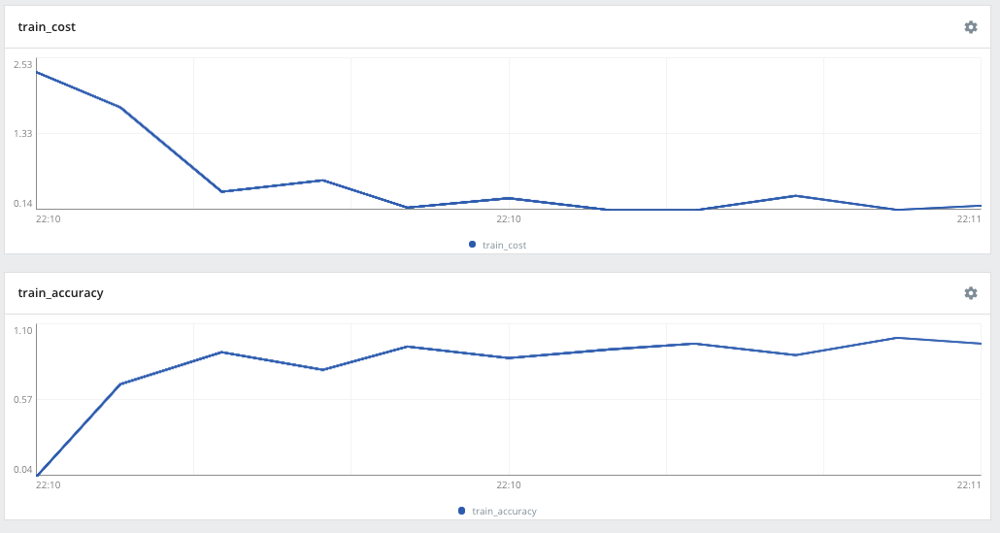
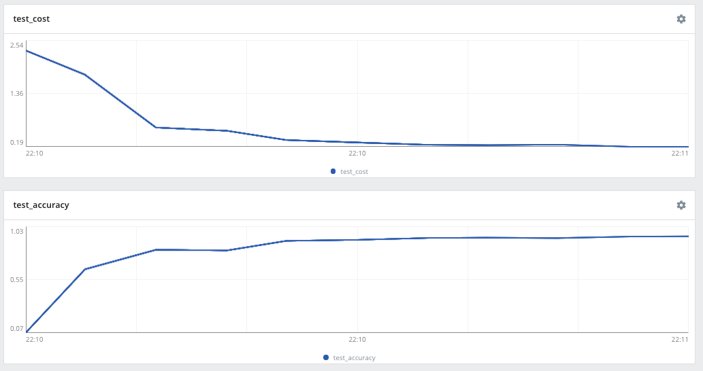
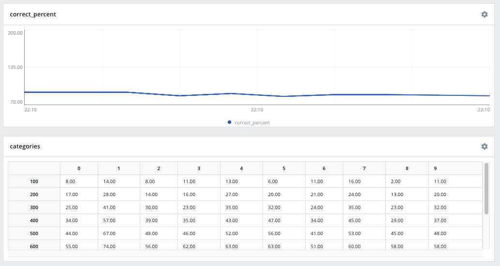
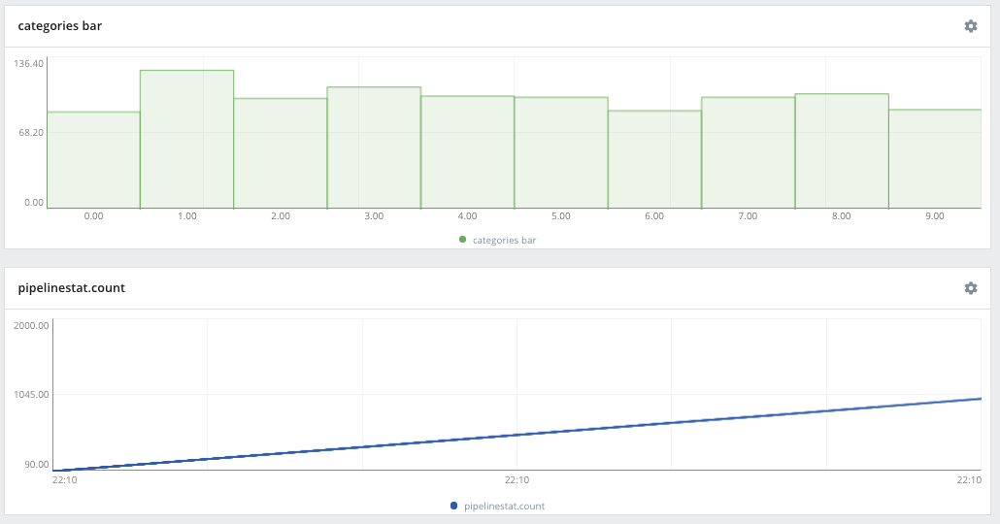
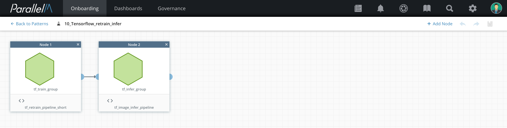
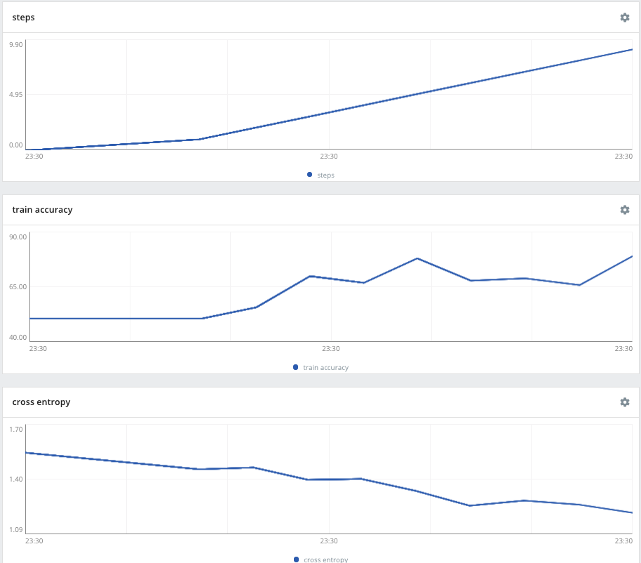
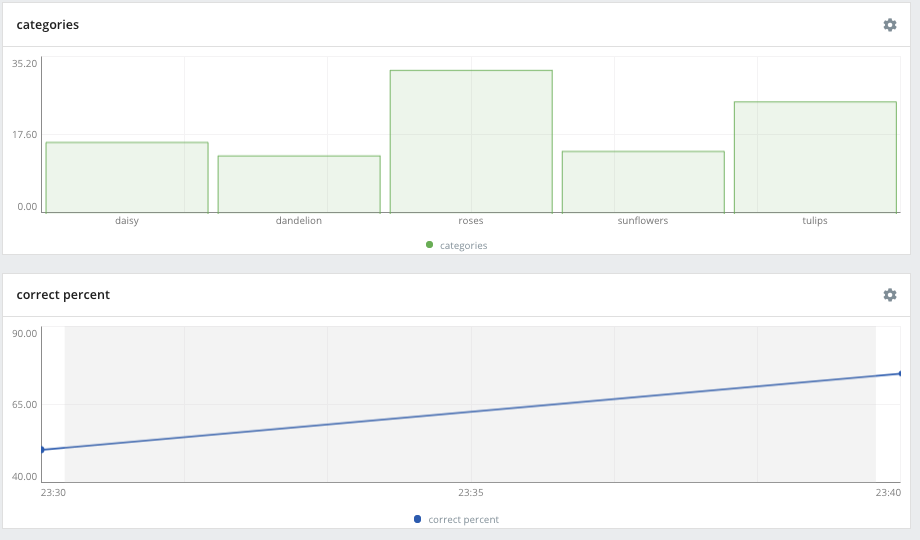
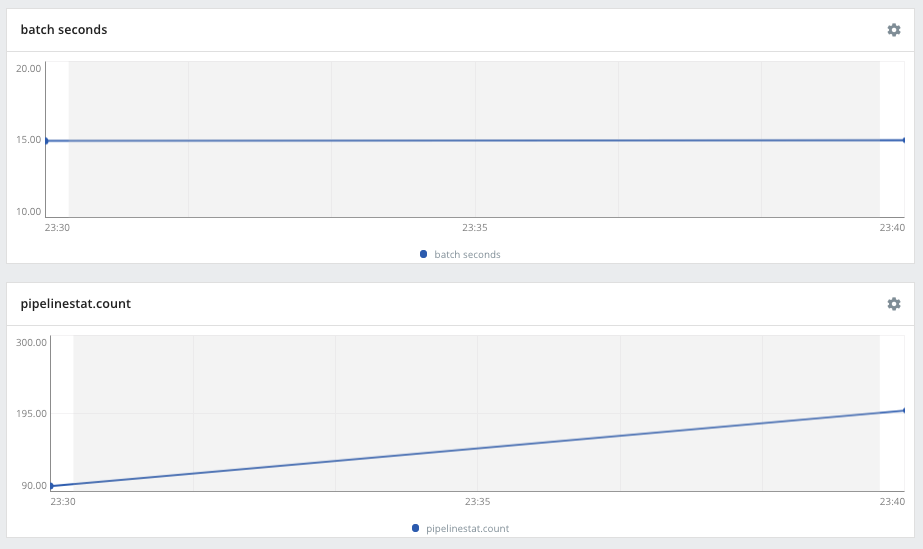

# 9.3 Bundled Components for TensorFlow

MCenter can be used to manage TensorFlow programs, handling pipeline scheduling, orchestration,
and governance. Scalar statistics written to TensorBoard are visible in the Data Science View; 
in this way, you can monitor common training statistics, such as accuracy and cost. Using the MLOps
API, you can add custom statistics and alerts. For example, you can raise an alert if the confidence
level falls below a threshold when performing inference.

Included in the MCenter distribution are example TensorFlow programs that have been modified to demonstrate
the use of the MLOps API. Because the MLOps API can run in standalone mode, you can develop and instrument
your TensorFlow programs outside of MCenter.

## Components

The following components are provided as uploadable components available with the bundled examples with
the MCenter distribution. Follow the instructions in the Manual Component Uploading section to upload these
components to make them available for use in pipelines.

### MNist Training Component

This program from TensorFlow uses a convolutional network for image recognition of the MNist data set of
hand-written digits. It has not been modified to use the MLOps API for statistics. However, because this
program periodically records its cost and accuracy to TensorBoard, these values are available in the 
Data Science View of the MCenter UI.

All parameters have default values set so the program can be run without further configuration. Note that
the **Model output dir** parameter must be left blank in order to work with orchestration. The number of
training iterations is low by default to enable fast experimentation. If you increase the number of
iterations, the model will have improved accuracy, but you may wish to reduce the frequency of statistics reporting and reduce the pipeline run frequency. 

### MNist Inference Component

This is an example program that acts as a client using a trained model to generate inferences. It demonstrates
statistics reporting on inferences. In addition, it raises an alert when a sufficient percentage of inferences
have confidences below a given threshold.

All parameters have default values set so the program can be run without further configuration.

When creating an inference pipeline, use **Set Default Model** to provide an initial model for the pipeline
to use. This model may be replaced later by orchestrated training pipelines that generate new models or
by manually setting a new model. We provide a default model for MNist with the bundled materials.

### Transfer Learning Re-training Component

This program from TensorFlow downloads a pre-trained model available from TensorFlow. By default, it downloads
the latest version of Inception3 from GitHub. It adds layers to the model and continues to re-train the layers
using the provided data set. We have added instrumentation with the MLOps API to show steps, cost, and accuracy
statistics in the Data Science View.

All parameters can be left at their default values except the input data directory. The bundled examples includes
a data directory that can be used for this purpose. The **Model output dir** parameter must be left blank when
using this pipeline in an orchestration configuration.

### Transfer Learning Inference Component

This program takes a trained model and uses it to perform inferences. We provide this program as an example
of how to the MLOps API can be used to generate inference-side statistics.

All parameters can be left at their default values except the input data directory. The bundled examples includes a data directory that can be used for this purpose. The **Model dir** parameter 
must be left blank when using this pipeline in an orchestration configuration.

When creating an inference pipeline, use **Set Default Model** to provide an initial model for the pipeline
to use. This model may be replaced later by orchestrated training pipelines that generate new models or
by manually setting a new model. In the bundled materials, we provide a default model for the inference component that will work with Inception3 models.

You can view which TensorFlow components have been uploaded by filtering on **Tensorflow** as the Engine Type in the Onboarding Components view in the UI.

## Pipelines

**Release Note:** Currently, TensorFlow components are supported only as legacy components. That is, they run
as single-component pipelines only.

You can create a single-component pipeline from each uploaded TensorFlow component. Follow the instructions for creating pipelines for legacy components in the Pipeline Builder chapter.

## Example MLApp: MNist Training and Inference

Once you have a training pipeline and an inference pipeline, you can use the MLApp Builder to orchestrate
model updates from the training model to be propagated to the inference pipeline. See the MLApp Builder
chapter for details.

You should configure the pipeline nodes as follows:

### Training Statistics

The MNist training statistics show the cost and accuracy for the training and test data sets as shown below.

### Inference Statistics

The MNist inference statistics show the prediction accuracy (because the labels are available for this data set). Note that if the training pipeline uses a small number of iterations (by default for demonstration purposes), the accuracy will drop after the inference pipeline switches from the default model to the new model produced by the training pipeline. Category distributions are shown both as a table, with cumulative counts for each 100 inferences and as a bar graph.

## Example MLApp: Transfer Learning Re-training and Inference

Once you have a training pipeline and an inference pipeline, you can use the MLApp Builder to orchestrate
model updates from the training model to be propagated to the inference pipeline. See the MLApp Builder
chapter for details.

You should configure the pipeline nodes as follows:

### Training Statistics

The re-training pipeline statistics show the steps, accuracy, and cross entropy over time.

### Inference Statistics

The inference pipeline statistics view shows a bar graph of the inference category distribution for
each batch of inferences processed. It shows the percent of inferences that were correctly categorized. Note that the default (not yet retrained) model only has about 50% accuracy. Once a new model is received
from the retraining pipeline, the accuracy rises (how much depends on the number of retraining iterations). Other graphs show the total seconds to process each batch of inferences and the cumulative
total number of inferences generated.

