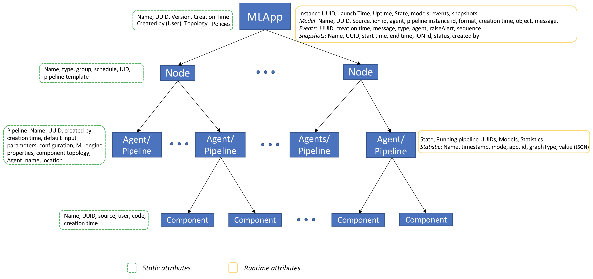

# Appendix: Governance Metadata

The MCenter *Governance* feature is enabled by certain metadata collected
in the database linked to MCenter Server. This metadata spans objects
ranging from static MLApp definition files to objects generated as a
result of executing various MLApp components. Each of these pieces are
linked together chronologically as well as causally. This linkage is
bound by the instance of the executing MLApp and helps expose the
Governance features available under the **Governance** tab in the MCenter
UI.

MCenter Governance Schema uses MLApps as the foundational objects. With a
few exceptions (covered later in this section), most objects are
maintained within reference to one or more MLApps. The following figure
shows the metadata that is captured per MLApp in the V1.0 release of
MCenter.

Both static and runtime attributes are tracked. In particular, the
following objects are tracked at each level.

MLApp Level
---------

### Static

This class of metadata includes objects and data formed at the time of
MLApp definition.

**Name **

User identified name provided to this MLApp.

**UUID**

A unique identifier assigned to this MLApp by the MCenter Server.

**Creation Time**

The timestamp at which this MLApp was first created and saved in the MCenter
Server.

**Created By (User)**

The user account with which this MLApp definition was created.

**Topology**

The structure of the MLApp constructed using the MLApp builder feature in
MCenter. This topology is represented by a JSON object containing
parent-child relationships between nodes in an MLApp and resembles a
directed cyclic graph.

**Policies**

The model and health policies that this MLApp was configured with.

### Dynamic

This class of metadata for an MLApp consists of objects gathered,
sometimes periodically, for each running instance of this MLApp pattern.

**Instance UUID**

A unique identifier assigned to an instance of an MLApp that was deployed
or launched.

**Launch Time**

The timestamp at which this MLApp was deployed or launched.

**State**

This field defines the state of the MLApp at the time of update. The state
can be one of *Accepted, Running*, *Snapshotting, Failed*,
or *Completed*.

**Models**

Each model produced by MLApps in the system is persisted. In addition,
certain metadata about each model is maintained by the MCenter Server for
Governance purposes. These include *Model Name*, *Model UUID*, *Format*,
*Creation Time*, *Object*, *MLApp instance UUID*, and *Pipeline Instance
UUID*.

**Events**

Events are recorded messages at the MCenter Server that pertain to a
specific action or operation during the MLApp's execution.

For each Event, we maintain a *UUID* (unique identifier), *Creation
Time*, *Message* (a description of the event as provided by the event's
creator), *Type*, *Agent ID* (the unique identifier of the MCenter Agent
at which the event originated), and *Raise Alert* (a true/false field
that marks this Event as an Alert).

**Timeline Captures**

For each Timeline Capture, we maintain *Name*, *UUID* (a unique
identifier for the Timeline Capture), *MLApp Instance ID*, *Start time*,
*End time*, and *Created By* (the user account used to trigger the
Timeline Capture).

MLApp Node Level
--------------

In V1.0, a node specifies execution of a single pipeline pattern across
on an execution environment.

### Static

This class of metadata consists of objects and data formed at the time
of definition of each node in an MLApp.

**Name**

The name assigned to the node in the MLApp.

**UUID**

A unique identifier assigned to the node in the MLApp.

**Type**

This field is used to define the pipeline that is attached to this MLApp
node. The type is one of `model_consumer` (for all pipelines that
accept model updates, `model_producer` (all pipelines that produce new
models), `pipeline_comparator` (pipelines that compare two or more
input streams of models or data patterns), or `auxiliary` (generic
pipelines not intended to produce or consume models).

**Schedule**

A cron pattern that defines the execution schedule of the attached
pipeline in this MLApp Node.

**Pipeline Pattern UUID**

The unique identifier that references the pipeline that is expected to
be executed in this MLApp Node.

Agent/Pipeline Level
--------------------

Each node encompasses an agent, which can run a
pipeline.

### Static

This class of metadata consists of objects and data formed at the time
of definition of each agent and pipeline within a node of an MLApp.

**Pipeline Pattern Name**

Name of the pipeline being deployed at the ML engine associated with the
specific agent.

**Pipeline Pattern UUID**

The unique identifier that references the pipeline that will be executed
via this agent.

**Created By**

The user who configured this MCenter Agent.

**Creation Time**

The timestamp at which this MCenter Agent was configured into the MCenter
via the **Admin** settings in the UI.

**Default Input Parameters**

The default arguments and values to be supplied to the ML pipeline being
executed via this MCenter Agent.

**Configuration**

The properties associated with the runtime execution of the attached
pipeline. This includes properties like socket ports, parallelism, etc.

**ML Engine**

The targeted ML/Analytics Engine that the MCenter Agent is configured
with. Specifically, this field describes the engine to be one of
*Spark*, *Docker*, or *Kubernetes*.

**Pipeline Component Topology**

The set of ML components that are combined in a topology to define an ML
pipeline. Each component in this topology contains the name of this
component, connection information to other components, expected data
types that bind two or more components and possibly default settings for
some of the component's parameters.

**Agent ID**

The unique identifier for the selected MCenter Agent.

**Agent Location**

This field describes the network address of the MCenter Agent, i.e.,
hostname or IP address.

### Dynamic 

This class of metadata consists of objects and data formed at the time
of execution of each pipeline within a node of an MLApp.

**Pipeline Instance ID**

After an MLApp is launched, each instance of a pipeline is assigned an
instance identifier that is attached to this agent and pipeline
combination for the duration of the MLApp. Even if the pipeline runs
repeatedly (as per the scheduling selection), the same instance ID is
used across runs. However, each independent run will have its own engine
job ID.

**Models**

As described above (See section on MLApp Level).

**Statistics**

Each statistic produced by each running pipeline is tracked under the
MLApp Instance ID. Each statistic in the database contains its name, time
at which it was generated, mode of generation (time series or instant),
the engine application ID, graph type of this statistic, and the actual
value itself.

Component Level
---------------

Each pipeline is made up of one or more components.

### Static

This class of metadata consists of objects and data formed at the time
of definition of each stage in an ML pipeline. These components form the
building blocks of an ML pipeline and can be introduced into the system
by a user or be one of predefined components that come bundled with the
MCenter installation.

**Name**

This field describes the name of the component.

**ID**

A unique identifier associated with this component.

**Engine Type**

Specifies the type of engine (Spark, TensorFlow, etc.) this component is
compatible with.

**Description**

A user-provided description of the component.

**Archive Type**

The file type of the linked component (for example, tar, gzip, etc.).

**Created By**

The user account associated with adding this component into the system.

**Code / Component**

The actual content of the component if this was uploaded and not linked
via source control.

**Origin**

The source of the component, i.e. how it was introduced into the system.
This can be one of *Uploaded*, *Source Control*, or *Built-in*.

**Creation Time**

The timestamp at which this component was introduced into the system.

Non-MLApp Context
---------------

All dynamic objects are tracked within the context of an MLApp. In V1.0,
there are also a number of static objects that can exist without an MLApp
reference. These include:

**Pipeline Patterns**

Pipeline patterns can be built from existing or uploaded pipeline
components. Pipeline patterns can be linked to an MLApp (as shown above)
or can exist without an MLApp.

**Pipeline Components**

Pipeline components (e.g., code components) can be uploaded into the
V1.0 system and used to build pipeline patterns. In future releases,
pipeline components can be referenced directly from a source control
repository such as Git.

**Uploaded Models**

Models can be uploaded by the user. When assigned to an MLApp, they become
part of the MLApp structure. Otherwise, they are tracked as independent
objects.

**Agents**

Each agent manages a single logical analytics engine (such as Spark,
TensorFlow, etc.). An agent can execute multiple pipelines from multiple
MLApps.

**SSH Credentials (Source Control)**

SSH key information that is used to access an external source
control repository, in order to fetch MCenter components. It is
generated internally by the MCenter and the public key can
be displayed, per user's request.

**Repositories (Source Control)**

Source control repositories that contain MCenter components that
can be registered and fetched by MCenter.

**Components (Source Control)**

Information about MCenter components stored in source control repositories.
These components can be registered in MCenter and used to build pipelines.
Depending on their 'autoUpdate' parameter configuration, whenever a
pipeline is launched, all the registered components in this pipeline are
automatically fetched and checked out thus the most updated version of
them is used within the running pipeline.
