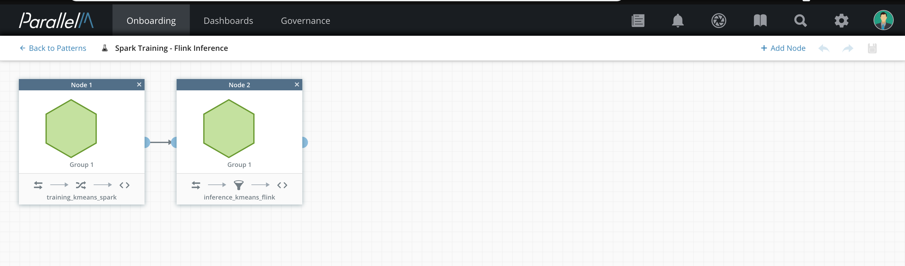

1 Introduction
==============

This User Guide covers the operation of MCenter in the current release,
with detailed directions on the set up and use of each feature. This
section provides a high-level overview of the product, key concepts,
and feature areas.

MCenter
-------

MCenter is a software solution that manages the full lifecycle of Machine
Learning (ML) applications in production:

-   Validate and deploy models or algorithms developed by data scientists
    in a range of production topologies from simple to complex in a highly scalable
    environment.

-   While in production, visualize, monitor, and manage the health of ML
    applications. MCenter provides insights into the health and operation
    of your ML initiatives and assists you in corrective actions to improve
    ML operation, quality, and insight.

-   Use industry-standard analytic engines and platforms (for example, Spark, Docker), custom code
    and components, as well as available out-of-the-box algorithms, feature
    engineering, and other functions.

-   Easily and efficiently collaborate at all stages of the production
    lifecycle, from initial development, through deployment, diagnostics,
    governance, business impact analysis, and continuous improvement.

Concepts
--------

### MLApp

The MLApp drives MCenter's business-focused
production ML management. An MLApp is comprised of all the ML constituent parts,
such as pipelines and policies, that comprise a single business objective.
The MLApp abstraction unifies all aspects of the application, including
management, diagnostics, provenance, and reporting across all MLApp components.
For example, the provenance of an ML model served by an inference pipeline
can be traced to the training pipeline that produced the model even when
these pipelines run on different frameworks and environments.

An MLApp is a virtual structure imposed on objects, like pipelines and policies,
which are used in ML and analytics operations. These resources can be distributed
(geographically or within a data center) or co-located within a single analytic
engine. By connecting all analytic engines, pipelines, and policies into a
single logical structure, the MLApp provides a consistent framework that
serves a single ML initiative. An example initiative is detecting anomalies
in a group of wind turbines using a combination of historical behavior and live data.

Using an MLApp, you can define multiple logical ML operations and co-locate
them on the same infrastructure, where they are monitored, controlled, and
optimized. The comprehensive scope of MLApps facilitates diagnosis of complex
systems and simplifies regulatory compliance.

Each MLApp is a virtual entity that you can "bind" to physical or virtual
resources such as analytic engines running on physical machines, virtual
machines, or containers. After binding, you can execute an MLApp.

### Pipelines

Pipelines perform the computational work within MLApps. Pipelines combine
multiple ML operations such as algorithm training and inference, feature
engineering, validation, and scoring. Pipelines can be batch (process all
the data at once from a static source) or streaming (operate incrementally
on live data), or intermediate forms, such as micro-batch. A single MLApp
can contain one or many pipelines. Most configurations contain two pipelines:
one for training and one for inference. More complex operations, such as
those involving ensemble models, multiple training, or inference, require
more pipelines per MLApp. A single MLApp can also combine different engine
types and different languages within pipelines. For example, different
pipelines within the same engine or MLApp can run Python, Scala, R, and Java.

### Analytic Engines

Each pipeline executes on the specific analytic engine type that it was defined
for. MCenter currently supports simple processes, Spark, Docker, and Kubernetes (in beta).
Containers can run R, Python, etc.
Python pipelines can be used with Python-based packages, such
as numpy, pandas, TensorFlow, and scikit-learn. Pipelines defined for these engines can contain components provided
in modules/libraries for that engine, such as Spark-ML/MLlib for Spark.
Custom programs written with each engine's API can also be
included in pipelines for that engine.

In some cases, you may wish to run an ML pipeline as a simple process on a single machine.
You can use the *OS* resource manager for this purpose. When launched, it spawns the pipeline as a process
on the machine hosting the agent. This is particularly useful if the given machine has been
configured for this pipeline, for example, a GCP node with configured GPUs.

### Policies

Policies specify how pipelines interact with one another, as well as if and
when operator input is required. For example, when a training pipeline outputs
a model after a training cycle is completed, several possible policies can
exist with respect to how this model is handled. In some cases, the model can
be automatically pushed to inference pipelines, while in other cases, operator
intervention is required to approve a new model. Policies give organizations
auditable approval processes with ML models for security, compliance, diagnostics,
tracking, and other purposes.

### Events

An MLApp can generate various types of events, such as alerts or other
predictions. MLApps also produce events to notify MCenter when pipelines
execute, new ML models are produced, or policy choices become available or are
executed. Policies and pipelines can receive events as input. For example, an
inference pipeline may consume an event that a new model is available for use
or is waiting to be approved.

### Example

The following figure shows an example of an MLApp that links ML training
and prediction pipelines.

In this example, new models are periodically retrained in a batch pipeline
(Training Spark Batch) that is running on a Spark cluster. As new models
are generated, an administrator is alerted. If the newly generated model
is approved by the administrator, it is pushed to the inference pipeline.

The training pipeline and the inference pipeline are running
independently, with occasional connection via pushing the new model.

As long as network connectivity exists between each analytic engine and
MCenter, the various pipelines can execute on analytic engines anywhere
in your environment.

The analytic engines running each pipeline can be distinct types. For example,
a batch engine Spark can run training while a streaming engine runs
inference. Different algorithms and pipelines can run on the same engine.
For example, the training pipeline can be Java based while the inference
pipelines are Python based.

Any pipeline can generate events (such as anomaly detections in this example).
Generated events are propagated to MCenter, displayed on views, and
further managed by policies configured for the MLApp.

To execute an MLApp, it needs to be bound to specific virtual or physical
resources. In this document, we use the term *engines* to refer to running
analytic pipelines. You can execute an MLApp after it is bound to
one or more engines.

This is one example of an MLApp pattern. Here are some other examples.

-   Multiple training pipelines to enable a hyper-parameter search or ensemble
    ML models.

-   Fully distributed learning with no central learning function, for example,
    federated learning.

-   Hybrid operation where inference occurs in production, and operators manually
    update models based on offline tests by data scientists.

-   Control elements, such as canary pipelines, whose purpose is to detect
    deviations of ML models in production.

Any pattern that can be expressed as a directed graph of the supported components
(such as pipelines and policies) can be defined as an MLApp and executed and
managed via MCenter. Unlike workflow managers common in other IT operations,
MLApps can contain cycles and multiple components that execute in parallel, a
situation common in ML operations.

Features
--------

### ML Governance

MCenter deployments can meet regulatory, compliance, and other requirements
imposed by the application or industry that they serve.

You can define all of the ML workflows that make up a business application
in one MLApp. All ML pipelines (training, inference, scoring, and so forth),
ML models, algorithms, dependencies, policies, configuration parameters, and
execution schedules are represented within that MLApp.

MCenter tracks all objects and events in each MLApp and stores them in an
SQL-compatible database that is supplied either by ParallelM or by your site.
The Model Governance tab in the MCenter user interface shows the provenance.
You can write your own analytics for the contents of the Model Governance
database and compute and store higher-level trends and triggers.

### ML Health

The performance of ML algorithms depends on the datasets
used in training and data seen during predictions. MCenter has a set of
built-in health indicators. These indicators capture:

-   The state of the ML application from the perspective of the data used
    for training and prediction (data deviation).

-   The pattern of predictions from inference pipelines. This pattern is
    useful for determining the health of a canary pipeline or for detecting a
    deviation in A/B testing results.

-   Live tracking of model comparisons over every instance of a trained or
    re-trained model.

The ML Health View shows the results from each built-in
indicator. You can define additional custom indicators via the MLOps API.
In addition, you can diagnose and optimize ML Health using features such as
timeline captures, log search in the Data Science View, and historical statistics.

### ML Orchestration

In MLApps, orchestration is the coordination of running related and possibly
dependent items in a workflow. With orchestration you can automate scaling,
increase predictability, and reduce operator overhead. You can define MLApps
to express virtually any ML pattern using these tools:

-   **Pipelines:** ML programs that include feature selection, data cleansing
    and transformation, training, scoring, and inference.

-   **MLApp patterns:** A dependency graph that links ML pipelines to each other
    based on the model-transfer dependency as well as policies applied at each
    link and globally.

-   **Schedules:** A definition of when each pipeline needs to be re-executed
    after completion. These include periodic and fixed-time automated executions.

-   **Policies:** Pipeline and MLApp policies that provide model deployment
    guidance and thresholds for managing the health of the model.

-   **Orchestration events:** Events that link pipelines, such
     as model generation, updates, and approvals. When a human is required in
     the loop, the MLApp raises an event. For example, when a model is trained,
     the event persists the model and then waits for a human to approve before
     deploying the model.

### Continuous Integration/Continuous Deployment

An MLApp can clearly represent and execute the ML portion of the CI/CD
lifecycle. Each MLApp can represent an entire cycle, one or more stages of
the cycle, or each stage of a cycle.  You can start a stage of the lifecycle
by pushing a single button, and depending upon how you configure the MLApp,
tests can run automatically, or results can be held to be approved by a human.

The MCenter Timeline Capture feature can record the entire runtime of an MLApp,
making the results available to be shared for debugging, review, and approval
for a completed CI/CD lifecycle stage.

### Business Focus

MCenter's business focus and Key Performance Indicators (KPIs) show the impact
that each ML pipeline, algorithm, and model has on the net result at the business application level.

-   MCenter gives you deep, fine-grained tracking of every ML object and its
    provenance, inter-dependencies between and among these objects, and how each
    link can be used to construct the end-to-end impact of an ML application on
    your business.

-   You can observe the performance of an ML application in the context of the
    business' performance via views and correlational linkages between metrics.
    This information can help you diagnose the low-level cause of changes in
    business KPIs.

General Instructions
--------------------

This guide covers MCenter installation instructions and the MCenter UI.

After the MCenter server is installed, you can view the web-based UI using
the server's URL at the UI port, for example,
`http:<server_name>:7092`.

Initially, you can log in using the pre-defined admin account or your LDAP
account (if your MCenter installation is configured with LDAP).

The MCenter UI includes a navigation bar across the top of the page.

The following tabs appear on the left side of the navigation bar:

- **Onboarding:** Create new MLApps, pipelines, components, or execution environments
- **Dashboards:** MLApp Overview view
- **Governance:** Governance view

On the right side of the navigation bar, you can see a series of icons.
Hovering over each icon shows its purpose:

- **Reports:** Business reports
- **Alerts:** Alerts raised from production MLApps
- **Timeline Captures:** Available timeline captures
- **User Guide:** Online version of this guide
- **Settings:** Admin configuration of users, agents, repositories, and
    repository credentials
