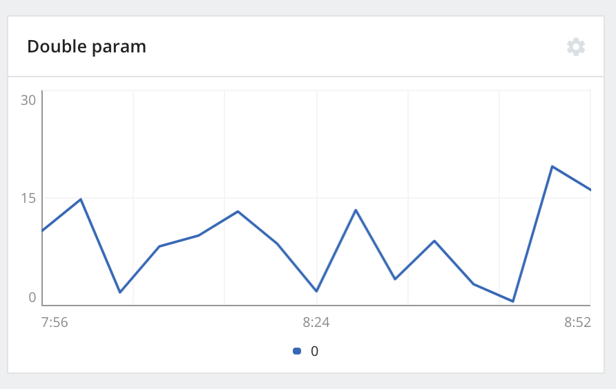
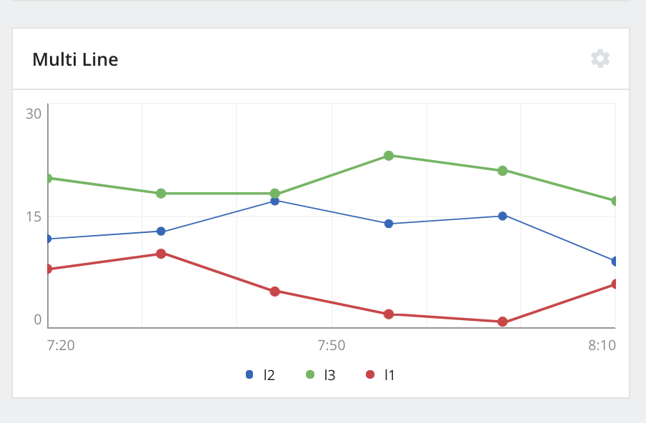
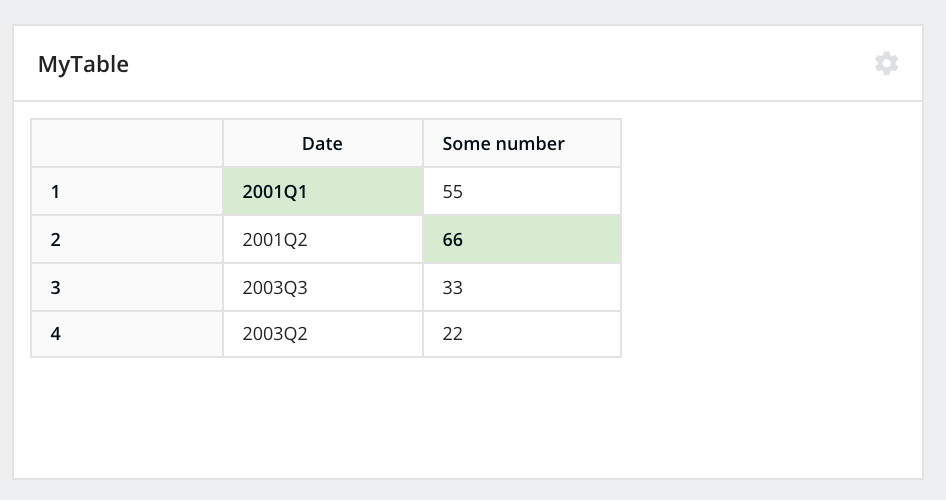

:orphan:

.. _deep_dive:

##########
Deep Dive
##########

Initializing mlops module
----------------------------

Before the mlops module can be used to report statistics, it should be initialized by calling the init() method
of the mlops singleton as follows:

    >>> from parallelm.mlops import mlops
    >>> mlops.init(spark_context)

This code passes the spark_context variable as a parameter to the mlops.init(). The mlops
module detects that this is a Spark program and tries to detect whether the current code is running with
the MLOps product. If this is the case, collected statistics will be pushed to MLOps; otherwise
they will be printed to a file.

It is also necessary to call mlops.done() at the end of the code.

Reporting statistics
---------------------

Each collected statistic is bound to a MLApp  and to the pipeline that generated it.
The mlops module supports multiple types of statistics. Each statistic is composed of *name*, *timestamp*, and *data*.
The *name* is used to distinguish it from other statistics generated by the same pipeline.
The *timestamp* is used to distinguish among multiple copies of the same statistic over time.
The *data* contains the values reported by the user. As we will see below, there are several types of
supported statistics.

Time series data
^^^^^^^^^^^^^^^^^
The most basic statistic is a single number as the data content. If multiple values are reported to the same statistic
name at different times, the values can form a time series. For example:

    >>> mlops.set_stat("my-stat", 5, st.TIME_SERIES)
    >>> mlops.set_stat("my-stat", 7, st.TIME_SERIES)

In this example, two such data points are generated under the name *my-stat*, the first with value of 5 and the second
with value of 7. Note that the two data points might result from one invocation of the pipeline code containing the
mlops.set_stat call or by two different invocations. Timestamps are added implicitly to the data points. The TIME_SERIES
parameter provides a suggestion for how the data is likely to be visualized. By default, such time series data will be
visualized by the UI using a line graph, where the Y-axis will be the range of seen values, and the X-axis will be time.

Multi-line graphs
^^^^^^^^^^^^^^^^^^
When multiple data points are reported for the same timestamp, mlops allows you to group such points
using a MultiLineGraph object.

    >>> from parallelm.mlops.stats.multi_line_graph import MultiLineGraph
    >>> mlt = MultiLineGraph().name("MyMultiLine").labels(["l1", "l2", "l3"])
    >>> mlt.data([13.2, 12.22, 20.5])
    >>> mlops.set_stat(mlt)
    >>> mlt.data([15.5, 8.9, 20.4])
    >>> mlops.set_stat(mlt)

In this example, a MultiLineGraph object is used to group three data points and also set the appropriate names of each
such data point. The first line will be named "l1" and will plot a line between the points 13.2 and 15.5.

Tables
^^^^^^^
mlops provides Table objects which allow the user to report a table back to MLOps. Each such table
has a timestamp associated with it (like any statistic). By default, the UI will display the most
recent table. If a specific time is specified, the table data for that time is selected.

A Table object can be generated as follows:

    >>> from parallelm.mlops.stats.table import Table
    >>> tbl = Table().name("MyTable").cols(["Date", "Some number"])
    >>> tbl.add_row("1", ["2001Q1", "55"])
    >>> tbl.add_row("2", ["2001Q2", "66"])
    >>> tbl.add_row("3", ["2003Q3", "33"])
    >>> tbl.add_row("4", ["2003Q2", "22"])
    >>> mlops.set_stat(tbl)

Handling Spark Models
^^^^^^^^^^^^^^^^^^^^^

An uploaded component, be it standalone or connectable, may eventually produce or consume a model.
Typically, training components produce models, while inference pipelines consume models.
A user can specify this behavior using the `modelBehavior` field: the value of this field is "ModelProducer"
for components that create models and "ModelConsumer" for components that consume them.
To identify the component parameter that specifies the model path, this parameter
is marked with a `tag` field in the `arguments` section of the `component.json`. If the component
produces a model, the tag value for the model output parameter is "model_dir". If the component
consumes a model, the tag value is "input_model_path".
MCenter populates this field with a path, where it either writes a new model (for model producers)
or reads a new model (for model consumers).
It is important to note that this path is relative to the MCenter agent responsible for the
cluster running the uploaded component.

Depending on the nature of the execution engine (e.g., Spark on Yarn or Standalone Spark or Python in a
Container), the MCenter agent provided path may or may not be accessible by the uploaded code. For
example, a remote Spark executor may not have access to the MCenter path (which may be local to
the Docker running the MCenter agent). Thus, we recommend using a shared location to act as the
intermediate staging area for models. In the inference case, the uploaded code must copy the MCenter
path to the shared location before loading models. Similarly, during training, Spark executors must save
the model to the shared path and later explicitly copy the model to the MCenter agent provided path.
The MCenter MLOps library provides a helper routine to automate this process. For example, if the original code
to load the model was:

>>> model_kmeans = PipelineModel.load(params.model_path)

With the help of the library, the code will look like the following:

>>> model_kmeans = \
>>>     SparkPipelineModelHelper()\
>>>      .set_shared_context(spark_context=sc)\
>>>      .set_local_path(local_path=params.model_path)\
>>>      .set_shared_path_prefix(shared_path_prefix=params.temp_shared_path)\
>>>      .load_sparkml_model()

The key elements to note here are:
1. `set_local_path` specifies the MCenter-provided path using this function.
2. `set_shared_path_prefix` specifies the shared path location using this function. The system will
create unique locations on this shared path as and when required.

Similarly, for saving models:

>>> model_kmeans = \
>>>     SparkPipelineModelHelper()\
>>>      .set_shared_context(spark_context=sc)\
>>>      .set_local_path(local_path=params.model_path)\
>>>      .set_shared_path_prefix(shared_path_prefix=params.temp_shared_path)\
>>>      .save_sparkml_model()
