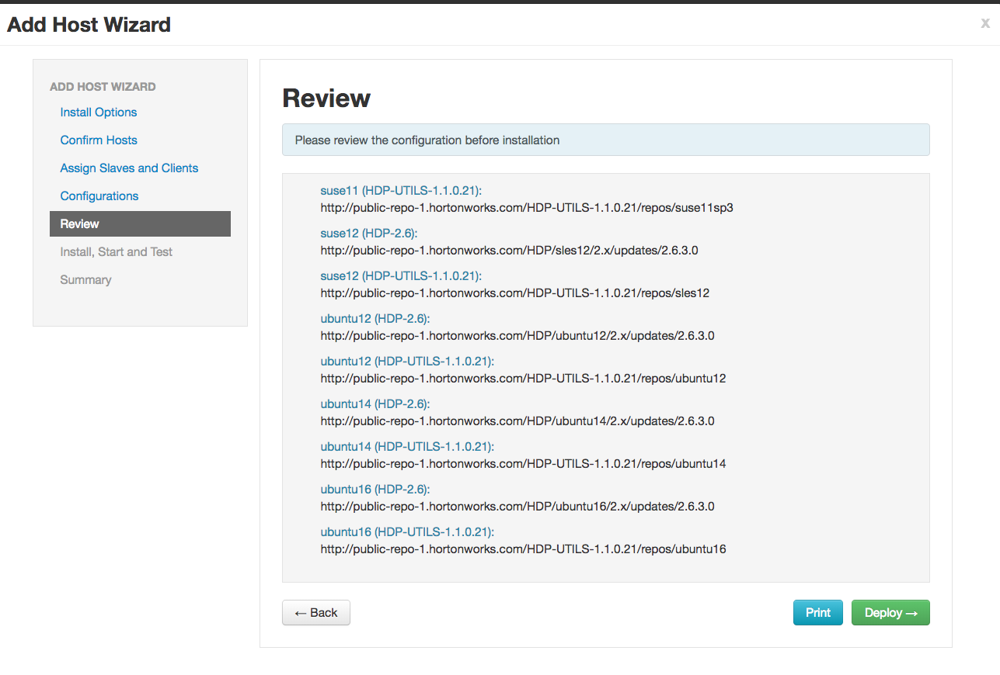
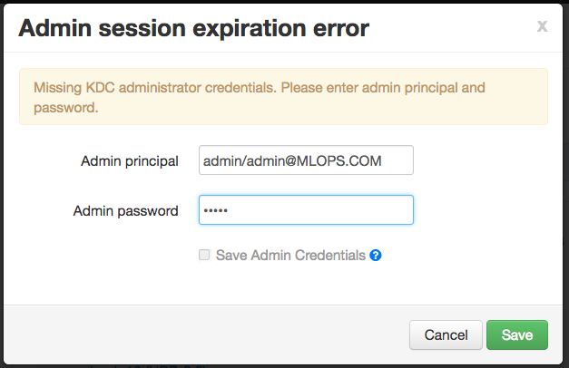

# Heading 1
Some text with *single* starred word.

**1.** First item.

**2.** Second item.

**3.** Third item.

## Heading 2

Some text with a **double** starred word.

### Heading 3

Some text with an `inline` code word.

#### Heading 4

Some text with several `inline code words`.

##### Heading 5

Some text and then a code block:

```
from parallelm.components import SparkDataComponent


class Csv2Df(SparkDataComponent):
    def __init__(self, ml_engine):
        super(self.__class__, self).__init__(ml_engine)

    def _dataframe(self, spark, user_data):
        filepath = self._params["filepath"]

        reader = spark.read.format("csv").option("inferSchema", "true")

        with_header = self._params.get("with_header", "true")
        reader.option("header", with_header)

        df = reader.load(filepath)
        self._logger.info("Loaded 'csv' converted to 'df': {}".format(df))
        return df
```

###### Heading 6

Words words words words words words words. Words words words words words words words. Words words words words words words words.Words words words words words words words. Words words words words words words words. Words words words words words words words. Words words words words words words words. Words words words words words words words.

There's a single empty line before this paragraph.
Words words words words words words words. Words words words words words words words. Words words words words words words words. Words words words words words words words. Words words words words words words words. Words words words words words words words. Words words words words words words words. Words words words words words words words.


There are two empty lines before this paragraph.
Words words words words words words words. Words words words words words words words. Words words words words words words words. Words words words words words words words. Words words words words words words words. Words words words words words words words. Words words words words words words words. Words words words words words words words.

# Heading 1 Again

| Field           | Description     | Standalone      | Connectable     |
|-----------------|-----------------|-----------------|-----------------|
| `engineType`     | Engine type that executes the component    | PySpark, Python, Tensorflow | PySpark |
| `language`       | Programming language | PySpark, Python, Tensorflow, R | PySpark, Python, R |
| `userStandalone` | Standalone or connectable | true (Optional) | false (Mandatory) |
| `name`           | Unique name     | Mandatory       | Mandatory       |
| `label`          | UI label        | Mandatory       | Mandatory       |
| `componentClass` | Main class | Not relevant    | Mandatory       |
| `modelBehavior` | ModelConsumer, ModelProducer, ModelProducerConsumer, or Auxiliary | Mandatory  | Mandatory |
| `useMLOps` | Uses MLOps module | Optional (default: false) | Optional (default: false) |
| `inputInfo`      | Description of data input path | Not relevant    | Optional (default: empty) |
| `outputInfo`     | Description of data output path | Not relevant    | Optional (default: empty)  |

Here's an image that doesn't require scaling:



Here's an image that should be scaled:


